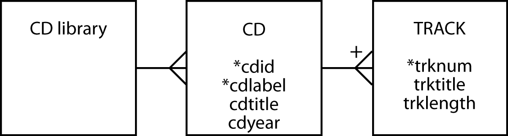
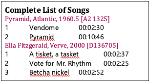
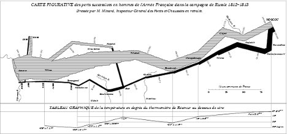
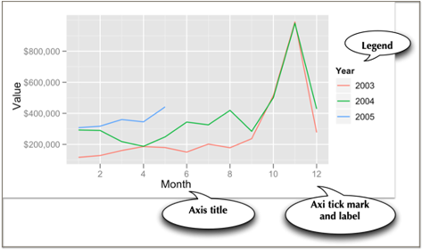
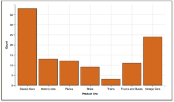
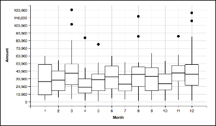
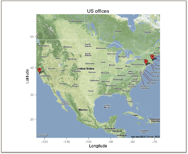

# Section 3: Advanced Data Management {-}

> *Advancement only comes with habitually doing more than you are asked.*
>
> Gary Ryan Blair.[^1]

The wiring of the world has given us ubiquitous networks and broadened
the scope of issues that data management must now embrace. In everyday
life, you might use a variety of networks (e.g., the Internet, 4G, WiFi,
and bluetooth) to gain access to information wherever you might be and
whatever time it is. As a result, data managers need to be concerned
with both the **spatial and temporal** dimensions of data. In a highly
connected world, massive amounts of data are exchanged every minute
between computers to enable a high level of global integration in
economic and social activity. **XML** has emerged as the foundation for
data exchange across many industries. It is a core technology for global
economic development. On the social side, every day people generate
millions of messages, photos, and videos that fuel services such as
Twitter, Flickr, and YouTube. Many organizations are interested in
analyzing these data streams to learn about social trends, customers'
opinions, and entrepreneurial opportunities. Organizations need skills
in collecting, processing, and interpreting the myriad data flows that
intersect with their everyday business. **Organizational or business
intelligence** is the general term for describing an enterprise's
efforts to collect, store, process, and interpret data from internal and
external sources. It is the first stage of data-driven decision making.
Once data have been captured and stored in an organizational repository,
there are several techniques that can be applied.

In a world awash with data, **visualization** has become increasingly
important for enabling executives to make sense of the business
environment, to identify problems, and highlight potential new
directions. **Text mining** is a popular tool for trying to make sense
of data streams emanating from tweets and blogs. The many new sources of
data and their high growth rate have made it more difficult to support
real time analysis of the torrents of data that might contain valuable
insights for an organization's managers. Fortunately, **Hadoop
distributed file system (HDFS)** and **cluster computing** methods are a
breakthrough in storing and processing data that enable faster
processing at lower cost. **Dashboards** are widely used for presenting
key information. Furthermore, the open source statistics and graphical
package, **R**, provides a common foundation for handling text mining,
data visualization, HDFS, and cluster computing. It has become another
component of the data manager's toolkit.

The section covers the following topics.

* Spatial and temporal data management

* XML

* Organizational intelligence

* Introduction to R

* Data visualization

* Text mining

* Cluster Computing

* Dashboards

## Chapter 11: Spatial and Temporal Data Management {-}

> *Nothing puzzles me more than time and space; and yet nothing troubles
me less, as I never think about them.*
>
> Charles Lamb, 1810.

### Learning objectives {-}

Students completing this chapter will

* be able to define and use a spatial database;

* be familiar with the issues surrounding the management of temporal data.

### Introduction {-}

The introduction of ubiquitous networks and smartphones has led to the
advent of location-based services. Customers expect information
delivered based on, among other things, where they are. For example, a
person touring the historic German city of Regensburg could receive
information about its buildings and parks via her mobile phone in the
language of her choice. Her smartphone will determine her location and
then select from a database details of her immediate environment. Data
managers need to know how to manage the **spatial** data necessary to
support location-based services.

Some aspect of time is an important fact to remember for many
applications. Banks, for example, want to remember what dates customers
made payments on their loans. Airlines need to recall for the current
and future days who will occupy seats on each flight. Thus, the
management of time-varying, or **temporal,** data would be assisted if a
database management system had built-in temporal support. As a result,
there has been extensive research on temporal data models and DBMSs for
more than a decade. The management of temporal data is another skill
required of today's data management specialist.

The Open Geospatial Consortium, Inc. (OGC) is a nonprofit international
organization developing standards for geospatial and location-based
services. Its goal is to create open and extensible software application
programming interfaces for geographic information systems (GIS) and
other geospatial technologies. DBMS vendors (e.g., MySQL) have
implemented some of OGC's recommendations for adding spatial features to
SQL. MySQL is gradually adding further GIS features as it develops its
DBMS.

### Managing spatial data {-}

A spatial database is a data management system for the collection,
storage, manipulation, and output of spatially referenced information.
Also known as a geographic information system (GIS), it is an extended
form of DBMS. Geospatial modeling is based on three key concepts: theme,
geographic object, and map.

A **theme** refers to data describing a particular topic (e.g., scenic
lookouts, rivers, cities) and is the spatial counterpart of an entity.
When a theme is presented on a screen or paper, it is commonly seen in
conjunction with a **map**. Color may be used to indicate different
themes (e.g., blue for rivers and black for roads). A map will usually
have a scale, legend, and possibly some explanatory text.

A **geographic object** is an instance of a theme (e.g., a river). Like
an instance of an entity, it has a set of attributes. In addition, it
has spatial components that can describe both geometry and topology.
Geometry refers to the location-based data, such as shape and length,
and topology refers to spatial relationships among objects, such as
adjacency. Management of spatial data requires some additional data
types to represent a point, line, and region.

*Generic spatial data types*

  Data type   Dimensions   Example
  ----------- ------------ ----------------
  Point       0            Scenic lookout
  Line        1            River
  Region      2            County
  
Consider the case where we want to create a database to store some
details of political units. A political unit can have many boundaries.
The United States, for example, has a boundary for the continental
portion, one for Alaska, one for Hawaii, and many more to include places
such as American Samoa. In its computer form, a boundary is represented
by an ordered set of line segments (a path).

*Data model for political units*


#### SQL/MM Spatial {-}

SQL/MM, also known as ISO 13249, is an extension of SQL to handle
spatial data. It uses the prefix ST\_ for tables, views, data types, and
function names. Originally, this prefix meant *Spatial* and *Temporal*,
because the intention was to develop a standard that combined spatial
and temporal extensions to SQL. However, it was realized that temporal
required a broader perspective and should be separate standard. Thus,
think of ST\_ as meaning *Spatial Type*.

MySQL has data types for storing geometric data, which are:

  Type         Representation                                  Description
  ------------ ----------------------------------------------- -----------------------------------------------------------------------------------------------------------------------
  Point        POINT(x y)                                      A point in space (e.g., a city's center)
  LineString   LINESTRING(x1 y1,x2 y2,...)                     A sequence of points with linear interpolation between points (e.g., a road)
  Polygon      POLYGON((x1 y1,x2 y2,...), (x1 y1,x2 y2,...))   A polygon (e.g., a boundary) which has a single exterior boundary and zero or more interior boundaries ( i.e., holes)
  
#### Spatial Reference Support System (SRS) {-}

A spatial reference system (SRS) is facilitates the location of
geometric objects using coordinates. A specific SRS is identified by an
SRID, which is an integer

There are three types of reference systems:

##### Projected {-}

A projected SRS is a projection of a globe on a flat surface. Map makers
have developed a variety of approaches, such as Mecator, to represent a
portion of the earth on a page or screen. Each point on the flat surface
is a place on the globe. A projected SRS typically shows a length
legend, such as the distance in miles or kilometers.

##### Geographic {-}

For a geographic SRS, the coordinates are latitude and longitude. The
SRID is 4326.[^2]

##### Cartesian {-}

A Cartesian SRS, is an infinite flat plane with no specified units. The
SRID is O, and this is the default if you don't specify an SRS.

#### Data model mapping {-}

The data model in the preceding figure is mapped to MySQL. By specifying
a SRID of 0, Ireland is represented using a Cartesian SRS. Since Ireland
is small relative the size of the earth, this is a reasonable
approximation.

In the following definition of the database's tables, note two things.
The boundpath column of boundary is defined with a data type of POLYGON
and SRID of 0. The cityloc column of city is defined as a POINT.
Otherwise, there is little new in the set of statements to create the
tables.

*Political unit database definition*

```{sql, connection = db, eval = FALSE}
CREATE TABLE political_unit (
	Unitname	VARCHAR(30) NOT NULL,
	Unitcode	CHAR(2),
	Unitpop	DECIMAL(6,2),
	PRIMARY KEY(unitcode));
```

```{sql, connection = db, eval = FALSE}
CREATE TABLE boundary (
	Boundid	INTEGER,
	Boundpath	POLYGON NOT NULL SRID 0,
	Unitcode	CHAR(2),
	PRIMARY KEY(boundid),
	CONSTRAINT fk_boundary_polunit FOREIGN KEY(unitcode)
		REFERENCES political_unit(unitcode));
```

```{sql, connection = db, eval = FALSE}
CREATE TABLE city (
	Cityname	VARCHAR(30),
	Cityloc	POINT NOT NULL SRID 0,
	Unitcode	CHAR(2),
	PRIMARY KEY(unitcode,cityname),
	CONSTRAINT fk_city_polunit FOREIGN KEY(unitcode) 
		REFERENCES political_unit(unitcode)); 
```

We now use the geographic entity of Ireland to demonstrate the
application of spatial concepts. The island has two political units. The
Republic of Ireland (Eire) governs the south, while Northern Ireland, a
part of the United Kingdom, is in the north.

*Map of Ireland*


To represent these two political units within a spatial database, we
need to define their boundaries. Typically, this is done by
approximating the boundary by a single exterior polygon. In the
preceding figure, you see a very coarse representation based on
connecting intersection points of the overlay grid. The SRID needs to be
specified for each geometric object, as for example where it is set to 0
when specifying Dublin's coordinates, `ST_GeomFROMText('POINT(9 6)', 0)`.

*Insert statements for populating database*

```{sql, connection = db, eval = FALSE}
INSERT INTO political_unit VALUES ('Republic of Ireland','ie', 3.9);
INSERT INTO political_unit VALUES ('Northern Ireland','ni', 1.7);
INSERT INTO boundary VALUES
	(1,ST_GeomFROMText('POLYGON((9 8, 9 3, 4 1, 2 2, 1 3, 3 5, 3 6, 2 6,
	 2 9, 5 9, 5 10, 6 11, 7 11, 7 10, 6 9, 7 8, 7 9, 8 9, 8 8, 9 8))', 0),'ie');
INSERT INTO boundary VALUES
	(2,ST_GeomFROMText('POLYGON((7 11, 9 11, 10 9, 10 8, 8 8, 8 9, 7 9,
	 7 8, 6 9, 7 10, 7 11))', 0),'ni');
INSERT INTO city VALUES ('Dublin',ST_GeomFROMText('POINT(9 6)', 0),'ie');
INSERT INTO city VALUES ('Cork',ST_GeomFROMText('POINT(5 2)', 0),'ie');
INSERT INTO city VALUES ('Limerick',ST_GeomFROMText('POINT(4 4)', 0),'ie');
INSERT INTO city VALUES ('Galway',ST_GeomFROMText('POINT(4 6)', 0),'ie');
INSERT INTO city VALUES ('Sligo',ST_GeomFROMText('POINT(5 8)', 0),'ie');
INSERT INTO city VALUES ('Tipperary',ST_GeomFROMText('POINT(5 3)', 0),'ie');
INSERT INTO city VALUES ('Belfast',ST_GeomFROMText('POINT(9 9)', 0),'ni');
INSERT INTO city VALUES ('Londonderry',ST_GeomFROMText('POINT(7 10)', 0),'ni');
```

The two sets of values for the column `boundary` define the boundaries of
the Republic of Ireland and Northern Ireland. Because of the coarseness
of this sample mapping, the Republic of Ireland has only one boundary. A
finer-grained mapping would have multiple boundaries, such as one to
include the Arran Islands off the west coast near Galway. Each city's
location is defined by a point or pair of coordinates. `ST_GeomFromText`
is an MySQL function to convert text into a geometry data form.

Workbench can show you the boundaries for you spatial database. See the
following screenshot.

*Boundary path as displayed by Workbench*


+-----------------------------------------------------------------------+
| *Skill builder*                                                       |
|                                                                       |
| Create the three tables for the example and insert the rows listed in |
| the preceding SQL code.                                               |
+-----------------------------------------------------------------------+

MySQL includes a number of geometry functions and operators for
processing spatial data that simplify the writing of queries. A column's
SRID value determines the method of calculating area or distance.
Euclidean geometry is use for a flat plane (SRID = 0), and spherical
geometry for latitude and longitude measures (SRID = 4326). For
illustrative purposes, just a few of the geometric functions are
described.

*Some MySQL geometric functions*

  Function                     Description
  ---------------------------- --------------------------------------
  ST\_X(Point)                 The x-coordinate of a point
  ST\_Y(Point)                 The y-coordinate of a point
  ST\_Distance(Point, Point)   The distance between two points
  ST\_NumPoints(LineString)    The number of points in a linestring
  ST\_Area(Polygon)            The area of a polygon

Once the database is established, we can do some queries to gain an
understanding of the additional capability provided by the spatial
additions. Before starting, examine the scale on the map and note that
one grid unit is about 37.5 kilometers (23 miles). This also means that
the area of one grid unit is 1406 km^2 (526 square miles).

*What is the area of the Republic of Ireland?*

Because we approximate the border by a polygon, we use the area function
and multiply the result by 1406 to convert to square kilometers.

```{sql, connection = db, eval = FALSE}
SELECT ST_AREA(boundpath)*1406 
	AS 'Area (km^2)' FROM political_unit JOIN boundary
   ON political_unit.unitcode = boundary.unitcode
   WHERE unitname = 'Republic of Ireland';
```

  Area(km\^2)
  -------------
  71706

*How far, as the crow flies, is it from Sligo to Dublin?*

You can measure the distance between two points using ST\_Distance. You
will need to multiply the result by 37.5 or 23 to convert to kilometers
or miles, respectively.

```{sql, connection = db, eval = FALSE}
SELECT ST_Distance(orig.cityloc,dest.cityloc)*37.5 
AS 'Distance (kms)'
	FROM city orig, city dest
 		WHERE orig.cityname = 'Sligo'
		AND dest.cityname = 'Dublin';
```

  Distance (kms)
  ----------------
  167.71

*What is the closest city to Limerick?*

This query has a familiar structure. The inner query determines the
minimum distance between Limerick and other cities. Notice that there is
a need to exclude comparing the distance from Limerick to itself, which
is zero.

```{sql, connection = db, eval = FALSE}
SELECT dest.cityname FROM city orig, city dest
WHERE orig.cityname = 'Limerick'
AND ST_Distance(orig.cityloc,dest.cityloc)=
	(SELECT MIN(ST_Distance(orig.cityloc,dest.cityloc)) 
	FROM city orig, city dest
	WHERE orig.cityname = 'Limerick' AND dest.cityname <> 'Limerick');
```

  cityname
  -----------
  Tipperary

*What is the westernmost city in Ireland?*

The first thing to recognize is that by convention the west is shown on
the left side of the map, which means the westernmost city will have the
smallest x-coordinate.

```{sql, connection = db, eval = FALSE}
SELECT west.cityname FROM city west
WHERE NOT EXISTS
	(SELECT * FROM city other WHERE ST_X(other.cityloc) < ST_X(west.cityloc));
```

  cityname
  ----------
  Limerick
  Galway

+--------------------------------------------------------------------------+
| *Skill builder*                                                          |
|                                                                          |
| 1.  What is the area of Northern Ireland? Because Northern Ireland is    |
|     part of the United Kingdom and miles are still often used to measure |
|     distances, report the area in square miles.                          |
|                                                                          |
| 2.  What is the direct distance from Belfast to Londonderry in miles?    |
|                                                                          |
| 3.  What is the northernmost city of the Republic of Ireland?            |
+--------------------------------------------------------------------------+

#### Geometry collections {-}

A geometry collection is a data type for describing one or more
geometries. It covers multiple points, strings, polygons, as well as
their possible combinations.

##### MultiPoint {-}

The multipoint data type records information about a set of points, such
as the bus stops on campus. For example:

```{sql, connection = db, eval = FALSE}
MULTIPOINT(9.0 6.1, 8.9 6.0)
```

##### MultiLineString {-}

The MultiLineString data type records information about a set of line
strings, such as the bus routes on campus. For example:

```{sql, connection = db, eval = FALSE}
MULTILINESTRING((9 6, 4 6), (9 6, 5 2))
```

##### MULTIPOLYGON {-}

The MultiPOLYGON data type records information about a set of polygons,
such as the shapes of the buildings on campus. For example:

```{sql, connection = db, eval = FALSE}
MULTIPOLYGON(((0 0,10 0,10 10,0 10,0 0)),((5 5,7 5,7 7,5 7, 5 5)))
```

##### GEOMETRYCOLLECTION {-}

The GEOMETRYCOLLECTION data type records information about a collection
of geometries, such as the bus routes and stops on campus. For example:

```{sql, connection = db, eval = FALSE}
GEOMETRYCOLLECTION(LINESTRING(15 15, 20 20), POINT(10 10), POINT(30 30))
```

You can insert data using `ST_GeomCollFromText`, as the following example
illustrates:

```{sql, connection = db, eval = FALSE}
INSERT INTO table VALUES
ST_GeomCollFromText('GEOMETRYCOLLECTION(POINT(1 1),LINESTRING(0 0,1 1,2 2,3 3,4 4))');
```

+------------------------------------------------------------------------+
| *Skill builder*                                                        |
|                                                                        |
| Modify the example database design to include:                         |
|                                                                        |
| 1.  Historic buildings in a city                                       |
|                                                                        |
| 2.  Walking paths in a city                                            |
|                                                                        |
| 3.  Use of the MULTIPOLYGON data type to indicate a political region's |
|     boundary                                                           |
+------------------------------------------------------------------------+

#### Geocoding using Google Maps {-}

To get the latitude and longitude of a location, you can use Google Maps
by following this procedure.

1.  Go to maps.google.com.

2.  Enter your address, zip code, airport code, or whatever you wish to
    geocode.

3.  Click on the link that says 'link to this page.' It is on the right
    side, just above the upper right corner of the map.

4.  The address bar (URL) will change. Copy the full link. For example:
    [[http://maps.google.com/maps?f=q&source=s\_q&hl=en&geocode=&q=ahn&aq=&sll=37.0625,-95.677068&sspn=48.822589,67.763672&ie=UTF8&hq=&hnear=Athens+Ben+Epps+Airport-Ahn,+1010+Ben+Epps+Dr,+Athens,+Georgia+30605&ll=33.953791,-83.323746&spn=0.025168,0.033088&z=15&iwloc=A]{.underline}](http://maps.google.com/maps?f=q&source=s_q&hl=en&geocode=&q=ahn&aq=&sll=37.0625,-95.677068&sspn=48.822589,67.763672&ie=UTF8&hq=&hnear=Athens+Ben+Epps+Airport-Ahn,+1010+Ben+Epps+Dr,+Athens,+Georgia+30605&ll=33.953791,-83.323746&spn=0.025168,0.033088&z=15&iwloc=A).

5.  The latitude and longitude are contained in the URL following &ll.
    In this case, latitude is: 33.953791 and longitude: -83.323746.

#### R-tree {-}

Conventional DBMSs were developed to handle one-dimensional data
(numbers and text strings). In a spatial database, points, lines, and
rectangles may be used to represent the location of retail outlets,
roads, utilities, and land parcels. Such data objects are represented by
sets of *x, y* or *x, y, z* coordinates. Other applications requiring
the storage of spatial data include computer-aided design (CAD),
robotics, and computer vision.

The B-tree, often used to store data in one-dimensional databases, can
be extended to *n* dimensions, where *n* ≥ 2. This extension of the
B-tree is called an **R-tree**. As well as storing pointers to records
in the sequence set, an R-tree also stores boundary data for each
object. For a two-dimensional application, the boundary data are the
**x** and **y** coordinates of the lower left and upper-right corners of
the *minimum bounding* rectangle, the smallest possible rectangle
enclosing the object. The index set, which contains pointers to
lower-level nodes as in a B-tree, also contains data for the minimum
bounding rectangle enclosing the objects referenced in the node. The
data in an R-tree permit answers to such problems as *Find all pizza
stores within 5 miles of the dorm.*

How an R-tree stores data is illustrated in the following figure, which
depicts five two-dimensional objects labeled A, B, C, D, and E. Each
object is represented by its minimum bounding rectangle (the objects
could be some other form, such as a circle). Data about these objects
are stored in the sequence set. The index set contains details of two
intermediate rectangles: X and Y. X fully encloses A, B, and C. Y fully
encloses D and E.

*An R-tree with sample spatial data*

 *MISSING*

An example demonstrates how these data are used to accelerate searching.
Using a mouse, a person could outline a region on a map displayed on a
screen. The minimum bounding rectangle for this region would then be
determined and the coordinates used to locate geographic objects falling
within the minimum boundary. Because an R-tree is an index, geographic
objects falling within a region can be found rapidly. In the following
figure, the drawn region (it has a bold border) completely covers object
E. The R-tree software would determine that the required object falls
within intermediate region Y, and thus takes the middle node at the next
level of the R-tree. Then, by examining coordinates in this node, it
would determine that E is the required object.

*Searching an R-tree*

 *MISSING*

As the preceding example illustrates, an R-tree has the same index
structure as a B-tree. An R-tree stores data about *n*-dimensional
objects in each node, whereas a B-tree stores data about a
one-dimensional data type in each node. Both also store pointers to the
next node in the tree (the index set) or the record (the sequence set).

This short introduction to spatial data has given you some idea of how
the relational model can be extended to support geometric information.
Most of the major DBMS vendors support management of spatial data.

### Managing temporal data {-}

With a temporal database, stored data have an associated time period
indicating when the item was valid or stored in the database. By
attaching a timestamp to data, it becomes possible to store and identify
different database states and support queries comparing these states.
Thus, you might be able to determine the number of seats booked on a
flight by 3 p.m. on January 21, 2011, and compare that to the number
booked by 3 p.m. on January 22, 2011.

To appreciate the value of a temporal database, you need to know the
difference between transaction and valid time and that bitemporal data
combines both valid and transaction time.

* **Transaction time** is the timestamp applied by the system when data
are entered and cannot be changed by an application. It can be applied
to a particular item or row. For example, when changing the price of a
product, the usual approach would be to update the existing product row
with the new price. The old price would be lost unless it was stored
explicitly. In contrast, with a temporal database, the old and new
prices would automatically have separate timestamps. In effect, an
additional row is inserted to store the new price and the time when the
insert occurred.

* **Valid time** is the actual time at which an item was or will be a
valid or true value. Consider the case where a firm plans to increase
its prices on a specified date. It might post new prices some time
before their effective date. Valid time can be changed by an
application.

* **Bitemporal data** records both the [valid
time](http://en.wikipedia.org/wiki/Valid_time) and [transaction
time](http://en.wikipedia.org/wiki/Transaction_time) for a fact. It
usually requires four extra columns to record the upper and lower bounds
for valid time and transaction time.

Valid time records when the change takes effect, and transaction time
records when the change was entered. Storing transaction time is
essential for database recovery because the DMBS can roll back the
database to a previous state. Valid time provides a historical record of
the state of the database. Both forms of time are necessary for a
temporal database.

As you might expect, a temporal database will be somewhat larger than a
traditional database because data are never discarded and new
timestamped values are inserted so that there is a complete history of
the values of an instance (e.g., the price of a product since it was
first entered in the database). Thus, you can think of most of the
databases we have dealt with previously as snapshots of a particular
state of the database, whereas a temporal database is a record of all
states of the database. As disk storage becomes increasingly cheaper and
firms recognize the value of business intelligence, we are likely to see
more attention paid to temporal database technology.

#### Times remembered {-}

SQL supports several different data types for storing numeric values
(e.g., integer and float), and a temporal database also needs a variety
of data types for storing time values. The first level of distinction is
to determine whether the time value is anchored or unanchored.
**Anchored time** has a defined starting point (e.g., October 15, 1582),
and **unanchored time** is a block of time with no specified start
(e.g., 45 minutes).

*Types of temporal data[^3]*


Anchored time is further split into an instant or interval. An
**instant** is a moment in time (e.g., a date and time). In SQL, an
instant can be represented by a date, time, or timestamp data type. An
**interval** is the time between two specified instants, and can be
defined as a value or a range with an upper and lower bound instant. For
example, [2011-01-01, 2011-01-23] defines an interval in 2011
beginning January 1 and ending January 23.

##### Interval {-}

SQL-99 introduced the INTERVAL data type, which has not yet been
implemented in MySQL. INTERVAL is a single value expressed in some unit
or units of time (e.g., 6 years, 5 days, 7 hours). A small example
illustrates the use of INTERVAL for time values. Consider the rotational
and orbital periods of the planets . The CREATE statement for this table
is

```{sql, connection = db, eval = FALSE}
CREATE TABLE planet (
	pltname 		VARCHAR(7),
	pltday 		INTERVAL,
	pltyear 		INTERVAL,
	PRIMARY KEY(pltname));
```

*Planetary data*

  -------------------------------------------------
  Planet     Rotational period\   Orbital period\
             (hours)              (years)
  ---------- -------------------- -----------------
  Mercury    1407.51              0.24

  Venus      --5832.44[^a]         0.62

  Earth      23.93                1

  Mars       24.62                1.88

  Jupiter    9.92                 11.86

  Saturn     10.66                29.45

  Uranus     17.24                84.02

  Neptune    16.11                164.79

  Pluto      153.28               247.92
  -------------------------------------------------

a\. Rotates in the opposite direction to the other planets

To insert the values for Mercury, you would use

```{sql, connection = db, eval = FALSE}
INSERT INTO planet VALUES ('Mercury','1407.51 hours','0.24 years');
```

##### Modeling temporal data {-}

You already have the tools for modeling temporal values. For example,
the project management data model discussed in Chapter 7 and reproduced
in the following figure contains temporal data.

*A project management data model*


If we take the SHARE entity introduced very early in your data modeling
experience, we can add temporal information to record the history of all
values that are time-varying (i.e., price, quantity, dividend, and
earnings). The data model to record temporal data is displayed. Firms
pay dividends and report earnings only a few times per year, so we can
associate a date with each value of dividend and earnings. Recording the
history of trading transactions requires a timestamp, because a person
can make multiple trades in a day. Every time a share is bought or sold,
a new row is inserted containing both the transaction quantity and
price. The number owned can be derived by using SUM.

*A temporal model of SHARE*


Recording the share's price requires further consideration. If the
intention is to record every change in price, then a time stamp is
required as there will be multiple price changes in a day, and even in
an hour, in busy trading. If there is less interest in the volatility of
the stock and only the closing price for each day is of interest, then a
date would be recorded.

You can add additional attributes to tables in a relational database to
handle temporal data, but doing so does not make it a temporal database.
The problem is that current relational implementations do not have
built-in functions for querying time-varying data. Such queries can also
be difficult to specify in SQL.

A temporal database has additional features for temporal data
definition, constraint specification, data manipulation, and querying. A
step in this direction is the development of TSQL (Temporal Structured
Query Language). Based on SQL, TSQL supports querying of temporal
databases without specifying time-varying criteria. SQL:2011, the
seventh revision of the SQL standard, has improved support for temporal
data.

### Summary {-}

Spatial database technology stores details about items that have
geometric features. It supports additional data types to describe these
features, and has functions and operators to support querying. The new
data types support point, line, and region values. Spatial technology is
likely to develop over the next few years to support organizations
offering localized information services.

Temporal database technology provides data types and functions for
managing time-varying data. Transaction time and valid time are two
characteristics of temporal data. Times can be anchored or unanchored
and measured as an instant or as an interval.

  Key terms and concepts
  ------------------------------------ --------------------------------------------------
  Anchored time                        Spatial data
  Geographic object                    Temporal data
  Geographic information system (GIS)  Theme
  Interval                             Transaction time
  Map                                  Valid time
  R-tree

#### References and additional readings {-}

Gibson, Rich, and Schuyler Erle. 2006. *Google maps hacks*. Sebastopol,
CA: O'Reilly.

Rigaux, P., M. O. Scholl, and A. Voisard. 2002. *Spatial databases: with application to GIS*, The Morgan Kaufmann series in data management
systems. San Francisco: Morgan Kaufmann Publishers.

#### Exercises {-}

1.  What circumstances will lead to increased use of spatial data?

2.  A national tourist bureau has asked you to design a database to
    record details of items of interest along a scenic road. What are
    some of the entities you might include? How would you model a road?
    Draw the data model.

3.  Using the map of the Iberian peninsula in the following figure,
    populate the spatial database with details of Andorra, Portugal, and
    Spain. Answer the following questions.

    a.  What is the direct distance, or bee line, from Lisbon to Madrid?

    b.  What is the farthest Spanish city from Barcelona?

    c.  Imagine you get lost in Portugal and your geographic positioning
        system (GPS) indicates that your coordinates are (3,9). What is
        the nearest city?

    d.  Are there any Spanish cities west of Braga?

    e.  What is the area of Portugal?

    f.  What is the southernmost city of Portugal?

4.  Redesign the data model for political units assuming that your
    relational database does not support point and polygon data types.

5. For more precision and to meet universal standards, it would be
    better to use latitude and longitude to specify points and paths.
    You should also recognize that Earth is a globe and not flat. How
    would you enter latitude and longitude in MySQL?

6. When might you use transaction time and when might you use valid
    time?

7. Design a database to report basketball scores. How would you record
    time?

8. A supermarket chain has asked you to record what goods customers buy
    during each visit. In other words, you want details of each shopping
    basket. It also wants to know when each purchase was made. Design
    the database.

9. An online auction site wants to keep track of the bids for each item
    that a supplier sells. Design the database.

10. Complete the Google maps lab exercise listed on the book's Web site.

*Iberian Peninsula*


## Chapter 12: Graph Databases {-}

> *When we use a network, the most important asset we get is access to one another.*
> 
> Clay Shirky, *Cognitive Surplus: Creativity and Generosity in a Connected Age*, 2010

#### Learning objectives {-}

Students completing this chapter will be able to

* define the features of a labelled property graph database;

* use a graph description language (GDL) to define nodes and
relationships;

* use a graph database query language (GQL) to query a graph database;

* identify applications of a graph database.

#### Introduction {-}

Relational database technology was developed to support the processing
of business transactions and the querying of organizational data. As
other applications, such social media developed, the **labeled property
database** was introduced to support the processing of relationships
between objects, such as people and organizations. Both are ways of
modeling the world, and storing and retrieving data. Like a relational
DBMS, a graph DBMS, supports Create, Read, Update, and Delete (CRUD)
procedures. Both can be used for online transaction processing (OLTP)
and online analytical processing (OLAP). The selection of one over the
other is dependent on the purpose of the database and the nature of
frequent queries. A graph database, for instance, is likely a better
choice for supply chain analytics because of the network structure of a
supply chain.

### A graph database {-}

A graph is a set of nodes and relationships (edges in graph
terminology). A **node** is similar to a relational row in that it
stores data about an instance of an entity. In graph database
terminology, a node has **properties** rather than attributes. Nodes can
also have one or more **labels**, which are used to group nodes together
and indicate their one or more roles in the domain of interest. Think of
a group of nodes with a common label as an entity.

In a graph database, a **relationship** is explicitly defined to connect
a pair of nodes, and can have properties, whereas, in a relational
database, a relationship is represented by a pair of primary and foreign
keys.

A graph description language (GDL) defines labels, nodes, and the
properties of nodes and relationships. A GDL statement defines a
specific entry in a graph database. It is like the INSERT statement of
SQL. In a relational database you first define a table and then insert
rows for specific instances, but in a graph database you start by
defining nodes. There is no equivalent of the SQL CREATE TABLE command.

The properties of a node or relationship are specified as a **key:value
pair**. A key is a unique identifier for some item of data (e.g., the
NYSE code for a listed stock), and a value is data associated with the
key (e.g., AAPL for Apple). When specifying properties of nodes or
relationships, a key remains fixed and its values change for different
instances. The following piece of code has two key-value pairs, and for
the first, the key is StockCode and its value is "AR". Similarly, Price
is a key with the value 31.82.

```cypher
StockCode: "AR", Price: 31.82
```

#### Property data types {-}

For the value component of a property's key:value pair, the possible
data types are:

* Numeric: Integer or Float

* String

* Boolean

* Spatial: Point

* Temporal: Date, Time, LocalTime, DateTime, LocalDateTime or Duration

A graph database is quite flexible because you can readily add nodes,
relationships, and properties, while a relational database limits
inserts of new data elements to the data type of columns previously
defined for a table. Because there is no equivalent to defining a table
in a graph database, you start by inserting nodes, relationships, and
properties. Relationships are pliant, and a relationship could change
from 1:m to m:m simply by adding a relationship that results in an m:m
between two nodes. New additions can be made without the need to rewrite
existing queries or recode applications.

Flexibility, like rigidity, has its pros and cons. Flexibility allows
for new features of the environment to be quickly incorporated into a
database, but at the same time it can lead to inconsistencies if nodes
or properties of the same type have different keys. For example, the
property for representing an employee's first name sometimes has a key
of firstName and other times a key of firstname. Rather than rushing
into database creation, some initial modeling of the domain and the
construction of a data dictionary is likely to be fruitful in the long
run.

In summary, the key features of a labelled property graph database are:

* It consists of nodes and relationships;

* Nodes and relationships can have properties in the form of key:value
pairs;

* A node can have one more labels;

* Relationships are between a pair of nodes;

* Relationships must be named.

**Cypher** is a combined graph description language (GDL) and graph
query languages (GQL) for graph databases. Originally designed for the
Neo4j graph database, it is now, in the form of Cypher 9, governed by
the openCypher Implementation Group.[^4] Cypher is used in open source
projects (e.g., Apache Spark) and commercial products (e.g., SAP HANA).
These actions indicate that Cypher will likely emerge as the industry
standard language for labeled property graphs. In parallel, ISO has
launched a project to create a new query language for graph databases
based on openCypher and other GQLs.^5^

### Neo4j -- a graph database implementation {-}

Neo4j is a popular labeled property graph database that supports Cypher
and has a free community version. These features make it suitable for
learning how to create and use a graph database. To get started:

* Watch the video titled *Neo4j in Two Minutes;*^6^

* Download Neo4j Desktop^7^ and follow the installation and launch guide
to create a project and open your browser.

### A single node {-}

We'll start, as we did with the relational model, with a simple example
of a set of nodes with the same label of Stock. There is no relationship
between nodes. The following is a visualization of the data model. As
the focus is on the graph structure, the properties of a node (a circle)
are distributed around the edges of the model in rectangles.

*A graph data model for a portfolio of stocks*

 *MISSING*

The Cypher code for creating a node for Stock is:

```cypher
CREATE (:Stock {StockCode: "AR", Firm: "Abyssinian Ruby",
Price: 31.82, Qty: 22020, Div: 1.32, PE: 13});
```

#### Inserting nodes {-}

Usually, the data to populate a database exist in digital format, and if
you can convert them to CSV format, such as an export of a spreadsheet,
then you can use Cypher's LOAD CSV command. The following code will
create the nodes for each of the rows in a remote CSV file and return a
count of how many nodes were created. You can load a local file by
specifying a path rather than a url.

```cypher
LOAD CSV WITH HEADERS FROM "https://www.richardtwatson.com/data/stock.csv" AS row
CREATE (s:Stock {StockCode: row.stkcode, Firm: row.stkfirm, 
	Price: toFloat(row.stkprice), Qty: toInteger(row.stkqty), Div: toFloat(row.stkdiv), 	PE: toInteger(row.stkpe)})
RETURN count(s);
```

The preceding code:

* Specifies the url of the external CSV file with the temporary name row;

* Creates a node with the label Stock and the temporary identifier s;

* Reads a row at a time and converts the format, as appropriate, since
    all data are read as character strings. For example,
    toFloat(row.stkprice) AS Price reads a cell in the stkprice column
    on the input file, converts it to float format and associates it
    with the key Price to create a key:value pair for the node
    identified by StockCode.
    
When the preceding code is executed, it creates 16 unconnected nodes, as
shown in the following figure.

*Visualization of unrelated nodes in graph*

 *MISSING*

### Querying a node {-}

This section mimics Chapter Three's coverage of querying a single entity
database. Many of the same queries are defined in Cypher code. As you
should now have a clear idea of the results of a query, they are not
shown in this chapter. You can alway run them in the Neo4j browser and
look at the different forms of output it provides.

#### Displaying data for nodes with the same label {-}

MATCH is Cypher's equivalent of SELECT. A MATCH statement can report the
properties for a particular type of node. Each node has an associated
temporary identifier which is usually short (e.g., s). In this case,
RETURN s, lists all the properties of Stock.

*List all Stock data*

```cypher
MATCH (s:Stock) 
RETURN s;
```

#### Reporting properties {-}

The Cypher code for the equivalent of a relational project defines the
keys of the properties to be displayed. Notice how a key is prefixed
with the temporary name for the node (i.e., s) to fully identify it
(e.g., s.Firm) and the use of AS to rename it for reporting (e.g.,
s.Firm AS Firm)

*Report a firm's name and price-earnings ratio.*

```cypher
MATCH (s:Stock) 
RETURN s.Firm AS Firm, s.PE AS PE;
```

#### Reporting nodes {-}

The Cypher code for the equivalent of a relational restrict also uses a
WHERE clause to specify which nodes are reported. Neo4j supports the
same arithmetic, Boolean, and comparison operators as SQL for use with
WHERE.

*Get all firms with a price-earnings ratio less than 12.*

```cypher
MATCH (s:Stock)
WHERE s.PE < 12
RETURN s;
```

#### Reporting properties and nodes {-}

A single Cypher MATCH statement can specify which properties of which
nodes to report.

*List the name, price, quantity, and dividend of each firm where the share holding is at least 100,000.*

```cypher
MATCH (s:Stock)
WHERE s.Qty > 100000
RETURN s.Firm AS Firm, s.Price AS Price, s.Qty AS Quantity, s.Div AS Dividend;
```

#### IN for a list of values {-}

As with SQL, the keyword IN is used with a list to specify a set of
values.

*Report data on firms with codes of FC, AR, or SLG.*

```cypher
MATCH (s:Stock)
WHERE s.StockCode IN ['FC','AR','SLG']
RETURN s;
```

+-----------------------------------------------------------------------+
| *Skill builder*                                                       |
|                                                                       |
| List those shares where the value of the holding exceeds one million. |
+-----------------------------------------------------------------------+

#### Ordering rows {-}

In Cypher, the ORDER BY clause sorts properties.

*List all firms where the PE is at least 10, and order the report in descending PE. Where PE ratios are identical, list firms in alphabetical order.*

```cypher
MATCH (s:Stock)
WHERE s.PE >= 10
RETURN s
ORDER BY s.PE DESC, s.Firm;
```

#### Derived data {-}

Calculations can be included in a query.

*Get firm name, price, quantity, and firm yield.*

```cypher
MATCH (s:Stock)
RETURN s.Firm AS Firm, s.Price AS Price, s.Qty AS Quantity, 
s.Div/s.Price*100 AS Yield;
```

#### Aggregate functions {-}

Cypher has built-in functions similar to those of SQL, as the following
two examples illustrate.

##### COUNT {-}

*How many firms are there in the portfolio?*

```cypher
MATCH (s:Stock)
RETURN count(s);
```

##### AVG {-}

What is the average yield for the portfolio?

```cypher
MATCH (s:Stock)
RETURN avg(s.Div/s.Price*100) As `Average yield`;
```

In the prior query, note how you use an angle quote (\`), rather than a
straight quote, to specify a column header that contains spaces.

#### String handling {-}

Cypher includes functions for string handling and supports regular
expressions. The string functions are typical of those in other
programming languages, such as toLower(), toUpper(), toString(), left(),
right(), substring(), and replace(). For a complete list, see the Cypher
manual.[^8]

Cypher supports regular expression using the syntax of Java regular
expressions.

*List the names of firms with a double 'e'.*

In the following code, the regular expression looks for any number of
characters at the beginning or end of each string (.\*) with two
consecutive 'e's ([e]{2}) in between.

```cypher
MATCH (s:Stock)
WHERE s.Firm =~ '.*[e]{2}.*'
RETURN s.Firm;
```

You can also express the query using the Cypher CONTAINS clause, as follows:

```cypher
MATCH (s:Stock)
WHERE s.Firm CONTAINS 'ee'
RETURN s.Firm;
```

#### Subqueries {-}

A subquery requires you to determine the answer to another query before
you can write the query of ultimate interest. The WITH clause chains
subqueries by forwarding the results from one subquery to the next. For
example, to list all shares with a PE ratio greater than the portfolio
average, you first must find the average PE ratio for the portfolio, and
then use the computed value in a second query.

*Report all firms with a PE ratio greater than the average for the portfolio.*

 *MISSING*

```cypher
MATCH (s:Stock)
WITH AVG(s.PE) AS AvgPE
MATCH (s:Stock)
WHERE s.PE > AvgPE
RETURN s.Firm AS FIRM, s.PE as PE;
```

### A relationship between nodes {-}

We will use the data model in Chapter Four that records details of
stocks listed in difference countries for illustrating a 1:m
relationship between nodes. When developing a graph model, common nouns
become labels (e.g., stock and country) and verbs become relationships.
In the phrase \"a nations lists many stocks," we could extract the verb
lists to use as a relationship name.

A graphical data model for an international portfolio of stocks

In this case, a country can list many stocks. First, we need to add four
nation nodes to the graph database, as follows:

```cypher
LOAD CSV WITH HEADERS FROM "https://www.richardtwatson.com/data/nation.csv" AS row
CREATE (n:Nation {NationCode: row.natcode, Nation: row.natname, ExchRate: toFloat(row.exchrate)})
RETURN count(n);
```

#### Specifying relationships in Cypher {-}

Relationships are represented in Cypher using an arrow, either -\> or
\<-, between two nodes. A node can have relationships to itself (i.e.,
recursive). In Neo4j, all relationships are directed (i.e., they are -\>
or \<-).

The nature of the relationship is defined within square brackets, such
as [:LISTS] in the case where a nation lists a stock on its exchange:

```cypher
(n:Nation)-[:LISTS]->(s:Stock);
```

If you want to refer to a relationship later in a query, you can define
a temporary name. In the follow code sample, r is the temporary name for
referring to the relationship LISTS.

```cypher
MATCH (n:Nation)-[r:LISTS]->(s:Stock)
```

Relationships can also have properties. The Cypher code for stating that
Bombay Duck was listed in India on 2019-11-10 is:

```cypher
MATCH (s:Stock), (n:Nation)
WHERE s.ShareCode = "BD" AND c.NationCode = "IND"
CREATE (n)-[r:LISTS {Listed: date('2019-11-10')}]->(s)
RETURN r;
```

The WHERE clause specifies that nodes Bombay Duck and India are related.
The third line of code creates the relationship by stating one nation,
abbreviated as n, can list many stocks, abbreviated as s. The name of
the relationship, LISTS, has the temporary name of r, which is is used
in the RETURN r statement.

Rather than have to match each country and its listed shares as separate
code chunks as with Bombay Duck, we can reread the stock file,
stock.csv, because it has a column containing the nation code of the
listing country. We match this code with a Nation node having the same
value for nation code to create the relationship. In other words, the
Cypher code creates the relationship by reading each row of stock.csv
and matching its value for row.natcode with a Nation node that has the
same value for the key NatCode. This is the same logic as matching a
primary and foreign key to join two tables.

```cypher
LOAD CSV WITH HEADERS FROM "https://www.richardtwatson.com/data/stock.csv" AS row
MATCH (n:Nation {NatCode: row.natcode})
MATCH (s:Stock {StockCode: row.stkcode})
CREATE (n)-[r:LISTS]->(s)
RETURN r;
```

#### Querying relationships {-}

When defining relationship in a graph database, a coder is effectively
pre-specifying how two tables are joined. As a result, querying is
slightly different from the relational style. Consider the following
request:

*Report the value of each stockholding in UK pounds. Sort the report by nation and firm.*

The first step is define the relationship between the two nodes that
contains the required properties to compute the value of the
stockholding and then define the properties to be reported, the
computation, and finally the sorting of the report.

```cypher
MATCH (n:Nation)-[:LISTS]->(s:Stock)
RETURN n.Nation AS Nation, s.Firm AS Firm, s.Price AS Price, s.Qty as Quantity,
round(s.Price*s.Qty*n.ExchRate) AS Value
ORDER BY Nation, Firm
```

##### WITH---reporting by groups {-}

The WITH clause permits grouping nodes and it produces one row for each
different value of the grouping node. The following example computes the
value of the shareholding in UK pounds for each nation.

*Report by nation the total value of stockholdings.*

```cypher
MATCH (n:Nation)-[:LISTS]->(s:Stock)
WITH n, round(sum(s.Price*s.Qty*n.ExchRate)) as Value
RETURN n.Nation AS Nation, Value;
```

Cypher's built-in functions (COUNT, SUM, AVERAGE, MIN, and MAX) can be
used similarly to their SQL partners. They are applied to a group of
rows having the same value for a specified column.

*Report the number of stocks and their total value by nation.*

```cypher
MATCH (n:Nation)-[:LISTS]->(s:Stock)
WITH n, count(s.StockCode) as Stocks, round(sum(s.Price*s.Qty*n.ExchRate)) as Value
RETURN n.Nation AS Nation, Stocks, Value;
```

+------------------------------------------------+
| *Skill Builder*                                |
|                                                |
| Report by nation the total value of dividends. |
+------------------------------------------------+

### Querying an m:m relationship {-}

In a graph database, a relationship replaces the associative entity used
in a relationship model for representing an m:m. In the following graph
model we could have indicated that an item can appear in many sales and
a sale can have many items. For bidirectional relationships, ignore the
direction when querying rather than create two relations.

*A graph data model for sales*

 *MISSING*

The sales example discussed in Chapter Five illustrates how to handle a
many-to-many situation. We first load these data and then define the
relationship. Notice that SET is used to establish the values of price
and quantity properties of the relationship, which in a relational model
are attributes of the associative entity. In practice, as each
transaction occurs, an entry would be generated for each item sold.

```cypher
LOAD CSV WITH HEADERS FROM "https://www.richardtwatson.com/data/item.csv" AS row
CREATE (i:Item {ItemNo: toInteger(row.itemno), ItemName: row.itemname, ItemType: row.itemtype, ItemColor: row.itemcolor})
RETURN count(i);

LOAD CSV WITH HEADERS FROM "https://www.richardtwatson.com/data/sale.csv" AS row
CREATE (s:Sale {SaleNo: toInteger(row.saleno), SaleDate: date(row.saledate), SaleText: row.saletext})
RETURN count(s);

LOAD CSV WITH HEADERS FROM "https://www.richardtwatson.com/data/receipt.csv" AS row
MATCH (s:Sale {SaleNo: toInteger(row.saleno)})
```

```cypher
MATCH (i:Item {ItemNo: toInteger(row.itemno)})
CREATE (s)-[r:CONTAINS]->(i)
SET r.Price = toFloat(row.receiptprice), r.Qty = toInteger(row.receiptqty);
```

Once you have created the database, click on the CONTAINS relationship
to get a visual of the database, as shown in the following figure. The
nodes with numbers, SaleNo, are sales.

*A view of the relationships between sales and items.*

 *MISSING*

Here is an example of Cypher code for querying the graph for items and
sales.

*List the name, quantity, price, and value of items sold on January 16, 2011.*

```cypher
MATCH (s: Sale)-[r:CONTAINS]->(i: Item)
WHERE S.SaleDate = date(‘2011-01-16')
RETURN i.ItemName AS Item, r.Qty as Quantity, r.Price as Price, r.Qty*r.Price AS Total;
```

The preceding query could also be written as:

```cypher
MATCH (s: Sale {SaleDate: date('2011-01-16')})-[r:CONTAINS]->(i: Item)
RETURN i.ItemName AS Item, r.Qty as Quantity, r.Price as Price, r.Qty*r.Price AS Total;
```

#### Does a relationship exist? {-}

MATCH can be used to determine whether a particular relationship exists
between two nodes by specifying the pattern of the sought relationship.
The first query reports details of nodes satisfying a relationship.

*Report all clothing items (type "C") for which a sale is recorded.*

```cypher
MATCH (s: Sale)-[:CONTAINS]->(i:Item {ItemType: 'C'})
RETURN DISTINCT i.ItemName AS Item, i.ItemColor AS Color;
```

The second query reports details of nodes not satisfying a relationship.

*Report all clothing items that have not been sold.*

The query has a two stage process. First, identify all the items that
have been sold and save their item numbers in SoldItems. Then, subtract
this list from the the list of all items of type C to find the items not
sold. This is similar to using a minus in SQL.

```cypher
MATCH (s: Sale)-[:CONTAINS]->(i:Item {ItemType: 'C'})
WITH COLLECT (DISTINCT i.ItemNo) AS SoldItems
MATCH (i: Item)
WHERE i.ItemType = 'C' AND NOT (i.ItemNo IN SoldItems)
RETURN DISTINCT i.ItemName AS Item, i.ItemColor AS Color;
```

+-----------------------------------------------+
| *Skill builder*                               |
|                                               |
| Report all red items that have not been sold. |
+-----------------------------------------------+

### Recursive relationships {-}

As you will recall, in data modeling a recursive relationship relates an
entity to itself. It maps one instance in the entity to another instance
of that entity. In graph terms, recursion relates nodes with the same
label. The following diagram represents the previously discussed 1:1
monarch succession as graph.

*A graph model for monarch*

 *MISSING*

To assist with understanding the monarch model, we repeat the prior
data.

*Recent British monarchs*

  Type    Name        Number   Reign begin
  ------- ----------- -------- -------------
  King    William     IV       1830-06-26
  Queen   Victoria    I        1837-06-20
  King    Edward      VII      1901-01-22
  King    George      V        1910-05-06
  King    Edward      VIII     1936-01-20
  King    George      VI       1936-12-11
  Queen   Elizabeth   II       1952-02-06

In the following Cypher code, observe the use of MATCH to connect each
predecessor and successor monarch pair and the use of SET to define the
succession date as a property of the succession relationship.

```cypher
LOAD CSV WITH HEADERS FROM "https://www.richardtwatson.com/data/monarch.csv" AS row
CREATE (m: Monarch {Type: row.montype, Name: row.monname, Number: row.monnum})
RETURN count(m);

MATCH (p:Monarch), (s:Monarch) // p for predecessor and s for successor
WHERE p.Name = 'William' AND p.Number = 'IV' AND s.Name = 'Victoria' AND s.Number = 'I'
CREATE (s)-[r:SUCCEEDED]->(p)
SET r.Date = date('1837-06-20')
RETURN(r);

MATCH (p:Monarch), (s:Monarch) 
WHERE p.Name = 'Victoria' AND p.Number = 'I' AND s.Name = 'Edward' AND s.Number = 'VII'
CREATE (s)-[r:SUCCEEDED]->(p)
SET r.Date = date('1901-01-22')
RETURN(r);

MATCH (p:Monarch), (s:Monarch)
WHERE p.Name = 'Edward' AND p.Number = 'VII' AND s.Name = 'George' AND s.Number = 'V'
CREATE (s)-[r:SUCCEEDED]->(p)
SET r.Date = date('1910-05-06')
RETURN(r);

MATCH (p:Monarch), (s:Monarch)
WHERE p.Name = 'George' AND p.Number = 'V' AND s.Name = 'Edward' AND s.Number = 'VIII'
CREATE (s)-[r:SUCCEEDED]->(p)
SET r.Date = date('1936-01-20')
RETURN(r);

MATCH (p:Monarch), (s:Monarch)
WHERE p.Name = 'Edward' AND p.Number = 'VIII' AND s.Name = 'George' AND s.Number = 'VI'
CREATE (s)-[r:SUCCEEDED]->(p)
SET r.Date = date('1936-12-11')
RETURN(r);

MATCH (p:Monarch), (s:Monarch)
WHERE p.Name = 'George' AND p.Number = 'VI' AND s.Name = 'Elizabeth' AND s.Number = 'II'
CREATE (s)-[r:SUCCEEDED]->(p)
SET r.Date = date('1952-02-06')
RETURN r;
```

The following figure shows the graph produced by Neo4j.

*Monarch succession graph*

 *MISSING*

#### Querying a recursive relationship {-}

Some queries on the monarch graph database demonstrate the ease of
querying a recursive relationship. Observe how to concatenate strings by
using a plus (+) sign.

*Who preceded Victoria I?*

```cypher
MATCH (s)-[r:SUCCEEDED]->(p)
WHERE s.Name = 'Victoria'
RETURN (p.Type + ' ' + p.Name + ' ' + p.Number);
```

*Who succeeded Victoria I?*

```cypher
MATCH (s)-[r:SUCCEEDED]->(p)
WHERE p.Name = 'Victoria'
RETURN (s.Type + ' ' + s.Name + ' ' + s.Number);
```

*List the kings and queens of England in ascending chronological order.*

```cypher
MATCH (s)-[r:SUCCEEDED]->(p)
RETURN (s.Type + ' ' + s.Name + ' ' + s.Number)
ORDER BY r.Date;
```

We see the power of a Cypher for querying a recursive relationship with
the following query that uses \*2 in the relationship pattern to select
the second node in a chain of relationships.

*Who was Elizabeth II's predecessor's predecessor?*

```cypher
MATCH (s)-[r:SUCCEEDED*2]->(p)
WHERE s.Name = 'Elizabeth' and s.Number = 'II'
RETURN (p.Type + ' ' + p.Name + ' ' + p.Number);
```

We can also select a series of nodes in a chain, and in the following
example the first to third are selected by specifying \*1..3 in the
relationship pattern.

*Who were Elizabeth II's three immediate predecessors?*

```cypher
MATCH (s)-[r:SUCCEEDED*1..3]->(p)
WHERE s.Name = 'Elizabeth' and s.Number = 'II'
RETURN (p.Type + ' ' + p.Name + ' ' + p.Number);
```

The modeling and querying of 1:m and m:m recursive relationships are
almost identical. Consider the case where an employee is the boss of
other employees, then this could be expressed as:

```cypher
MATCH (b:Employee), (e:Employee) // b for boss and e for employee
WHERE b.EmpCode = 1 AND e.EmpCode IN [2, 15, 23]
CREATE (b)-[r:IS_BOSS_OF]->(e);
```

and a query might start with:

```cypher
MATCH (b)-[r:IS_BOSS_OF]->(e)
```

For a recursive m:m, such as a bill of materials, we might write:

```cypher
MATCH (a:Part), (p:Part) // a for assembly and p for part
WHERE a.PartCode = 1 AND p.PartCode IN [2,35,4,19,121]
CREATE (a)-[r:CONTAINS]->p;
```

#### Indexes and constraints {-}

To speed up processing, indexes can be created on labels and property
combinations. For example, the following code indexes the Stock label on
the values of StockCode.

```cypher
CREATE INDEX ON :Stock(StockCode);
```

If you wanted to ensure all nation codes are unique, you would code:

```cypher
CREATE CONSTRAINT ON (n:Nation) ASSERT n.NatCode IS UNIQUE;
```

#### Remove duplicates {-}

As with SQL, DISTINCT will remove duplicates from the results of a query.

```cypher
MATCH (s:Stock)
RETURN DISTINCT s.PE AS PE;
```

#### Delete all nodes and relationships {-}

To start afresh, use the following code to delete all nodes and
relationships:

```cypher
MATCH (a) 
OPTIONAL MATCH (a)-[r]-() 
DELETE a, r
```

#### Conclusion {-}

Graph databases are suitable for a wide range of common business
problems. Graph analytics, in general, is useful for addressing three
types of questions: How do things spread? What are the capacities,
costs, and control points? How do things interact, and will that
change?[^9]

### Summary {-}

A labeled property graph database consists of nodes and relationships.
Both nodes and relationships can have properties. A relationship is
explicitly defined to connect a pair of nodes, and can have properties.
Nodes and relationships can have properties in the form of key:value
pairs. Nodes can be given one or more labels to group them. A graph
description language (GDL) defines nodes and relationships. A graph
query language (GQL) enables querying. Cypher is a GDL and GQL. A graph
database is a good choice when many queries are about the network of
relationships between nodes.

  Key terms and concepts
  ------------------------------ ---------------------------------------------
  Edge                           Node
  Graph                          Property
  Label                          Relationship

#### References and additional resources {-}

Francis, N., Green, A., Guagliardo, P., Libkin, L., Lindaaker, T.,
Marsault, V., . . . Taylor, A. (2018). Cypher: An evolving query
language for property graphs. Paper presented at the Proceedings of the
2018 International Conference on Management of Data.
doi:10.1145/3183713.3190657

Robinson, I., Webber, J., & Eifrem, E. (2013). *Graph databases*:
O\'Reilly Media, Inc. ISBN: 1449356249

Problem showcases:
[[gist.neo4j.org/]{.underline}](http://gist.neo4j.org/) and
[[neo4j.com/use-cases/]{.underline}](http://neo4j.com/use-cases/)

The following exercises are based on the NorthWinds graph database,
which you can create on your desktop by running the supplied code.[^10]
The graph model for NorthWinds follows the questions.

#### Exercises {-}

1.  Write Cypher code for the following queries.

    a.  How many employees are there in the company?

    b.  Prepare a list of employees by last name, first name, and job
        title. Sort by last name.

    c.  List the products that contain 'sauce' in their product
        description.

    d.  In what category are sauces?

    e.  List in alphabetical order those customers have placed an order.

    f.  List in alphabetical order those customers who have not placed
        an order.

    g.  Which customers have purchased 'Chai'?

    h.  List the amount ordered by each customer by the value of the
        order.

    i.  List the products in each category.

    j. How many products in each category?

    k. What is the minimum value of a received order?

    l. Who is the customer who placed the minimum value order?

    m. Report total value of orders for Blauer See Delikatessen.

    n. Who reports to Andrew Fuller? Report by last name alphabetically
        and concatenate first and last names for each person.

    o. Report those employees who have sold to Blauer See Delikatessen.

    p. Report the total value of orders by year.

2. **Basket of goods analysis**: A common retail analytics task is
        to analyze each basket or order to learn what products are often
        purchased together. Report the names of products that appear in
        the same order three or more times.

3.  **ABC reporting:** Compute the revenue generated by each
        customer based on their orders. Also, show each customer\'s
        revenue as a percentage of total revenue. Sort by customer name.

4.  **Same as Last Year (SALY) analysis**: Compute the ratio for
        each product of sales for 1997 versus 1996.
        
*Graph model for NorthWinds*

 *MISSING*

## Chapter 13: XML: Managing Data Exchange {-}

> *Words can have no single fixed meaning. Like wayward electrons, theycan spin away from their initial orbit and enter a wider magnetic field. No one owns them or has a proprietary right to dictate how they will be used.*
> 
> David Lehman, End of the Word, 1991

#### Learning objectives {-}

Students completing this chapter will be able to

* define the purpose of XML;

* create an XML schema;

* code data in XML format;

* create an XML stylesheet;

* discuss data management options for XML documents.

#### Introduction {-}

There are four central problems in data management: capture, storage,
retrieval, and exchange. The focus for most of this book has been on
storage (i.e., data modeling) and retrieval (i.e., SQL). Now it is time
to consider capture and exchange. Capture has always been an important
issue, and the guiding principle is to capture data once in the cheapest
possible manner.

### SGML {-}

The Standard Generalized Markup Language (SGML) was designed to reduce
the cost and increase the efficiency of document management. Its child,
XML, has essentially replaced SGML. For example, the second edition of
the *Oxford English Dictionary* was specified in SGML, and the third
edition is stored in XML format.[^11]

A markup language embeds information about a document in the text. In
the following table, the markup tags indicate that the text contains CD
liner notes. Note also that the titles and identifiers of the mentioned
CDs are explicitly identified.

*Markup language*

```sgml
<cdliner>This uniquely creative collaboration between Miles Davis and Gil Evans has already resulted in two extraordinary albums—<cdtitle>Miles Ahead</cdtitle><cdid>CL 1041</cdid> and <cdtitle>Porgy and Bess</cdtitle><cdid>CL 1274</cdid>.</cdliner>
```

SGML is an International Standard (ISO 8879) that defines the structure
of documents. It is a vendor-independent language that supports
cross-system portability and publication for all media. Developed in
1986 to manage software documentation, SGML was widely accepted as the
markup language for a number of information-intensive industries. As a
metalanguage, SGML is the mother of both HTML and XML.

SGML illustrates four major advantages a markup language provides for
data management:

* **Reuse**: Information can be created once and reused over and over. By
storing critical documents in markup format, firms do not need to
duplicate efforts when there are changes to documents. For example, a
firm might store all its legal contracts in SGML.

* **Flexibility**: SGML documents can be published in any medium for a
wide variety of audiences. Because SGML is content-oriented,
presentation decisions are delayed until the output format is known.
Thus, the same content could be printed, presented on the Web in HTML,
or written to a DVD as a PDF.

* **Revision**: SGML enhances control over revision and enables version
control. When stored in an SGML database, original data are archived
alongside any changes. That means you know exactly what the original
document contained and what changes were made.

* **Format independence**: SGML files are stored as text and can be read
by many programs on all operating systems. Thus, it preserves textual
information independent of how and when it is presented. SGML protects a
firm's investment in documentation for the long term. Because it is now
possible to display documentation using multiple media (e.g., Web and
iPad), firms have become sensitized to the need to store documents in a
single, independent manner that can then be converted for display by a
particular medium.

SGML's power is derived from its recording of both text and the meaning
of that text. A short section of SGML demonstrates clearly the features
and strength of SGML. The tags surrounding a chunk of text describe its
meaning and thus support presentation and retrieval. For example, the
pair of tags \<title\> and \</title\> surrounding "XML: Managing Data
Exchange" indicates that it is the chapter title.

*SGML code*

```sgml
<chapter>
<no>18</no>
<title>XML: Managing Data Exchange</title>
<section>
<quote><emph type = '2'>Words can have no single fixed meaning. Like wayward electrons, they can spin away from their initial orbit and enter a wider magnetic field. No one owns them or has a proprietary right to dictate how they will be used.</emph>
</quote>
</section>
</chapter>
```

Taking this piece of SGML, it is possible, using an appropriate
stylesheet, to create a print version where the title of the chapter is
displayed in Times, 16 point, bold, or a HTML version where the title is
displayed in red, Georgia, 14 point, italics. Furthermore, the database
in which this text is stored can be searched for any chapters that
contain "Exchange" in their title.

Now, consider the case where the text is stored as HTML. How do you,
with complete certainty, identify the chapter title? Do you extract all
text contained by \<h1\> and \</h1\> tags? You will then retrieve "18"
as a possible chapter title. What happens if there is other text
displayed using \<h1\> and \</h1\> tags? The problem with HTML is that
it defines presentation and has very little meaning. A similar problem
exists for documents prepared with a word processor.

*HTML code*

```html
<html>
<body>
<h1><b>18 </b></h1>
<h1><b>XML: Managing Data Exchange</b></h1>
<p><i>Words can have no single fixed meaning. Like wayward electrons, they can spin away from their initial orbit and enter a wider magnetic field. No one owns them or has a proprietary right to dictate how they will be used.</i>
</body>
</html>
```

By using embedded tags to record meaning, SGML makes a document
platform-independent and greatly improves the effectiveness of
searching. Despite its many advantages, there are some features of SGML
that make implementation difficult and also limit the ability to create
tools for information management and exchange. As a result, XML, a
derivative of SGML, was developed.

### XML {-}

Extensible Markup Language (XML), a language designed to make
information self-describing, retains the core ideas of SGML. You can
think of XML as SGML for electronic and mobile commerce. Since the
definition of XML was completed in early 1998 by the World Wide Web
Consortium (W3C), the standard has spread rapidly because it solves a
critical data management problem. XML is a metalanguage---a language to
generate languages.

Despite having the same parent, there are major differences between XML
and HTML.

*XML vs. HTML*

  XML                                     HTML
  --------------------------------------- -------------------------------------
  Structured text                         Formatted text
  User-definable structure (extensible)   Predefined formats (not extensible)
  Context-sensitive retrieval             Limited retrieval
  Greater hypertext linking               Limited hypertext linking

HTML, an electronic-publishing language, describes how a Web browser
should display text and images on a computer screen. It tells the
browser nothing about the meaning of the data. For example, the browser
does not know whether a piece of text represents a price, a product
code, or a delivery date. Humans infer meaning from the context (e.g.,
August 8, 2012, is recognized as a date). Given the explosive growth of
the Web, HTML clearly works well enough for exchanging data between
computers and humans. It does not, however, work for exchanging data
between computers, because computers are not smart enough to deduce
meaning from context.

Successful data exchange requires that the meaning of the exchanged data
be readily determined by a computer. The XML solution is to embed tags
in a file to describe the data (e.g., insert tags into an order to
indicate attributes such as price, size, quantity, and color). A
browser, or program for that matter, can then recognize this document as
a customer order. Consequently, it can do far more than just display the
price. For example, it can convert all prices to another currency. More
importantly, the data can be exchanged between computers and understood
by the receiving system.

XML consists of rules (that anyone can follow to create a markup
language (e.g., a markup language for financial data such as XBRL).
Hence, the "eXtensible" in the XML name, indicating that the language
can be easily extended to include new tags. In contrast, HTML is not
extensible and its set of tags is fixed, which is one of the major
reasons why HTML is easy to learn. The XML rules ensure that a type of
computer program known as a parser can process any extension or addition
of new tags.

*XML rules*

* Elements must have both an opening and a closing tag.

* Elements must follow a strict hierarchy with only one root element.

* Elements must not overlap other elements.

* Element names must obey XML naming conventions.

* XML is case sensitive.

Consider the credit card company that wants to send you your latest
statement via the Internet so that you can load it into your financial
management program. Since this is a common problem for credit card
companies and financial software authors, these industry groups have
combined to create Open Financial Exchange (OFX),[^12] a language for
the exchange of financial data across the Internet.

XML has a small number of rules. Tags always come in pairs, as in HTML.
A pair of tags surrounds each piece of data (e.g.,
\<price\>89.12\</price\>) to indicate its meaning, whereas in HTML ,they
indicate how the data are presented. Tag pairs can be nested inside one
another to multiple levels, which effectively creates a tree or
hierarchical structure. Because XML uses Unicode (see the discussion in
Chapter 11), it enables the exchange of information not only between
different computer systems, but also across language boundaries.

The differences between HTML and XML are captured in the following
examples for each markup language. Note that in the following table,
HTML incorporates formatting instructions (i.e., the course code is
bold), whereas XML describes the meaning of the data.

*Comparison of HTML and XML coding*

+--------------------------+------------------------------------+
| HTML                     | XML                                |
+==========================+====================================+
| \<p\>\<b\>MIST7600\</b\> | \<course\>                         |
|                          |                                    |
| Data Management\<br\>    | \<code\>MIST7600\</code\>          |
|                          |                                    |
| 3 credit hours\</p\>     | \<title\>Data Management\</title\> |
|                          |                                    |
| \</course\>              | \<credit\>3\</credit\>             |
+--------------------------+------------------------------------+

XML enables a shift of processing from the server to the browser. At
present, most processing has to be done by the server because that is
where knowledge about the data is stored. The browser knows nothing
about the data and therefore can only present but not process. However,
when XML is implemented, the browser can take on processing that
previously had to be handled by the server.

Imagine that you are selecting a shirt from a mail-order catalog. The
merchant's Web server sends you data on 20 shirts (100 Kbytes of text
and images) with prices in U.S. dollars. If you want to see the prices
in euros, the calculation will be done by the server, and the full
details for the 20 shirts retransmitted (i.e., another 100 Kbytes are
sent from the server to the browser). However, once XML is in place, all
that needs to be sent from the server to the browser is the conversion
rate of U.S. dollars to euros and a program to compute the conversion at
the browser end. In most cases, less data will be transmitted between a
server and browser when XML is in place. Consequently, widespread
adoption of XML will reduce network traffic.

*Execution of HTML and XML code*

+-----------------------------------+-----------------------------------+
| HTML                              | XML                               |
+===================================+===================================+
| Retrieve shirt data with prices   | Retrieve shirt data with prices   |
| in USD.                           | in USD.                           |
|                                   |                                   |
| Retrieve shirt data with prices   | Retrieve conversion rate of USD   |
| in EUR.                           | to EUR.                           |
|                                   |                                   |
|                                   | Retrieve Java program to convert  |
|                                   | currencies.                       |
|                                   |                                   |
|                                   | Compute prices in EUR.            |
+-----------------------------------+-----------------------------------+

XML can also make searching more efficient and effective. At present,
search engines look for matching text strings, and consequently return
many links that are completely irrelevant. For instance, if you are
searching for details on the Nomad speaker system, and specify "nomad"
as the sought text string, you will get links to many items that are of
no interest (e.g., The Fabulous Nomads Surf Band). Searching will be
more precise when you can specify that you are looking for a product
name that includes the text "nomad." The search engine can then confine
its attention to text contained with the tags \<productname\> and
\</productname\>, assuming these tags are the XML standard for
representing product names.

The major expected gains from the introduction of XML are

* Store once and format many ways---Data stored in XML format can be
extracted and reformatted for multiple presentation styles (e.g.,
printed report, DVD).

* Hardware and software independence---One format is valid for all
systems. Capture once and exchange many times---Data are captured as
close to the source as possible and never again (i.e., no rekeying).

* Accelerated targeted searching---Searches are more precise and faster
because they use XML tags.

* Less network congestion---The processing load shifts from the server to
the browser.

#### XML language design {-}

XML lets developers design application-specific vocabularies. To create
a new language, designers must agree on three things:

* The allowable tags

* The rules for nesting tagged elements

* Which tagged elements can be processed

The first two, the language's vocabulary and structure, are typically
defined in an XML schema. Developers use the XML schema to understand
the meaning of tags so they can write software to process an XML file.

XML tags describe meaning, independent of the display medium. An XML
stylesheet, another set of rules, defines how an XML file is
automatically formatted for various devices. This set of rules is called
an Extensible Stylesheet Language (XSL). Stylesheets allow data to be
rendered in a variety of ways, such as Braille or audio for visually
impaired people.

#### XML schema {-}

An XML schema (or just schema for brevity) is an XML file associated
with an XML document that informs an application how to interpret markup
tags and valid formats for tags. The advantage of a schema is that it
leads to standardization. Consistently named and defined tags create
conformity and support organizational efficiency. They avoid the
confusion and loss of time when the meaning of data is not clear. Also,
when validation information is built into a schema, some errors are
detected before data are exchanged.

XML does not require the creation of a schema. If a document is well
formed, XML will interpret it correctly. A well-formed document follows
XML syntax and has tags that are correctly nested.

A schema is a very strict specification, and any errors will be detected
when parsing. A schema defines:

* The names and contents of all elements that are permissible in a certain
document

* The structure of the document

* How often an element may appear

* The order in which the elements must appear

* The type of data the element can contain

##### DOM {-}

The **Document Object Model** (DOM) is the model underlying XML. It is
based on a tree (i.e., it directly supports one-to-one and one-to-many,
but not many-to-many relationships). A document is modeled as a
hierarchical collection of nodes that have parent/child relationships.
The node is the primary object and can be of different types (such as
document, element, attribute, text). Each document has a single document
node, which has no parent, and zero or more children that are element
nodes. It is a good practice to create a visual model of the XML
document and then convert this to a schema, which is XML's formal
representation of the DOM.

At this point, an example is the best way to demonstrate XML, schema,
and DOM concepts. We will use the familiar CD problem that was
introduced in Chapter 3. In keeping with the style of this text, we
define a minimal amount of XML to get you started, and then more
features are added once you have mastered the basics.

#### CD library case {-}

The CD library case gradually develops, over several chapters, a data
model for recording details of a CD collection, culminating in the model
at the end of Chapter 6. Unfortunately, we cannot quickly convert this
final model to an XML document model, because a DOM is based on a tree
model. Thus, we must start afresh.

The model , in this case, is based on the observation that a CD library
has many CDs, and a CD has many tracks.

*CD library tree data model*



A model is then mapped into a schema using the following procedure.

* Each entity becomes a complex element type.

* Each data model attribute becomes a simple element type.

* The one-to-many (1:m) relationship is recorded as a sequence.

The schema for the CD library follows. For convenience of exposition,
the source code lines have been numbered, but these numbers are not part
of a schema.[^13]

*Schema for CD library (cdlib.xsd)*

```xml
<?xml version="1.0" encoding="UTF-8"?>
<xsd:schema xmlns:xsd='http://www.w3.org/2001/XMLSchema'>
<!--CD library-->
	<xsd:element name="cdlibrary">
		<xsd:complexType>
			<xsd:sequence>
				<xsd:element name="cd" type="cdType" minOccurs="1" 
					maxOccurs="unbounded"/>
			</xsd:sequence>
		</xsd:complexType>
	</xsd:element>
<!--CD-->
	<xsd:complexType name="cdType">
		<xsd:sequence>
			<xsd:element name="cdid" type="xsd:string"/>
			<xsd:element name="cdlabel" type="xsd:string"/>
			<xsd:element name="cdtitle" type="xsd:string"/>
			<xsd:element name="cdyear" type="xsd:integer"/>
			<xsd:element name="track" type="trackType" minOccurs="1" 
					maxOccurs="unbounded"/>
		</xsd:sequence>
	</xsd:complexType>
<!--Track-->
	<xsd:complexType name="trackType">
		<xsd:sequence>
			<xsd:element name="trknum" type="xsd:integer"/>
			<xsd:element name="trktitle" type="xsd:string"/>
			<xsd:element name="trklen" type="xsd:time"/>
		</xsd:sequence>
	</xsd:complexType>
</xsd:schema>
```

There are several things to observe about the schema.

* All XML documents begin with an XML declaration {1}.[^14] The encoding
attribute (i.e., encoding=\"UTF-8\") specifies what form of Unicode is
used (in this case the 8-bit form).

* The XSD Schema namespace[^15] is declared {2}.

* Comments are placed inside the tag pair \<!\-- and \--\> {3}.

* The CD library is defined {4--10} as a complex element type, which
essentially means that it can have embedded elements, which are a
sequence of CDs in this case.

* A sequence is a series of child elements embedded in a parent, as
illustrated by a CD library containing a sequence of CDs {7}, and a CD
containing elements of CD identifier, label, and so forth {15--20}. The
order of a sequence must be maintained by any XML document based on the
schema.

* A sequence can have a specified range of elements. In this case, there
must be at least one CD (minOccurs=\"1\") but there is no upper limit
(maxOccurs= \"unbounded\") on how many CDs there can be in the library
{7}.

* An element that has a child (e.g., cdlibrary, which is at the 1 end of a
1:m) or possesses attributes (e.g., track) is termed a complex element
type.

* A CD is represented by a complex element type {13--20}, and has the name
cdType {13}.

* The element cd is defined by specifying the name of the complex type
(i.e., cdType) containing its specification {7}.

* A track is represented by a complex type because it contains elements of
track number, title, and length {24--30}. The name of this complex type
is trackType {24}.

* Notice the reference within the definition of cd to the complex type
trackType, used to specify the element track {19}.

* Simple types (e.g., cdid and cdyear) do not contain any elements, and
thus the type of data they store must be defined. Thus, cdid is a text
string and cdyear is an integer.

The purpose of a schema is to define the contents and structure of an
XML file. It is also used to verify that an XML file has a valid
structure and that all elements in the XML file are defined in the
schema.

If you use an editor, you can possibly create a visual view of the
schema.

*A visual depiction of a schema as created by Oxygen*


Some common data types are shown in the
following table. The meaning is obvious in most cases for those familiar
with SQL, except for uriReference. A Uniform Resource Identifier (URI)
is a generalization of the URL concept.

*Some common data types*

  Data type
  -----------
  string
  boolean
  anyURI
  decimal
  float
  integer
  time
  date

We can now use the recently defined CDlibrary schema to describe a small
CD library containing the CD information given in the following table.

*Data for a small CD library*

The XML for describing the CD library follows. There are several things
to observe:

* All XML documents begin with an XML declaration.

* The declaration immediately following the XML declaration identifies the
root element of the document (i.e., cdlibrary) and the schema (i.e.,
cdlib.xsd).

* Details of a CD are enclosed by the tags \<cd\> and \</cd\>.

* Details of a track are enclosed by the tags \<track\> and \</track\>.

*XML for describing a CD (cdlib.xml)*

```xml
<?xml version="1.0" encoding="UTF-8"?>
<cdlibrary xmlns:xsi="http://www.w3.org/2001/XMLSchema-instance"
	xsi:noNamespaceSchemaLocation="cdlib.xsd">
    <cd>
        <cdid>A2 1325</cdid>
        <cdlabel>Atlantic</cdlabel>
        <cdtitle>Pyramid</cdtitle>
        <cdyear>1960</cdyear>
        <track>
            <trknum>1</trknum>
            <trktitle>Vendome</trktitle>
            <trklen>00:02:30</trklen>
        </track>
        <track>
            <trknum>2</trknum>
            <trktitle>Pyramid</trktitle>
            <trklen>00:10:46</trklen>
        </track>
    </cd>
    <cd>
        <cdid>D136705</cdid>
        <cdlabel>Verve</cdlabel>
        <cdtitle>Ella Fitzgerald</cdtitle>
        <cdyear>2000</cdyear>
        <track>
            <trknum>1</trknum>
            <trktitle>A tisket, a tasket</trktitle>
            <trklen>00:02:37</trklen>
        </track>
        <track>
            <trknum>2</trknum>
            <trktitle>Vote for Mr. Rhythm</trktitle>
            <trklen>00:02:25</trklen>
        </track>
        <track>
            <trknum>3</trknum>
            <trktitle>Betcha nickel</trktitle>
            <trklen>00:02:52</trklen>
        </track>
    </cd>
</cdlibrary>
```

As you now realize, the definition of an XML document is relatively
straightforward. It is a bit tedious with all the typing of tags to
surround each data element. Fortunately, there are XML editors that
relieve this tedium.

+---------------------------------------------------------------------------+
| *Skill builder*                                                           |
|                                                                           |
| 1.  Use the Firefox browser[^16] to access this book's Web site, link to  |
|     the Support \> XML section, and click on customerpayments.xml. You    |
|     will see how this browser displays XML. Investigate what happens      |
|     when you click on the \'-\' and \'+\' signs next to some entries.     |
|                                                                           |
| 2. Again, using Firefox, save the displayed XML code (Save Page As ...)   |
|     as customerpayments.xml, and open it in a text editor.                |
|                                                                           |
| 3. Now, add details of the customer and payment data displayed in the     |
|     following table to the beginning of the XML file. Open the saved      |
|     file with Firefox, and verify your work.                              |
+---------------------------------------------------------------------------+

*Customer and payment data*

+--------------+---------+------------+
| AA Souvenirs |         |            |
|              |         |            |
| Yallingup    |         |            |
|              |         |            |
| Australia    |         |            |
+==============+=========+============+
| Check        | Amount  | Date       |
+--------------+---------+------------+
| QP45901      | 9387.45 | 2005-03-16 |
+--------------+---------+------------+
| AG9984       | 3718.67 | 2005-07-24 |
+--------------+---------+------------+

##### XSL {-}

As you now know from the prior exercise, the browser display of XML is
not particularly useful. What is missing is a stylesheet that tells the
browser how to display an XML file. The eXtensible Stylesheet Language
(XSL) is used for defining the rendering of an XML file. An XSL document
defines the rules for presenting an XML document's data. XSL is an
application of XML, and an XSL file is also an XML file.

The power of XSL is demonstrated by applying the stylesheet that follows
to the preceding XML.

*Result of applying a stylesheet to CD library data*



*Stylesheet for displaying an XML file of CD data (cdlib.xsl)*

```{XLM, eval = FALSE}
<?xml version="1.0" encoding="UTF-8"?>
<xsl:stylesheet version="1.0" 
		xmlns:xsl="http://www.w3.org/1999/XSL/Transform">
	<xsl:output encoding="UTF-8" indent="yes" method=“html" />
	<xsl:template match="/">
	<html>
		<head>
			<title> Complete List of Songs </title> 
		</head>
	<body>
		<h1> Complete List of Songs </h1> 
		<xsl:apply-templates select="cdlibrary" />
		</body>
		</html>
	</xsl:template>
	<xsl:template match="cdlibrary">
		<xsl:for-each select="cd">
			<br/>
			<font color="maroon"> 
				<xsl:value-of select="cdtitle" />
				, 
				<xsl:value-of select="cdlabel" />
				, 
				<xsl:value-of select="cdyear" />
				[ 
				<xsl:value-of select="cdid" />
				] </font> 
			<br/>
			<table>
				<xsl:for-each select="track">
					<tr>
						<td align="left">
							<xsl:value-of select="trknum" />
						</td>
						<td>
							<xsl:value-of select="trktitle" />
						</td>
						<td align="center">
							<xsl:value-of select="trklen" />
						</td>
					</tr>
				</xsl:for-each>
			</table>
			<br/>
		</xsl:for-each>
	</xsl:template>
</xsl:stylesheet>
```

To use a stylesheet with an XML file, you must add a line of code to
point to the stylesheet file. In this case, you add the following:

```xml
<?xml-stylesheet type=”text/xsl” href=”cdlib.xsl” media=”screen”?>
```

as the second line of cdlib.xml (i.e., it appears before \<cdlibrary ...
\>). The added line of code points to cdlib.xsl as the stylesheet. This
means that when the browser loads cdlib.xml, it uses the contents of
cdlib.xsl to determine how to render the contents of cdlib.xml.

We now need to examine the contents of cdlib.xsl so that you can learn
some basics of creating XSL commands. You will soon notice that all XSL
commands are preceded by xsl:

* Tell the browser it is processing an XML file {1}

* Specify that the file is a stylesheet {2}

* Specify a template, which identifies which elements should be processed
and how they are processed. The match attribute {4} indicates the
template applies to the source node. Process the template {11} defined
in the file {15--45}. A stylesheet can specify multiple templates to
produce different reports from the same XML input.

* Specify a template to be applied when the XSL processor encounters the
\<cdlibrary\> node {15}.

* Create an outer loop for processing each CD {16--44}.

* Define the values to be reported for each CD (i.e., title, label, year,
and id) {19, 21, 23, 25}. The respective XSL commands select the values.
For example, \<xsl:value-of select="cdtitle" /\> specifies selection of
cdtitle.

* Create an inner loop for processing the tracks on a particular CD
{29--41}.

* Present the track data in tabular form using HTML table commands
interspersed with XSL {28--42}.

+--------------------------------------------------------------------------+
| *Skill builder*                                                          |
|                                                                          |
| 1.  Use the Firefox browser to access this book's Web site, navigate to  |
|     the XML page, and download cdlib.xml and cdlib.xsl to a directory or |
|     folder on your machine. Use Save Page As ... for downloading.        |
|                                                                          |
| 2. Using a text editor, change the saved copy of cdlib.xml by inserting  |
|     the following as the second line:\                                   |
|     \<?xml-stylesheet type=\"text/xsl\" href=\"cdlib.xsl\"               |
|     media=\"screen\"?\>                                                  |
|                                                                          |
| 3. Save the edited file in the same directory or folder as cdlib.xsl.    |
|     Open the saved XML file with Firefox.                                |
+--------------------------------------------------------------------------+

#### Converting XML {-}

There are occasions when there is a need to convert an XML file:

* **Transformation**: conversion from one XML vocabulary to another (e.g.,
between financial languages FPML and finML)

* **Manipulation**: reordering, filtering, or sorting parts of a document

* **Rendering in another language**: rendering the XML file using another
format

You have already seen how XSL can be used to transform XML for rendering
as HTML. The original XSL has been split into three languages:

* XSLT for transformation and manipulation

* XSLT for rendition

* XPath for accessing the structure of an XML file

For a data management course, this is as far as you need to go with
learning about XSL. Just remember that you have only touched the
surface. To become proficient in XML, you will need an entire course on
the topic.

### XPath for navigating an XML document {-}

XPath is a navigation language for an XML document. It defines how to
select nodes or sets of nodes in a document. The first step to
understanding XPath is to know about the different types of nodes. In
the following XML document, the document node is \<cdlibrary\> {1},
\<trktitle\>Vendome\</trktitle\> {9} is an example of an element node,
and \<track length=\"00:02:30\"\> {7} is an instance of an attribute
node.

*An XML document*

```xml
<cdlibrary>
	<cd>
 		<cdid>A2 1325</cdid>
		<cdlabel>Atlantic</cdlabel>
		<cdtitle>Pyramid</cdtitle>
		<cdyear>1960</cdyear>
		<track length="00:02:30">
			<trknum>1</trknum>
			<trktitle>Vendome</trktitle>
		</track>
		<track length="00:10:46">
			<trknum>2</trknum>
			<trktitle>Pyramid</trktitle>
		</track>
	</cd>
</cdlibrary>
```

#### A family of nodes {-}

Each element and attribute has one **parent node**. In the preceding XML
document, cd is the parent of cdid, cdlabel, cdyear, and track. Element
nodes may have zero or more **children nodes**. Thus cdid, cdlabel,
cdyear, and track are the children of cd. **Ancestor nodes** are the
parent, parent's parent, and so forth of a node. For example, cd and
cdlibrary are ancestors of cdtitle. Similarly, we have **descendant
nodes**, which are the children, children's children, and so on of a
node. The descendants of cd include cdid, cdtitle, track, trknum, and
trktitle. Finally, we have **sibling nodes**, which are nodes that share
a parent. In the sample document, cdid, cdlabel, cdyear, and track are
siblings.

#### Navigation examples {-}

The examples in the following table give you an idea of how you can use
XPath to extract data from an XML document. Our preference is to answer
such queries using SQL, but if your data are in XML format, then XPath
provides a means of interrogating the file.

*XPath examples*

  Example                                          Result
  ------------------------------------------------ ---------------------------------------------
  /cdlibrary/cd[1\]                                Selects the first CD
  //trktitle                                       Selects all the titles of all tracks
  /cdlibrary/cd[last() -1\]                        Selects the second last CD
  /cdlibrary/cd[last()\]/track[last()\]/trklen    The length of the last track on the last CD
  /cdlibrary/cd[cdyear=1960\]                      Selects all CDs released in 1960
  /cdlibrary/cd[cdyear\>1950\]/cdtitle             Titles of CDs released after 1950

### XQuery for querying an XML document {-}

XQuery is a query language for XML, and thus it plays a similar role
that SQL plays for a relational database. It is used for finding and
extracting elements and attributes of an XML document. It builds on
XPath\'s method for specifying navigation through the elements of an XML
document. As well as being used for querying, XQuery can also be used
for transforming XML to XHTML.

The first step is to specify the location of the XML file. In this case,
we will use the cdlib.xml file, which is stored on the web site for this
book. Using XPath notation it is relatively straightforward to list some
values in an XML file

*List the titles of CDs.*

```{XQuery, eval = FALSE}
doc("http://www.richardtwatson.com/xml/cdlib.xml")/cdlibrary/cd/cdtitle
<?xml version="1.0" encoding="UTF-8"?>
<cdtitle>Pyramid</cdtitle>
<cdtitle>Ella Fitzgerald</cdtitle>
```

You can also use an XPath expression to select particular information.

*List the titles of CDs released under the Verve label*

```{XQuery, eval = FALSE}
doc("http://www.richardtwatson.com/xml/cdlib.xml")/cdlibrary/cd[cdlabel='Verve']/cdtitle
<?xml version="1.0" encoding="UTF-8"?>
<cdtitle>Ella Fitzgerald</cdtitle>
```

XQuery commands can also be written using an SQL like structure, which
is called FLWOR, an easy way to remember \'For, Let, Where, Order by,
Return.\' Here is an example.

*List the titles of tracks longer than 5 minutes*

```{XQuery, eval = FALSE}
for $x in doc("http://www.richardtwatson.com/xml/cdlib.xml")/cdlibrary/cd/track
where $x/'track length' > "00:05:00"
order by $x/'trktitle'
return $x

<?xml version="1.0" encoding="UTF-8"?>
<track>
	<trknum>2</trknum>
	<trktitle>Pyramid</trktitle>
	<trklen>00:10:46</trklen>
</track>
```

If you want to just report the data without the tags, use return
data(\$x).

### XML and databases {-}

XML is more than a document-processing technology. It is also a powerful
tool for data management. For database developers, XML can be used to
facilitate middle-tier data integration and schemas. Most of the major
DBMS producers have XML-centric extensions for their product lines.

Many XML documents are stored for the long term, because they are an
important repository of organizational memory. A data exchange language,
XML is a means of moving data between databases, which means a need for
tools for exporting and importing XML.

XML documents can be stored in the same format as you would store a word
processing or HTML file: You just place them in an appropriately named
folder. File systems, however, have limitations that become particularly
apparent when a large number of files need to be stored, as in the
corporate setting.

What is needed is a DBMS for storing, retrieving, and manipulating XML
documents. Such a DBMS should:

* Be *MISSING CONTENT*

Two possible solutions for XML document management are a relational
database management system (RDBMS) or an XML database.

#### RDBMS {-}

An XML document can stored within an RDBMS. Storing an intact XML
document as a CLOB is a sensible strategy if the XML document contains
static content that will only be updated by replacing the entire
document. Examples include written text such as articles,
advertisements, books, or legal contracts. These document-centric files
(e.g., articles and legal contracts) are retrieved and updated in their
entirety.

For more dynamic data-centric XML files (e.g., orders, price lists,
airline schedules), the RDBMS must be extended to support the structure
of the data so that portions of the document (e.g., an element such as
the price for a product) can be retrieved and updated.

#### XML database {-}

A second approach is to build a special-purpose XML database.
Tamino[^17] is an example of such an approach.

### MySQL and XML {-}

MySQL has functions for storing, searching, and maintaining XML
documents. Any XML file can be stored as a document, and each XML
fragment is stored as a character string. Creation of a table is
straightforward:

```{sql, eval = FALSE}
CREATE TABLE cdlib (
	docid 	INT AUTO_INCREMENT,
	doc 		VARCHAR(10000),
	PRIMARY KEY(docid));
```

Insertion of an XML fragment follows the familiar pattern:

```{sql, eval = FALSE}
INSERT INTO cdlib (doc) VALUES
('<cd>
	<cdid>A2 1325</cdid>
	<cdlabel>Atlantic</cdlabel>
	<cdtitle>Pyramid</cdtitle>
	<cdyear>1960</cdyear>
	<track length="00:02:30">
		<trknum>1</trknum>
		<trktitle>Vendome</trktitle>
	</track>
	<track length="00:10:46">
		<trknum>2</trknum>
		<trktitle>Pyramid</trktitle>
	</track>
</cd>');
```

#### Querying XML {-}

ExtractValue is the MySQL function for retrieving data from a node. It
requires specification of the XML fragment to be retrieved and the XPath
expression to locate the required node.

*Report the title of the first CD in the library*

```{sql, eval = FALSE}
SELECT ExtractValue(doc,'/cd/cdtitle[1]') FROM cdlib;
```

  ExtractValue
  --------------
  Pyramid

*Report the title of the first track on the first CD.*

```{sql, eval = FALSE}
SELECT ExtractValue(doc,'//cd[1]/track[1]/trktitle') FROM cdlib;
```

  ExtractValue
  --------------
  Vendome

#### Updating XML {-}

UpdateXML replaces a single fragment of XML with another fragment. It
requires specification of the XML fragment to be replaced and the XPath
expression to locate the required node.

*Change the title for the CD with identifier A2 1325 to Stonehenge*

```{sql, eval = FALSE}
UPDATE cdlib SET doc = UpdateXML(doc,'//cd[cdid="A2 1325"]/cdtitle', '<cdtitle>Stonehenge</cdtitle>');
```

You can repeat the previous query to find the title of the first CD to
verify the update.

#### Generating XML {-}

A set of user defined functions (UDF)[^18] has been developed to convert
the results of an SQL query into XML. The xql\_element function is used
to define the name and value of the XML element to be reported. Here is
an example.

*List in XML format the name of all stocks with a PE ratio greater than 14.*

```{sql, eval = FALSE}
SELECT xql_element ('firm',shrfirm) FROM share WHERE shrpe > 14
```

*Query output*

```xml
<firm>Canadian Sugar</firm>
<firm>Freedonia Copper</firm>
<firm>Sri Lankan Gold</firm>
```

The preceding is just a brief example of what can be done. Read the
documentation on UDF to learn how to handle more elaborate
transformations.

#### Conclusion {-}

XML has two main roles. The first is to facilitate the exchange of data
between organizations and within those organizations that do not have
integrated systems. Its second purpose is to support exchange between
servers.

Mastery of XML is well beyond the scope of a single chapter. Indeed, it
is a book-length topic, and hundreds of books have been written on XML.
It is important to remember that the prime goal of XML is to support
data interchange. If you would like to continue learning about XML, then
consider the open content textbook (en.wikibooks.org/wiki/XML), which
was created by students and is under continual revision. You might want
to contribute to this book.

### Summary {-}

Electronic data exchange became more important with the introduction of
the Internet. SGML, a precursor of XML, defines the structure of
documents. SGML's value derives from its reusability, flexibility,
support for revision, and format independence. XML, a derivative of
SGML, is designed to support electronic commerce and overcome some of
the shortcomings of SGML. XML supports data exchange by making
information self-describing. It is a metalanguage because it is a
language for generating other languages (e.g., finML). It provides
substantial gains for the management and distribution of data. The XML
language consists of an XML schema, document object model (DOM), and
XSL. A schema defines the structure of a document and how an application
should interpret XML markup tags. The DOM is a tree-based data model of
an XML document. XSL is used to specify a stylesheet for displaying an
XML document. XML documents can be stored in either a RDBMS or XML
database.

  Key terms and concepts
  -------------------------------------- --------------------------------------------------
  Document object model (DOM)            Markup language
  Document type definition (DTD)         Occurrence indicators
  Electronic data interchange (EDI)      Standard generalized markup language (SGML)
  Extensible markup language (XML)       XML database
  Extensible stylesheet language (XSL)   XML schema
  Hypertext markup language (HTML)

#### References and additional readings {-}

Watson, R. T., and others. 2004. *XML: managing data exchange*:\
[[http://en.wikibooks.org/wiki/XML\_-\_Managing\_Data\_Exchange]{.underline}](http://en.wikibooks.org/wiki/XML_-_Managing_Data_Exchange).

#### Exercises {-}

1.  A business has a telephone directory that records the first and last
    name, telephone number, and e-mail address of everyone working in
    the firm. Departments are the main organizing unit of the firm, so
    the telephone directory is typically displayed in department order,
    and shows for each department the contact phone and fax numbers and
    e-mail address.

    a.  Create a hierarchical data model for this problem.

    b.  Define the schema.

    c.  Create an XML file containing some directory data.

    d. Create an XSL file for a stylesheet and apply the transformation
        to the XML file.

2. Create a schema for your university or college's course bulletin.

3. Create a schema for a credit card statement.

4. Create a schema for a bus timetable.

5. Using the portion of ClassicModels that has been converted to
    XML,[^19] answer the following questions using XPath.

    a. List all customers.

    b. Who is the last customer in the file?

    c. Select all customers in Sweden.

    d. List the payments of more than USD 100,000.

    e. Select the first payments by Toys4GrownUps.com.

    f. What was the payment date for check DP677013?

    g. Who paid with check DP677013?

    h. What payments were received on 2003-12-04?

    i. Who made payments on 2003-12-04?

    j. List the numbers of all checks from customers in Denmark.

6. Using the portion of ClassicModels that has been converted to XML,
    answer the following questions using XQuery.

    a. List all customers.

    b. Who is the last customer in the file?

    c. Select all customers in Sweden sorted by customer name.

    d. List the payments of more than USD 100,000.

    e. Select the first payments by Toys4GrownUps.com.

    f. What was the payment date for check DP677013?

    g. Who paid with check DP677013?

    h. What payments were received on 2003-12-04?

    i. Who made payments on 2003-12-04?

    j. List the numbers of all checks from customers in Denmark.

## Chapter 14: Organizational Intelligence {-}

> *There are three kinds of intelligence: One kind understands things for itself, the other appreciates what others can understand, the third understands neither for itself nor through others. This first kind is excellent, the second good, and the third kind useless.*

> Machiavelli, *The Prince*, 1513

#### Learning objectives {-}

Students completing this chapter will be able to

* understand the principles of organizational intelligence;

* decide whether to use verification or discovery for a given problem;

* select the appropriate data analysis technique(s) for a given situation;

#### Introduction {-}

Too many companies are *data rich* but *information poor*. They collect
vast amounts of data with their transaction processing systems, but they
fail to turn these data into the necessary information to support
managerial decision making. Many organizations make limited use of their
data because they are scattered across many systems rather than
centralized in one readily accessible, integrated data store.
Technologies exist to enable organizations to create vast repositories
of data that can be then analyzed to inform decision making and enhance
operational performance.

**Organizational intelligence** is the outcome of an organization's
efforts to collect, store, process, and interpret data from internal and
external sources. The conclusions or clues gleaned from an
organization's data stores enable it to identify problems or
opportunities, which is the first stage of decision making.

Organizational intelligence technology is in transition. In this
chapter, we deal with the the older version, which is still in place in
many organizations. In the latter chapter on cluster computing, we cover
the newer approach that some firms have already adopted. It is likely
that a mix of the two sets of technologies will exist in parallel for
some time.

#### An organizational intelligence system {-}

Transaction processing systems (TPSs) are a core component of
organizational memory and thus an important source of data. Along with
relevant external information, the various TPSs are the bedrock of an
organizational intelligence system. They provide the raw facts that an
organization can use to learn about itself, its competitors, and the
environment. A TPS can generate huge volumes of data. In the United
States, a telephone company may generate millions of records per day
detailing the telephone calls it has handled. The hundreds of million
credit cards on issue in the world generate billions of transactions per
year. A popular Web site can have a hundred million hits per day. TPSs
are creating a massive torrent of data that potentially reveals to an
organization a great deal about its business and its customers.

Unfortunately, many organizations are unable to exploit, either
effectively or efficiently, the massive amount of data generated by
TPSs. Data are typically scattered across a variety of systems, in
different database technologies, in different operating systems, and in
different locations. The fundamental problem is that organizational
memory is highly fragmented. Consequently, organizations need a
technology that can accumulate a considerable proportion of
organizational memory into one readily accessible system. Making these
data available to decision makers is crucial to improving organizational
performance, providing first-class customer service, increasing
revenues, cutting costs, and preparing for the future. For many
organizations, their memory is a major untapped resource---*an underused
intelligence system containing undetected key facts about customers.* To
take advantage of the mass of available raw data, an organization first
needs to organize these data into one logical collection and then use
software to sift through this collection to extract meaning.

The **data warehouse**, a subject-oriented, integrated, time-variant,
and nonvolatile set of data that supports decision making, has emerged
as the key device for harnessing organizational memory. *Subject*
databases are designed around the essential entities of a business
(e.g., customer) rather than applications (e.g., auto insurance).
*Integrated* implies consistency in naming conventions, keys,
relationships, encoding, and translation (e.g., gender is always coded
as m or f in all relevant fields). *Time-variant* means that data are
organized by various time periods (e.g., by months). Because a data
warehouse is updated with a bulk upload, rather than as transactions
occur, it contains *nonvolatile* data.

Data warehouses are enormous collections of data, often measured in
terabytes, compiled by mass marketers, retailers, and service companies
from the transactions of their millions of customers. Associated with a
data warehouse are data management aids (e.g., data extraction),
analysis tools (e.g., OLAP), and applications (e.g., executive
information system).

*The data warehouse*


### The data warehouse {-}

#### Creating and maintaining the data warehouse {-}

A data warehouse is a snapshot of an organization at a particular time.
In order to create this snapshot, data must be extracted from existing
systems, transformed, cleaned, and loaded into the data warehouse. In
addition, regular snapshots must be taken to maintain the usefulness of
the warehouse.

##### Extraction {-}

Data from the operational systems, stored in operational data stores
(ODS), are the raw material of a data warehouse. Unfortunately, it is
not simply a case of pulling data out of ODSs and loading them into the
warehouse. Operational systems were often written many years ago at
different times. There was no plan to merge these data into a single
system. Each application is independent or shares little data with
others. The same data may exist in different systems with different
names and in different formats. The extraction of data from many
different systems is time-consuming and complex. Furthermore, extraction
is not a one-time process. Data must be extracted from operational
systems on an ongoing basis so that analysts can work with current data.

##### Transformation {-}

Transformation is part of the data extraction process. In the warehouse,
data must be standardized and follow consistent coding systems. There
are several types of transformation:

* **Encoding**: Non-numeric attributes must be converted to a common
coding system. Gender may be coded, for instance, in a variety of ways
(e.g., m/f, 1/0, or M/F) in different systems. The extraction program
must transform data from each application to a single coding system
(e.g., m/f).

* **Unit of measure**: Distance, volume, and weight can be recorded in
varying units in different systems (e.g., centimeters or inches) and
must be converted to a common system.

* **Field**: The same attribute may have different names in different
applications (e.g., sales-date, sdate, or saledate), and a standard name
must be defined.

* **Date**: Dates are stored in a variety of ways. In Europe the standard
for date is *dd/mm/yy*, in the U.S. it is *mm/dd/yy*, whereas the ISO
standard is *yyyy-mm-dd*.

##### Cleaning {-}

Unfortunately, some of the data collected from applications may be
*dirty*---they contain errors, inconsistencies, or redundancies.
There are a variety of reasons why data may need cleaning:

* The same record is stored by several departments. For instance, both
Human Resources and Production have an employee record. Duplicate
records must be deleted.

* Multiple records for a company exist because of an acquisition. For
example, the record for Sun Microsystems should be removed because it
was acquired by Oracle.

* Multiple entries for the same entity exist because there are no
corporate data entry standards. For example, FedEx and Federal Express
both appear in different records for the same company.

* Data entry fields are misused. For example, an address line field is
used to record a second phone number.

Data cleaning starts with determining the dirtiness of the data. An
analysis of a sample should indicate the extent of the problem and
whether commercial data-cleaning tools are required. Data cleaning is
unlikely to be a one-time process. All data added to the data warehouse
should be validated in order to maintain the integrity of the warehouse.
Cleaning can be performed using specialized software or custom-written
code.

##### Loading {-}

Data that have been extracted, transformed, and cleaned can be loaded
into the warehouse. There are three types of data loads:

* **Archival:** Historical data (e.g., sales for the period 2005--2012)
that is loaded once. Many organizations may elect not to load these data
because of their low value relative to the cost of loading.

* **Current:** Data from current operational systems.

* **Ongoing:** Continual revision of the warehouse as operational data are
generated. Managing the ongoing loading of data is the largest challenge
for warehouse management. This loading is done either by completely
reloading the data warehouse or by just updating it with the changes.

##### Scheduling {-}

Refreshing the warehouse, which can take many hours, must be scheduled
as part of a data center's regular operations. Because a data warehouse
supports medium- to long-term decision making, it is unlikely that it
would need to be refreshed more frequently than daily. For shorter
decisions, operational systems are available. Some firms may decide to
schedule less frequently after comparing the cost of each load with the
cost of using data that are a few days old.

##### Metadata {-}

A data dictionary is a reference repository containing *metadata* (i.e.,
*data about data*). It includes a description of each data type, its
format, coding standards (e.g., volume in liters), and the meaning of
the field. For the data warehouse setting, a data dictionary is likely
to include details of which operational system created the data,
transformations of the data, and the frequency of extracts. Analysts
need access to metadata so that they can plan their analyses and learn
about the contents of the data warehouse. If a data dictionary does not
exist, it should be established and maintained as part of ensuring the
integrity of the data warehouse.

#### Data warehouse technology {-}

Selecting an appropriate data warehouse system is critical to support
significant data mining or online analytical processing. Data analysis
often requires intensive processing of large volumes of data, and large
main memories are necessary for good performance. In addition, the
system should be scalable so that as the demand for data analysis grows,
the system can be readily upgraded.

In recent years, there has been a shift to Hadoop, which is covered in
the next chapter, as the foundation for a data warehouse. It offers
speed and cost advantages over the technology that had predominated for
some years.

### Exploiting data stores {-}

Two approaches to analyzing a data store (i.e., a database or data
warehouse) are data mining and online analytical processing (OLAP).
Before discussing each of these approaches, it is helpful to recognize
the fundamentally different approaches that can be taken to exploiting a
data store.

#### Verification and discovery {-}

The **verification** approach to data analysis is driven by a hypothesis
or conjecture about some relationship (e.g., customers with incomes in
the range of \$50,000--75,000 are more likely to buy minivans). The
analyst then formulates a query to process the data to test the
hypothesis. The resulting report will either support or disconfirm the
theory. If the theory is disconfirmed, the analyst may continue to
propose and test hypotheses until a target customer group of likely
prospects for minivans is identified. Then, the minivan firm may market
directly to this group because the likelihood of converting them to
customers is higher than mass marketing to everyone. The verification
approach is highly dependent on a persistent analyst eventually finding
a useful relationship (i.e., who buys minivans?) by testing many
hypotheses. OLAP, DSS, EIS, and SQL-based querying systems support the
verification approach.

Data mining uses the **discovery** approach. It sifts through the data
in search of frequently occurring patterns and trends to report
generalizations about the data. Data mining tools operate with minimal
guidance from the client. Data mining tools are designed to yield useful
facts about business relationships efficiently from a large data store.
The advantage of discovery is that it may uncover important
relationships that no amount of conjecturing would have revealed and
tested.

A useful analogy for thinking about the difference between verification
and discovery is the difference between conventional and open-pit gold
mining. A conventional mine is worked by digging shafts and tunnels with
the intention of intersecting the richest gold vein. Verification is
like conventional mining---some parts of the gold deposit may never be
examined. The company drills where it believes there will be gold. In
open-pit mining, everything is excavated and processed. Discovery is
similar to open-pit mining---everything is examined. Both verification
and discovery are useful; it is not a case of selecting one or the
other. Indeed, analysts should use both methods to gain as many insights
as possible from the data.

Comparison of verification and discovery

  **Verification**                                                                                          **Discovery**
  --------------------------------------------------------------------------------------------------------- -----------------------------------------------------
  What is the average sale for in-store and catalog customers?                                              What is the best predictor of sales?
  What is the average high school GPA of students who graduate from college compared to those who do not?   What are the best predictors of college graduation?

### OLAP {-}

Edgar F. Codd, the father of the relational model, and colleagues
(including, notably, Sharon B. Codd, his wife) proclaimed in 1993 that
RDBMSs were never intended to provide powerful functions for data
synthesis, analysis, and consolidation. This was the role of
spreadsheets and special-purpose applications. They argued that analysts
need data analysis tools that complement RDBMS technology, and they put
forward the concept of **online analytical processing (OLAP):** the
analysis of business operations with the intention of making timely and
accurate analysis-based decisions.

Instead of rows and columns, OLAP tools provide multidimensional views
of data, as well as some other differences. OLAP means fast and flexible
access to large volumes of derived data whose underlying inputs may be
changing continuously.

*Comparison of TPS and OLAP applications*

  ***TPS***                                ***OLAP***
  ---------------------------------------- -----------------------------
  Optimized for transaction volume         Optimized for data analysis
  Process a few records at a time          Process summarized data
  Real-time update as transactions occur   Batch update (e.g., daily)
  Based on tables                          Based on hypercubes
  Raw data                                 Aggregated data
  SQL is widely used                       MDX becoming a standard

For instance, an OLAP tool enables an analyst to view how many widgets
were shipped to each region by each quarter in 2012. If shipments to a
particular region are below budget, the analyst can find out which
customers in that region are ordering less than expected. The analyst
may even go as far as examining the data for a particular quarter or
shipment. As this example demonstrates, the idea of OLAP is to give
analysts the power to view data in a variety of ways at different
levels. In the process of investigating data anomalies, the analyst may
discover new relationships. The operations supported by the typical OLAP
tool include

* Calculations and modeling across dimensions, through hierarchies, or
across members

* Trend analysis over sequential time periods

* Slicing subsets for on-screen viewing

* Drill-down to deeper levels of consolidation

* Drill-through to underlying detail data

* Rotation to new dimensional comparisons in the viewing area

An OLAP system should give fast, flexible, shared access to analytical
information. Rapid access and calculation are required if analysts are
to make ad hoc queries and follow a trail of analysis. Such quick-fire
analysis requires computational speed and fast access to data. It also
requires powerful analytic capabilities to aggregate and order data
(e.g., summarizing sales by region, ordered from most to least
profitable). Flexibility is another desired feature. Data should be
viewable from a variety of dimensions, and a range of analyses should be
supported.

#### MDDB {-}

OLAP is typically used with an MDDB, a data management system in which
data are represented by a multidimensional structure. The MDDB approach
is to mirror and extend some of the features found in spreadsheets by
moving beyond two dimensions. These tools are built directly into the
MDDB to increase the speed with which data can be retrieved and
manipulated. These additional processing abilities, however, come at a
cost. The dimensions of analysis must be identified prior to building
the database. In addition, MDDBs have size limitations that RDBMSs do
not have and, in general, are an order of magnitude smaller than a
RDBMS.

MDDB technology is optimized for analysis, whereas relational technology
is optimized for the high transaction volumes of a TPS. For example, SQL
queries to create summaries of product sales by region, region sales by
product, and so on, could involve retrieving many of the records in a
marketing database and could take hours of processing. A MDDB could
handle these queries in a few seconds. TPS applications tend to process
a few records at a time (e.g., processing a customer order may entail
one update to the customer record, two or three updates to inventory,
and the creation of an order record). In contrast, OLAP applications
usually deal with summarized data.

Fortunately, RDBMS vendors have standardized on SQL, and this provides a
commonality that allows analysts to transfer considerable expertise from
one relational system to another. Similarly, MDX, originally developed
by Microsoft to support multidimensional querying of an SQL server, has
been implemented by a number of vendors for interrogating an MDDB. More
details are provided later in this chapter.

The current limit of MDDB technology is approximately 10 dimensions,
which can be millions to trillions of data points.

##### ROLAP {-}

An alternative to a physical MDDB is a *relational OLAP* (or ROLAP), in
which case a multidimensional model is imposed on a relational model. As
we discussed earlier, this is also known as a logical MDDB. Not
surprisingly, a system designed to support OLAP should be superior to
trying to retrofit relational technology to a task for which it was not
specifically designed.

The **star schema** is used by some MDDBs to represent multidimensional
data within a relational structure. The center of the star is a table
storing multidimensional ***facts*** derived from other tables. Linked
to this central table are the ***dimensions*** (e.g., region) using the
familiar primary-key/foreign-key approach of the relational model. The
following figure depicts a star schema for an international automotive
company. The advantage of the star model is that it makes use of a
RDBMS, a mature technology capable of handling massive data stores and
having extensive data management features (e.g., backup and recovery).
However, if the fact table is very large, which is often the case,
performance may be slow. A typical query is a join between the fact
table and some of the dimensional tables.

*A star schema*


A **snowflake schema**, more complex than a star schema, resembles a
snowflake. Dimensional data are grouped into multiple tables instead of
one large table. Space is saved at the expense of query performance
because more joins must be executed. Unless you have good reasons, you
should opt for a star over a snowflake schema.

*A snowflake schema*


*Rotation, drill-down, and drill-through*

MDDB technology supports **rotation** of data objects (e.g., changing
the view of the data from "by year" to "by region" as shown in the
following figure) and **drill-down** (e.g., reporting the details for
each nation in a selected region as shown in the Drill Down figure),
which is also possible with a relational system. Drill-down can slice
through several layers of summary data to get to finer levels of detail.
The Japanese data, for instance, could be dissected by region (e.g.,
Tokyo), and if the analyst wants to go further, Tokyo could be analyzed
by store. In some systems, an analyst can **drill through** the
summarized data to examine the source data within the organizational
data store from which the MDDB summary data were extracted.

*Rotation*

                                            Region                            
  ----------------------- ----------------- -------- -------- --------------- -------------
  Year                    Data              Asia     Europe   North America   Grand total
  2010                    Sum of hardware   97       23       198             318
                          Sum of software   83       41       425             549
  2011                    Sum of hardware   115      28       224             367
                          Sum of software   78       65       410             553
  2012                    Sum of hardware   102      25       259             386
                          Sum of software   55       73       497             625
  Total sum of hardware   314               76       681      1,071           
  Total sum of software   216               179      1,322    1717            

                                            Year                  
  ----------------------- ----------------- ------ ------ ------- -------------
  Region                  Data              2010   2011   2012    Grand total
  Asia                    Sum of hardware   97     115    102     314
                          Sum of software   83     78     55      216
  Europe                  Sum of hardware   23     28     25      76
                          Sum of software   41     65     73      179
  North America           Sum of hardware   198    224    259     681
                          Sum of software   425    410    497     1,332
  Total sum of hardware   318               367    386    1,071   
  Total sum of software   549               553    625    1,727   

*Drill-down*

  Region          Sales variance                          
  --------------- ---------------- ---------- ----------- ----------------
  Africa          105%                        Nation      Sales variance
  Asia            57%              ------\>   China       123%
  Europe          122%                        Japan       52%
  North America   97%                         India       87%
  Pacific         85%                         Singapore   95%
  South America   163%                                    

#### The hypercube {-}

From the analyst's perspective, a fundamental difference between MDDB
and RDBMS is the representation of data. As you know from data modeling,
the relational model is based on tables, and analysts must think in
terms of tables when they manipulate and view data. The relational world
is two-dimensional. In contrast, the **hypercube** is the fundamental
representational unit of a MDDB. Analysts can move beyond two
dimensions. To envisage this change, consider the difference between the
two-dimensional blueprints of a house and a three-dimensional model. The
additional dimension provides greater insight into the final form of the
building.

*A hypercube*


Of course, on a screen or paper only two dimensions can be shown. This
problem is typically overcome by selecting an attribute of one dimension
(e.g., North region) and showing the other two dimensions (i.e., product
sales by year). You can think of the third dimension (i.e., region in
this case) as the page dimension---each page of the screen shows one
region or slice of the cube.

  Page                                           Columns
  --------------- ------- ---------- ----------- ---------
  Region: North                                  Sales
                          Red blob   Blue blob   Total
                  2011                           
  Rows            2012                           
  Year            Total                          

*A three-dimensional hypercube display*

A hypercube can have many dimensions. Consider the case of a furniture
retailer who wants to capture six dimensions of data. Although it is
extremely difficult to visualize a six-dimensional hypercube, it helps
to think of each cell of the cube as representing a fact (e.g., the
Atlanta store sold five Mt. Airy desks to a business in January).

*A six-dimensional hypercube*

  Dimension          Example
  ------------------ ------------
  Brand              Mt. Airy
  Store              Atlanta
  Customer segment   Business
  Product group      Desks
  Period             January
  Variable           Units sold

Similarly, a six-dimensional hypercube can be represented by combining
dimensions (e.g., brand and store can be combined in the row dimension
by showing stores within a brand).

A quick inspection of the table of the comparison of TPS and OLAP
applications reveals that relational and multidimensional database
technologies are designed for very different circumstances. Thus, the
two technologies should be considered as complementary, not competing,
technologies. Appropriate data can be periodically extracted from an
RDBMS, aggregated, and loaded into an MDDB. Ideally, this process is
automated so that the MDDB is continuously updated. Because analysts
sometimes want to drill down to low-level aggregations and even drill
through to raw data, there must be a connection from the MDDB to the
RDBMS to facilitate access to data stored in the relational system.

*The relationship between RDBMS and MDDB*


#### Designing a multidimensional database {-}

The multidimensional model, based on the hypercube, requires a different
design methodology from the relational model. At this stage, there is no
commonly used approach, such as the entity-relationship principle of the
relational model. However, the method proposed by Thomsen (1997)
deserves consideration.

The starting point is to identify what must be tracked (e.g., sales for
a retailer or revenue per passenger mile for a transportation firm). A
collection of tracking variables is called a **variable dimension**.

The next step is to consider what types of analyses will be performed on
the variable dimension. In a sales system, these may include sales by
store by month, comparison of this month's sales with last month's for
each product, and sales by class of customer. These types of analyses
cannot be conducted unless the instances of each variable have an
identifying tag. In this case, each sale must be tagged with time,
store, product, and customer type. Each set of identifying factors is an
**identifier dimension**. As a cross-check for identifying either type
of dimension, use these six basic prompts.

*Basic prompts for determining dimensions*

  Prompt     Example                   Source
  ---------- ------------------------- ----------------------------------------
  When?      June 5, 2013 10:27am      Transaction data
  Where?     Paris                     
  What?      Tent                      
  How?       Catalog                   
  Who?       Young adult woman         Face recognition or credit card issuer
  Why?       Camping trip to Bolivia   Social media
  Outcome?   Revenue of €624.00        Transaction data

Most of the data related to the prompts can be extracted from
transactional data. Face recognition software could be used to estimate
the age and gender of the buyer in a traditional retail establishment.
If the buyer uses a credit card, then such data, with greater precision,
could be obtained from the bank issuing the credit card. In the case of
why, the motivation for the purchase, the retailer can mine social
exchanges made by the customer. Of course, this requires the retailer to
be able to uniquely identify the buyer, through a store account or
credit card, and use this identification to mine social media.

Variables and identifiers are the key concepts of MDDB design. The
difference between the two is illustrated in the following table.
Observe that time, an identifier, follows a regular pattern, whereas
sales do not. Identifiers are typically known in advance and remain
constant (e.g., store name and customer type), while variables change.
It is this difference that readily distinguishes between variables and
identifiers. Unfortunately, when this is not the case, there is no
objective method of discriminating between the two. As a result, some
dimensions can be used as both identifiers and variables.

*A sales table*

+----------------+-----------------+
| **Identifier** | **Variable**    |
|                |                 |
| time (hour)    | sales (dollars) |
+================+=================+
| 10:00          | 523             |
+----------------+-----------------+
| 11:00          | 789             |
+----------------+-----------------+
| 12:00          | 1,256           |
+----------------+-----------------+
| 13:00          | 4,128           |
+----------------+-----------------+
| 14:00          | 2,634           |
+----------------+-----------------+

There can be a situation when your intuitive notion of an identifier and
variable is not initially correct. Consider a Web site that is counting
the number of hits on a particular page. In this case, the identifier is
hit and time is the variable because the time of each hit is recorded.

*A hit table*

+----------------+-----------------+
| **Identifier** | **Variable**    |
|                |                 |
| hit            | time (hh:mm:ss) |
+================+=================+
| 1              | 9:34:45         |
+----------------+-----------------+
| 2              | 9:34:57         |
+----------------+-----------------+
| 3              | 9:36:12         |
+----------------+-----------------+
| 4              | 9:41:56         |
+----------------+-----------------+

The next design step is to consider the form of the dimensions. You will
recall from statistics that there are three types of variables
(dimensions in MDDB language): nominal, ordinal, and continuous. A
nominal variable is an unordered category (e.g., region), an ordinal
variable is an ordered category (e.g., age group), and a continuous
variable has a numeric value (e.g., passenger miles). A hypercube is
typically a combination of several types of dimensions. For instance,
the identifier dimensions could be product and store (both nominal), and
the variable dimensions could be sales and customers. A dimension's type
comes into play when analyzing relationships between identifiers and
variables, which are known as independent and dependent variables in
statistics. The most powerful forms of analysis are available when both
dimensions are continuous. Furthermore, it is always possible to recode
a continuous variable into ordinal categories. As a result, wherever
feasible, data should be collected as a continuous dimension.

*Relationship of dimension type to possible analyses*

+-----------------+-----------------+-----------------+-----------------+
|                 |                 | Identifier      |                 |
|                 |                 | dimension       |                 |
+=================+=================+=================+=================+
|                 |                 | Continuous      | Nominal or      |
|                 |                 |                 | ordinal         |
+-----------------+-----------------+-----------------+-----------------+
| Variable        | Continuous      | Regression and  | Analysis of     |
| dimension       |                 | curve fitting   | variance        |
|                 |                 |                 |                 |
|                 |                 | Sales over time | Sales by store  |
+-----------------+-----------------+-----------------+-----------------+
|                 | Nominal or      | Logistic        | Contingency     |
|                 | ordinal         | regression      | table analysis  |
|                 |                 |                 |                 |
|                 |                 | *Customer       | Number of sales |
|                 |                 | response (yes   | by region       |
|                 |                 | or no) to the   |                 |
|                 |                 | level of        |                 |
|                 |                 | advertising*    |                 |
+-----------------+-----------------+-----------------+-----------------+

This brief introduction to multidimensionality modeling has demonstrated
the importance of distinguishing between types of dimensions and
considering how the form of a dimension (e.g., nominal or continuous)
will affect the choice of analysis tools. Because multidimensional
modeling is a relatively new concept, you can expect design concepts to
evolve. If you become involved in designing an MDDB, then be sure to
review carefully current design concepts. In addition, it would be wise
to build some prototype systems, preferably with different vendor
implementations of the multidimensional concept, to enable analysts to
test the usefulness of your design.

+-------------------------------------------------------------------------+
| *Skill builder*                                                         |
|                                                                         |
| A national cinema chain has commissioned you to design a                |
| multidimensional database for its marketing department. What identifier |
| and variable dimensions would you select?                               |
+-------------------------------------------------------------------------+

### Data mining {-}

Data mining is the search for relationships and global patterns that
exist in large databases but are hidden in the vast amounts of data. In
data mining, an analyst combines knowledge of the data with advanced
machine learning technologies to discover nuggets of knowledge hidden in
the data. Data mining software can find meaningful relationships that
might take years to find with conventional techniques. The software is
designed to sift through large collections of data and, by using
statistical and artificial intelligence techniques, identify hidden
relationships. The mined data typically include electronic point-of-sale
records, inventory, customer transactions, and customer records with
matching demographics, usually obtained from an external source. Data
mining does not require the presence of a data warehouse. An
organization can mine data from its operational files or independent
databases. However, data mining independent files will not uncover
relationships that exist between data in different files. Data mining
will usually be easier and more effective when the organization
accumulates as much data as possible in a single data store, such as a
data warehouse. Recent advances in processing speeds and lower storage
costs have made large-scale mining of corporate data a reality.

Database marketing, a common application of data mining, is also one of
the best examples of the effective use of the technology. Database
marketers use data mining to develop, test, implement, measure, and
modify tailored marketing programs. The intention is to use data to
maintain a lifelong relationship with a customer. The database marketer
wants to anticipate and fulfill the customer's needs as they emerge. For
example, recognizing that a customer buys a new car every three or four
years and with each purchase gets an increasingly more luxurious car,
the car dealer contacts the customer during the third year of the life
of the current car with a special offer on its latest luxury model.

#### Data mining uses {-}

There are many applications of data mining:

* Predicting the probability of default for consumer loan applications.
Data mining can help lenders reduce loan losses substantially by
improving their ability to predict bad loans.

* Reducing fabrication flaws in VLSI chips. Data mining systems can sift
through vast quantities of data collected during the semiconductor
fabrication process to identify conditions that cause yield problems.

* Predicting audience share for television programs. A market-share
prediction system allows television programming executives to arrange
show schedules to maximize market share and increase advertising
revenues.

* Predicting the probability that a cancer patient will respond to
radiation therapy. By more accurately predicting the effectiveness of
expensive medical procedures, health care costs can be reduced without
affecting quality of care.

* Predicting the probability that an offshore oil well is going to produce
oil. An offshore oil well may cost \$30 million. Data mining technology
can increase the probability that this investment will be profitable.

* Identifying quasars from trillions of bytes of satellite data. This was
one of the earliest applications of data mining systems, because the
technology was first applied in the scientific community.

#### Data mining functions {-}

Based on the functions they perform, five types of data mining functions
exist:

##### Associations {-}

An association function identifies affinities existing among the
collection of items in a given set of records. These relationships can
be expressed by rules such as "72 percent of all the records that
contain items A, B, and C also contain items D and E." Knowing that 85
percent of customers who buy a certain brand of wine also buy a certain
type of pasta can help supermarkets improve use of shelf space and
promotional offers. Discovering that fathers, on the way home on Friday,
often grab a six-pack of beer after buying some diapers, enabled a
supermarket to improve sales by placing beer specials next to diapers.

##### Sequential patterns {-}

Sequential pattern mining functions identify frequently occurring
sequences from given records. For example, these functions can be used
to detect the set of customers associated with certain frequent buying
patterns. Data mining might discover, for example, that 32 percent of
female customers within six months of ordering a red jacket also buy a
gray skirt. A retailer with knowledge of this sequential pattern can
then offer the red-jacket buyer a coupon or other enticement to attract
the prospective gray-skirt buyer.

##### Classifying {-}

Classifying divides predefined classes (e.g., types of customers) into
mutually exclusive groups, such that the members of each group are as
*close* as possible to one another, and different groups are as *far* as
possible from one another, where distance is measured with respect to
specific predefined variables. The classification of groups is done
before data analysis. Thus, based on sales, customers may be first
categorized as *infrequent**,** occasional**, ***and *frequent**. ***A
classifier could be used to identify those attributes, from a given set,
that discriminate among the three types of customers. For example, a
classifier might identify frequent customers as those with incomes above
\$50,000 and having two or more children. Classification functions have
been used extensively in applications such as credit risk analysis,
portfolio selection, health risk analysis, and image and speech
recognition. Thus, when a new customer is recruited, the firm can use
the classifying function to determine the customer's sales potential and
accordingly tailor its market to that person.

##### Clustering {-}

Whereas classifying starts with predefined categories, clustering starts
with just the data and discovers the *hidden* categories. These
categories are derived from the data. Clustering divides a dataset into
mutually exclusive groups such that the members of each group are as
*close* as possible to one another, and different groups are as *far* as
possible from one another, where distance is measured with respect to
all available variables. The goal of clustering is to identify
categories. Clustering could be used, for instance, to identify natural
groupings of customers by processing all the available data on them.
Examples of applications that can use clustering functions are market
segmentation, discovering affinity groups, and defect analysis.

##### Prediction {-}

Prediction calculates the future value of a variable. For example, it
might be used to predict the revenue value of a new customer based on
that person's demographic variables.

These various data mining techniques can be used together. For example,
a sequence pattern analysis could identify potential customers (e.g.,
red jacket leads to gray skirt), and then classifying could be used to
distinguish between those prospects who are converted to customers and
those who are not (i.e., did not follow the sequential pattern of buying
a gray skirt). This additional analysis should enable the retailer to
refine its marketing strategy further to increase the conversion rate of
red-jacket customers to gray-skirt purchasers.

#### Data mining technologies {-}

Data miners use technologies that are based on statistical analysis and
data visualization.

##### Decision trees {-}

Tree-shaped structures can be used to represent decisions and rules for
the classification of a dataset. As well as being easy to understand,
tree-based models are suited to selecting important variables and are
best when many of the predictors are irrelevant. A decision tree, for
example, can be used to assess the risk of a prospective renter of an
apartment.

*A decision tree*

 *MISSING*

##### Genetic algorithms {-}

Genetic algorithms are optimization techniques based on the concepts of
biological evolution, and use processes such as genetic combination,
mutation, and natural selection. Possible solutions for a problem
compete with each other. In an evolutionary struggle of the survival of
the fittest, the best solution survives the battle. Genetic algorithms
are suited for optimization problems with many candidate variables
(e.g., candidates for a loan).

##### K-nearest-neighbor method {-}

The nearest-neighbor method is used for clustering and classification.
In the case of clustering, the method first plots each record in
*n*-dimensional space, where *n* attributes are used in the analysis.
Then, it adjusts the weights for each dimension to cluster together data
points with similar goal features. For instance, if the goal is to
identify customers who frequently switch phone companies, the
*k*-nearest-neighbor method would adjust weights for relevant variables
(such as monthly phone bill and percentage of non-U.S. calls) to cluster
switching customers in the same neighborhood. Customers who did not
switch would be clustered some distance apart.

##### Neural networks {-}

A neural network, mimicking the neurophysiology of the human brain, can
learn from examples to find patterns in data and classify data. Although
neural networks can be used for classification, they must first be
trained to recognize patterns in a sample dataset. Once trained, a
neural network can make predictions from new data. Neural networks are
suited to combining information from many predictor variables; they work
well when many of the predictors are partially redundant. One
shortcoming of a neural network is that it can be viewed as a black box
with no explanation of the results provided. Often managers are
reluctant to apply models they do not understand, and this can limit the
applicability of neural networks.

##### Data visualization {-}

Data visualization can make it possible for the analyst to gain a
deeper, intuitive understanding of data. Because they present data in a
visual format, visualization tools take advantage of our capability to
discern visual patterns rapidly. Data mining can enable the analyst to
focus attention on important patterns and trends and explore these in
depth using visualization techniques. Data mining and data visualization
work especially well together.

#### SQL-99 and OLAP {-}

SQL-99 includes extensions to the GROUP BY clause to support some of the
data aggregation capabilities typically required for OLAP. Prior to
SQL-99, the following questions required separate queries:

1.  Find the total revenue.

2. Report revenue by location.

3. Report revenue by channel.

4. Report revenue by location and channel.

+------------------------------------------------------------------------+
| *Skill builder*                                                        |
|                                                                        |
| Write SQL to answer each of the four preceding queries using the exped |
| table, which is a sample of 1,000 sales transactions from The          |
| Expeditioner.                                                          |
+------------------------------------------------------------------------+

Writing separate queries is time-consuming for the analyst and is
inefficient because it requires multiple passes of the table. SQL-99
introduced GROUPING SETS, ROLLUP, and CUBE as a means of getting
multiple answers from a single query and addressing some of the
aggregation requirements necessary for OLAP.

##### Grouping sets {-}

The GROUPING SETS clause is used to specify multiple aggregations in a
single query and can be used with all the SQL aggregate functions. In
the following SQL statement, aggregations by location and channel are
computed. In effect, it combines questions 2 and 3 of the preceding
list.

```{sql, eval = FALSE}
SELECT location, channel, SUM(revenue)
	FROM exped
		GROUP BY GROUPING SETS (location, channel);
```

  location   channel   revenue
  ---------- --------- ---------
  null       Catalog   108762
  null       Store     347537
  null       Web       27166
  London     null      214334
  New York   null      39123
  Paris      null      143303
  Sydney     null      29989
  Tokyo      null      56716

The query sums revenue by channel or location. The null in a cell
implies that there is no associated location or channel value. Thus, the
total revenue for catalog sales is 108,762, and that for Tokyo sales is
56,716.

Although GROUPING SETS enables multiple aggregations to be written as a
single query, the resulting output is hardly elegant. It is not a
relational table, and thus a view based on GROUPING SETS should not be
used as a basis for further SQL queries.

##### Rollup {-}

The ROLLUP option supports aggregation across multiple columns. It can
be used, for example, to cross-tabulate revenue by channel and location.

```{sql, eval = FALSE}
SELECT location, channel, SUM(revenue)
	FROM exped
		GROUP BY ROLLUP (location, channel);
```

  location   channel   revenue
  ---------- --------- ---------
  null       null      483465
  London     null      214334
  New York   null      39123
  Paris      null      143303
  Sydney     null      29989
  Tokyo      null      56716
  London     Catalog   50310
  London     Store     151015
  London     Web       13009
  New York   Catalog   8712
  New York   Store     28060
  New York   Web       2351
  Paris      Catalog   32166
  Paris      Store     104083
  Paris      Web       7054
  Sydney     Catalog   5471
  Sydney     Store     21769
  Sydney     Web       2749
  Tokyo      Catalog   12103
  Tokyo      Store     42610
  Tokyo      Web       2003

In the columns with null for location and channel, the preceding query
reports a total revenue of 483,465. It also reports the total revenue
for each location and revenue for each combination of location and
channel. For example, Tokyo Web revenue totaled 2,003.

##### Cube {-}

CUBE reports all possible values for a set of reporting variables. If
SUM is used as the aggregating function, it will report a grand total, a
total for each variable, and totals for all combinations of the
reporting variables.

```{sql, eval = FALSE}
SELECT location, channel, SUM(revenue)
	FROM exped
		GROUP BY cube (location, channel);
```

  location   channel   revenue
  ---------- --------- ---------
  null       Catalog   108762
  null       Store     347537
  null       Web       27166
  null       null      483465
  London     null      214334
  New York   null      39123
  Paris      null      143303
  Sydney     null      29989
  Tokyo      null      56716
  London     Catalog   50310
  London     Store     151015
  London     Web       13009
  New York   Catalog   8712
  New York   Store     28060
  New York   Web       2351
  Paris      Catalog   32166
  Paris      Store     104083
  Paris      Web       7054
  Sydney     Catalog   5471
  Sydney     Store     21769
  Sydney     Web       2749
  Tokyo      Catalog   12103
  Tokyo      Store     42610
  Tokyo      Web       2003

##### MySQL {-}

MySQL supports a variant of CUBE. The MySQL format for the preceding
query is

```{sql, eval = FALSE}
SELECT location, channel, FORMAT(SUM(revenue),0) FROM exped
	GROUP BY location, channel WITH ROLLUP;
```

+-------------------------------------------------------------------+
| *Skill builder*                                                   |
|                                                                   |
| Using MySQL's ROLLUP capability, report the sales by location and |
| channel for each item.                                            |
+-------------------------------------------------------------------+

The SQL-99 extensions to GROUP BY are useful, but they certainly do not
give SQL the power of a multidimensional database. It would seem that
CUBE could be used as the default without worrying about the differences
among the three options.

#### Conclusion {-}

Data management is a rapidly evolving discipline. Where once the
spotlight was clearly on TPSs and the relational model, there are now
multiple centers of attention. In an information economy, the knowledge
to be gleaned from data collected by routine transactions can be an
important source of competitive advantage. The more an organization can
learn about its customers by studying their behavior, the more likely it
can provide superior products and services to retain existing customers
and lure prospective buyers. As a result, data managers now have the
dual responsibility of administering databases that keep the
organization in business today and tomorrow. They must now master the
organizational intelligence technologies described in this chapter.

### Summary {-}

Organizations recognize that data are a key resource necessary for the
daily operations of the business and its future success. Recent
developments in hardware and software have given organizations the
capability to store and process vast collections of data. Data warehouse
software supports the creation and management of huge data stores. The
choice of architecture, hardware, and software is critical to
establishing a data warehouse. The two approaches to exploiting data are
verification and discovery. DSS and OLAP are mainly data verification
methods. Data mining, a data discovery approach, uses statistical
analysis techniques to discover *hidden* relationships. The relational
model was not designed for OLAP, and MDDB is the appropriate data store
to support OLAP. MDDB design is based on recognizing variable and
identifier dimensions. SQL-99 includes extensions to GROUP BY to improve
aggregation reporting.

  Key terms and concepts
  ------------------------------------ --------------------------------------------------
  Association                          Loading
  Classifying                          Management information system (MIS)
  Cleaning                             Metadata
  Clustering                           Multidimensional database (MDDB)
  CUBE                                 Neural network
  Continuous variable                  Nominal variable
  Database marketing                   Object-relational
  Data mining                          Online analytical processing (OLAP)
  Data visualization                   Operational data store (ODS)
  Data warehouse                       Ordinal variable
  Decision support system (DSS)        Organizational intelligence
  Decision tree                        Prediction
  Discovery                            Relational OLAP (ROLAP)
  Drill-down                           ROLLUP
  Drill-through                        Rotation
  Extraction                           Scheduling
  Genetic algorithm                    Sequential pattern
  GROUPING SETS                        Star model
  Hypercube                            Transaction processing system (TPS)
  Identifier dimension                 Transformation
  Information systems cycle            Variable dimension
  K-nearest-neighbor method            Verification

#### References and additional readings {-}

Codd, E. F., S. B. Codd, and C. T. Salley. 1993. Beyond decision
support. *Computerworld*, 87--89.

#### Exercises {-}

1.  Identify data captured by a TPS at your university. Estimate how
    much data are generated in a year.

2. What data does your university need to support decision making? Does
    the data come from internal or external sources?

3. If your university were to implement a data warehouse, what examples
    of dirty data might you expect to find?

4. How frequently do you think a university should refresh its data
    warehouse?

5. Write five data verification questions for a university data
    warehouse.

6. Write five data discovery questions for a university data warehouse.

7. Imagine you work as an analyst for a major global auto manufacturer.
    What techniques would you use for the following questions?

    a. How do sports car buyers differ from other customers?

    b. How should the market for trucks be segmented?

    c. Where does our major competitor have its dealers?

    d. How much money is a dealer likely to make from servicing a
        customer who buys a luxury car?

    e. What do people who buy midsize sedans have in common?

    f. What products do customers buy within six months of buying a new
        car?

    g. Who are the most likely prospects to buy a luxury car?

    h. What were last year's sales of compacts in Europe by country and
        quarter?

    i. We know a great deal about the sort of car a customer will buy
        based on demographic data (e.g., age, number of children, and
        type of job). What is a simple visual aid we can provide to
        sales personnel to help them show customers the car they are
        most likely to buy?

8. An international airline has commissioned you to design an MDDB for
    its marketing department. Choose identifier and variable dimensions.
    List some of the analyses that could be performed against this
    database and the statistical techniques that might be appropriate
    for them.

9. A telephone company needs your advice on the data it should include
    in its MDDB. It has an extensive relational database that captures
    details (e.g., calling and called phone numbers, time of day, cost,
    length of call) of every call. As well, it has access to extensive
    demographic data so that it can allocate customers to one of 50
    lifestyle categories. What data would you load into the MDDB? What
    aggregations would you use? It might help to identify initially the
    identifier and variable dimensions.

10. What are the possible dangers of data mining? How might you avoid
    these?

11. Download the file exped.xls from the book's web site and open it as
    a spreadsheet in LibreOffice. This file is a sample of 1,000 sales
    transactions for The Expeditioner. For each sale, there is a row
    recording when it was sold, where it was sold, what was sold, how it
    was sold, the quantity sold, and the sales revenue. Use the
    PivotTable Wizard (Data\>PivotTable) to produce the following
    report:

  Sum of REVENUE   HOW                          
  ---------------- --------- --------- -------- -------------
  WHERE            Catalog   Store     Web      Grand total
  London           50,310    151,015   13,009   214,334
  New York         8,712     28,060    2,351    39,123
  Paris            32,166    104,083   7,054    143,303
  Sydney           5,471     21,769    2,749    29,989
  Tokyo            12,103    42,610    2,003    56,716
  Grand Total      108,762   347,537   27,166   483,465

12. Continue to use the PivotTable Wizard to answer the following questions:

    a. What was the value of catalog sales for London in the first quarter?

    b. What percent of the total were Tokyo web sales in the fourth
        quarter?

    c. What percent of Sydney's annual sales were catalog sales?

    d. What was the value of catalog sales for London in January? Give
        details of the transactions.

    e. What was the value of camel saddle sales for Paris in 2002 by
        quarter?

    f. How many elephant polo sticks were sold in New York in each month of
       2002?

## Chapter 15: Introduction to R {-}

> *Statistics are no substitute for judgment*
> 
> Henry Clay, U.S. congressman and senator

#### Learning objectives {-}

Students completing this chapter will:

* Be able to use R for file handling and basic statistics;

* Be competent in the use of RStudio.

### The R project {-}

The [[R project]{.underline}](http://www.r-project.org) supports ongoing
development of R, a free software environment for statistical computing,
data visualization, and data analytics. It is a highly-extensible
platform, the R programming language is object-oriented, and R runs on
the common operating systems. There is evidence to indicate that
adoption of R has grown in recent years, and is now the one of the most
popular analytics platform.

[[RStudio]{.underline}](http://www.rstudio.com) is a commonly used
integrated development environment (IDE) for R. It contains four
windows. The upper-left window contains scripts, one or more lines of R
code that constitute a task. Scripts can be saved and reused. It is good
practice to save scripts as you will find you can often edit an existing
script to meet the needs of a new task. The upper-right window provides
details of all datasets created. It also useful for importing datasets
and reviewing the history of R commands executed. The lower-left window
displays the results of executed scripts. If you want to clear this
window, then press control-L. The lower-right window can be used to show
files on your system, plots you have created by executing a script,
packages installed and loaded, and help information.

#### Creating a project {-}

It usually makes sense to store all R scripts and data in the same
folder or directory. Thus, when you first start RStudio, create a new
project.

Project \> Create Project...

RStudio remembers the state of each window, so when you quit and reopen,
it will restore the windows to their prior state. You can also open an
existing project, which sets the path to the folder for that project. As
a result, all saved scripts and files during a session are stored in
that folder.

*RStudio interface*


#### Scripting {-}

A script is a set of R commands. You can also think of it as a short
program.

```{r, eval = FALSE}
# CO2 parts per million (ppm) for 2000-2009
co2 <- c(369.40,371.07,373.17,375.78,377.52,379.76,381.85,383.71,385.57,384.78)
year <-  (2000:2009) # a range of values
# show values
co2
year
# compute mean and standard deviation
mean(co2)
sd(co2)
plot(year,co2)
```

The previous script

* Creates an object co2 with the values 369.40, 371.07, ... , 348.78.

* Creates an object year with values 2000 through 2009.

* Displays in the lower-left window the values stored in these two
objects.

* Computes the mean for each variable.

* Creates an x-y plot of year and co2, which is shown in the lower-right
window.

+---------------------------------------------------------------------------------------------------------------+
| Note the use of \<- for assigning values to an object and that c is short for combine in the expression:[^20] |
+---------------------------------------------------------------------------------------------------------------+

+-----------------------------------------------------------------------+
| #### Smart editing {#smart-editing}                                   |
|                                                                       |
| It is not uncommon to find that a dataset you would like to use is in |
| electronic format, but not in a format that matches your need. In     |
| most cases, you can use a word processor, spreadsheet, or text editor |
| to reformat the data. In the case of the data in the previous table,  |
| here is a recipe for reformatting the data.                           |
|                                                                       |
| 1.  Copy each column to a word processor                              |
|                                                                       |
| 2.  Use the convert table to text command                             |
|                                                                       |
| 3.  Search and replace commas with nulls (i.e, "")                    |
|                                                                       |
| 4.  Search and replace returns with commas                            |
|                                                                       |
| 5.  Edit to put R code around numbers                                 |
|                                                                       |
| In some cases, you might find it quicker to copy a table to a         |
| spreadsheet, select each column within the spreadsheet, and then      |
| proceed as described above. This technique works well when the        |
| original table is in a pdf document.                                  |
+-----------------------------------------------------------------------+

+--------------------------------------------------------------------------+
| *Skill builder*                                                          |
|                                                                          |
| Plot kWh per square foot by year for the following University of Georgia |
| data.                                                                    |
|                                                                          |
|   year   square feet   kWh                                               |
|   ------ ------------- -----------                                       |
|   2007   14,214,216    2,141,705                                         |
|   2008   14,359,041    2,108,088                                         |
|   2009   14,752,886    2,150,841                                         |
|   2010   15,341,886    2,211,414                                         |
|   2011   15,573,100    2,187,164                                         |
|   2012   15,740,742    2,057,364                                         |
|                                                                          |
| \# Data in R format                                                      |
|                                                                          |
| year \<- (2007:2012)                                                     |
|                                                                          |
| sqft \<- c(14214216, 14359041, 14752886, 15341886, 15573100, 15740742)   |
|                                                                          |
| kwh \<- c(2141705, 2108088, 2150841, 2211414, 2187164, 2057364)          |
+--------------------------------------------------------------------------+

#### Datasets {-}

An R dataset is the familiar table of the relational model. There is one
row for each observation, and the columns contain the observed values or
facts about each observation. R supports multiple data structures and
data types.

##### Vector {-}

A vector is a single row table where data are all of the same type
(e.g., character, logical, numeric). In the following sample code, two
numeric vectors are created.

```{r, eval = FALSE}
co2 <-  c(369.40,371.07,373.17,375.78,377.52,379.76,381.85,383.71,385.57,384.78)
year <-  (2000:2009)
co2[2] # show the second value
```

##### Matrix {-}

A matrix is a table where all data are of the same type. Because it is a
table, a matrix has two dimensions, which need to be specified when
defining the matrix. The sample code creates a matrix with 4 rows and 3
columns, as the results of the executed code illustrate.

```{r, eval = FALSE}
m <- matrix(1:12, nrow=4,ncol=3)
m[4,3] # show the value in row 4, column 3
```

+----------------+-----------------+-----------------+-----------------+
|                | [,1\]           | [,2\]           | [,3\]           |
+================+=================+=================+=================+
| [1,\]          | 1               | 5               | 9               |
+----------------+-----------------+-----------------+-----------------+
| [2,\]          | 2               | 6               | 10              |
+----------------+-----------------+-----------------+-----------------+
| [3,\]          | 3               | 7               | 11              |
+----------------+-----------------+-----------------+-----------------+
| [4,\]          | 4               | 8               | 12              |
+----------------+-----------------+-----------------+-----------------+

+--------------------------------------------------------------------+
| *Skill builder*                                                    |
|                                                                    |
| Create a matrix with 6 rows and 3 columns containing the numbers 1 |
| through 18.                                                        |
+--------------------------------------------------------------------+

##### Array {-}

An array is a multidimensional table. It extends a matrix beyond two
dimensions. Review the results of running the following code by
displaying the array created.

```{r, eval = FALSE}
a <-  array(letters[seq(1:24)], c(4,3,2))
a[1,1,1] # show the first value in the array
```

##### Data frame {-}

While vectors, matrices, and arrays are all forms of a table, they are
restricted to data of the same type (e.g., numeric). A data frame, like
a relational table, can have columns of different data types. The sample
code creates a data frame with character and numeric data types.

```{r, eval = FALSE}
gender <- c("m","f","f")
age <- c(5,8,3)
df <-  data.frame(gender,age)
# show some data frame values
df[1,2] # a cell
df[1,] # a row
df[,2] # a column
```

##### List {-}

The most general form of data storage is a list, which is an ordered
collection of objects. It permits you to store a variety of objects
together under a single name. In other words, a list is an object that
contains other objects. Retrieve a list member with a *single square
bracket* [\]. To reference a list member directly, use a *double square
bracket* [\[\]].

```{r, eval = FALSE}
l <-  list(co2,m,df)
# show a list member
l[3] # retrieves list member
l[[3]] # reference a list member
l[[1]][2] # second element of list 1
```

#### Logical operators {-}

R supports the common logical operators, as shown in the following
table.

  Logical operator   Symbol
  ------------------ --------
  EQUAL              ==\'
  AND                &
  OR                 \|
  NOT                !

##### Object {-}

In R, an object is anything that can be assigned to a variable. It can
be a constant, a function, a data structure, a graph, a times series,
and so on. You find that the various packages in R support the creation
of a wide range of objects and provide functions to work with these and
other objects. A variable is a way of referring to an object. Thus, we
might use the variable named *l* to refer to the list object defined in
the preceding subsection.

#### Types of data {-}

R can handle the four types of data: nominal, ordinal, interval, and
ratio. Nominal data, typically character strings, are used for
classification (e.g., high, medium, or low). Ordinal data represent an
ordering and thus can be sorted (e.g., the seeding or ranking of players
for a tennis tournament). The intervals between ordinal data are not
necessarily equal. Thus, the top seeded tennis play (ranked 1) might be
far superior to the second seeded (ranked 2), who might be only
marginally better than the third seed (ranked 3). Interval and ratio are
forms of measurement data. The interval between the units of measure for
interval data are equal. In other words, the distance between 50cm and
51cm is the same as the distance between 105cm and 106cm. Ratio data
have equal intervals and a natural zero point. Time, distance, and mass
are examples of ratio scales. Celsius and Fahrenheit are interval data
types, but not ratio, because the zero point is arbitrary. As a result,
10º C is not twice as hot as 5º C. Whereas, Kelvin is a ratio data type
because nothing can be colder than 0º K, a natural zero point.

In R, nominal and ordinal data types are also known as *factors*.
Defining a column as a factor determines how its data are analyzed and
presented. By default, factor levels for character vectors are created
in alphabetical order, which is often not what is desired. To be
precise, specify using the levels option.

```{r, eval = FALSE}
rating <-   c('high','medium','low')
rating <-  factor(rating, order=T, levels = c('high','medium','low'))
```

Thus, the preceding code will result in changing the default reporting
of factors from alphabetical order (i.e., high, low, and medium) to
listing them in the specified order (i.e., high, medium, and low).

#### Missing values {-}

Missing values in R are represented as NA, meaning not available.
Infeasible values, such as the result of dividing by zero, are indicated
by NaN, meaning not a number. Any arithmetic expression or function
operating on data containing missing values will return NA. Thus
`sum(c(1,NA,2))` will return NA.

To exclude missing values from calculations, use the option `na.rm = T`,
which specifies the removal of missing values prior to calculations.
Thus, `sum(c(1,NA,2),na.rm=T)` will return 3.

You can remove rows with missing data by using `na.omit()`, which will
delete those rows containing missing values.

```{r, eval = FALSE}
gender <- c("m","f","f","f")
age <- c(5,8,3,NA)
df <-  data.frame(gender,age)
df2 <-  na.omit(df)
```

#### Packages {-}

A major advantage of R is that the basic software can be easily extended
by installing additional packages, of which more than 6,000 exist. You
can consult the R package directory to help find a package that has the
functions you need.[^21] RStudio has an interface for finding and
installing packages. See the Packages tab on RStudio's lower-right
window.

Before running a script, you need to indicate which packages it needs,
beyond the default packages that are automatically loaded. The library
statement specifies that a package is required for execution. The
following example uses the measurements package to handle the conversion
of Fahrenheit to Celsius. The package's documentation provides details
of how to use its various conversion options.

```{r, eval = FALSE}
library(measurements) # previously installed
# convert F to C
conv_unit(100,'F','C')
```

+--------------------------------------------------------------+
| *Skill builder*                                              |
|                                                              |
| Install the measurements package and run the preceding code. |
+--------------------------------------------------------------+

#### Reading a file {-}

Files are the usual form of input for R scripts. Fortunately, R can
handle a wide variety of input formats, including text (e.g., CSV),
statistical package (e.g., SAS), and XML. A common approach is to use a
spreadsheet to prepare a data file, export it as CSV, and then read it
into R.

Files can be read from the local computer on which R is installed or the
Internet, as the following sample code illustrates. We will use the
readr library for handling files, so you will need to install it before
running the following code.

```{r, eval = FALSE}
library(readr)
# read a local file (this will not work on your computer)
t <- read_delim("Documents/R/Data/centralparktemps.txt", delim=",")
```

You can also read a remote file using a URL.

```{r, eval = FALSE}
library(readr)
# read using a URL
url <-  'http://www.richardtwatson.com/data/centralparktemps.txt'
t <- read_delim(url, delim=',')
```

You must define the separator for data fields with the delim keyword
(e.g., for a tab use `delim='\t')`.

##### Learning about a file {-}

After reading a file, you might want to learn about its contents. First,
you can click on the file's name in the top-right window. This will open
the file in the top-left window. If it is a long file, only a portion,
such as the first 1000 rows, will be displayed. Second, you can execute
some R commands, as shown in the following code, to show the first few
and last few rows. You can also report the dimensions of the file, its
structure, and the type of object.

```{r, eval = FALSE}
library(readr)
url <-  'http://www.richardtwatson.com/data/centralparktemps.txt'
t <- read_delim(url, delim=',')
head(t) #  first few rows
tail(t) #  last few rows
dim(t) # dimension
str(t) # structure of a dataset
class(t) #type of object
```

#### Referencing columns {-}

Columns within a table are referenced by using the format
tablename\$columname. This is similar to the qualification method used
in SQL. The following code shows a few examples. It also illustrates how
to add a new column to an existing table.

```{r, eval = FALSE}
library(measurements)
library(readr) 
url <-  'http://www.richardtwatson.com/data/centralparktemps.txt'
t <- read_delim(url, delim=',')
# qualify with table name to reference a column
mean(t$temperature)
max(t$year)
range(t$month)
# create a new column with the temperature in Celsius
t$Ctemp = round(conv_unit(t$temperature,'F','C'),1) # round to one decimal
```

#### Recoding {-}

Some analyses might be facilitated by the recoding of data. For
instance, you might want to split a continuous measure into two
categories. Imagine you decide to classify all temperatures greater than
or equal to 25ºC as 'hot' and the rest as 'other.' Here are the R
command to create a new column in table t called Category.

```{r, eval = FALSE}
t$Category <- ifelse(t$Ctemp >= 30, 'Hot','Other')
```

#### Deleting a column {-}

You can delete a column by setting each of its values to NULL.

```{r, eval = FALSE}
t$Category <-  NULL
```

#### Reshaping data {-}

Data are not always in the shape that you want. For example, you might
have a spreadsheet that, for each year, lists the quarterly observations
(i.e., year and four quarterly values in one row). For analysis, you
typically need to have a row for each distinct observation (e.g., year,
quarter, value). *Gathering* converts a document from what is commonly
called *wide* to *narrow* format. It is akin to normalization in that
the new table has year and quarter as the identifier of each
observation.

Once the file has been read, you create appropriate column names for the
converted file using the colnames() function applied to the file t.
Thus, the input file has column names of Q1, Q2, etc, but it makes sense
for these to be integers in the new file in a new column called quarter.

The gather command specifies the file to be gathered, the column names
of the new file, and the columns of the input file to be gathered (i.e.,
the four quarters in columns 2 through 5). Note that you also need
convert the column quarter from character to integer.

*Reshaping data with gathering and spreading*

 *MISSING*

```{r, eval = FALSE}
library(readr)
library(tidyr)
url <-  'http://www.richardtwatson.com/data/gatherExample.csv'
t <- read_csv(url)
t
colnames(t) <- c('year',1:4)
t
# gather with data in columns 2 through 5
g <- gather(t,'quarter','value',2:5) 
g$quarter <- as.integer(g$quarter)
g

# spread
s <- spread(g,quarter,value)
s
colnames(s) <- c('year', 'Q1','Q2','Q3','Q4')
s
Spreading takes a narrow file and converts it to wide or spreadsheet format. This is the reverse of gathering.
s <- spread(g,quarter,value)
s
colnames(s) <- c('year', 'Q1','Q2','Q3','Q4')
s
```

#### Writing files {-}

R can write data in a few file formats. We just focus on text format in
this brief introduction. The following code illustrates how to create a
new column containing the temperature in C and renaming an existing
column. The revised table is then written as a csv text file to the
project's folder.

```{r, eval = FALSE}
library(measurements)
library(readr)
url <-  'http://www.richardtwatson.com/data/centralparktemps.txt'
t <- read_delim(url, delim=',')
# compute Celsius and round to one decimal place
t$Ctemp = round(conv_unit(t$temperature,'F','C'),1)
colnames(t)[3] <-  'Ftemp' # rename third column to indicate Fahrenheit
write_csv(t,"centralparktempsCF.txt")
```

#### Data manipulation with dplyr {-}

The dplyr package[^22] provides functions for efficiently manipulating
data sets. By providing a series of basic data handling functions and
use of the pipe function ( %\>% ),[^23] dplyr implements a grammar for
data manipulation. The pipe function is used to pass data from one
operation to the next.

*Some dplyr functions*

  Function        Purpose
  --------------- ----------------------------------------------------------
  filter()        Select rows
  select()        Select columns
  arrange()       Sort rows
  summarize()     Compute a single summary statistic
  group\_by()     Pair with summarize() to analyze groups within a dataset
  inner\_join()   Join two tables
  mutate()        Create a new column

Here are some examples using dplyr with data frame t.

```{r, eval = FALSE}
library(dplyr)
library(readr)
url <-  'http://www.richardtwatson.com/data/centralparktemps.txt'
t <- read_delim(url, delim=',')
# a row subset
trow <-  filter(t, year == 1999)
# a column subset
tcol <-  select(t, year)
```

The following example illustrates application of the pipe function. The
data frame t is piped to select(), and the results of select method
passed onto filter(). The final output is stored in trowcol, which
contains year, month, and Celsius temperature for the years 1990 through
1999.

```{r, eval = FALSE}
# a combo subset and use of the pipe function
trowcol <-  t %>% select(year, month, temperature) %>% filter(year > 1989 & year < 2000)
```

#### Sorting {-}

You can also use dplyr for sorting.

```{r, eval = FALSE}
t <-  arrange(t, desc(year),month)
```

+----------------------------------------------------------------------+
| *Skill builder*                                                      |
|                                                                      |
| * View the [web page]{.underline} of yearly CO~2~ emissions (million |
|   metric tons) since the beginning of the industrial revolution.     |
|                                                                      |
| * Create a new text file using R                                     |
|                                                                      |
| * Clean up the file for use with R and save it as CO2.txt            |
|                                                                      |
| * Import (Import Dataset) the file into R                            |
|                                                                      |
| * Plot year versus CO~2~ emissions                                   |
+----------------------------------------------------------------------+

#### Summarizing data {-}

The dplyr function can be used for summarizing data in a specified way
(e.g., mean, minimum, standard deviation). In the sample code, a file
containing the mean temperature for each year is created. Notice the use
of the pipe function to first group the data by year and then compute
the mean for each group.

```{r, eval = FALSE}
library(dplyr)
url <- 'http://www.richardtwatson.com/data/centralparktemps.txt'
t <- read_delim(url, delim=',')
w <-  t  %>% group_by(year) %>% summarize(averageF = mean(temperature))
```

#### Adding a column {-}

The following example shows how to add a column and compute its average.

```{r, eval = FALSE}
# add column
t <-  mutate(t, CTemp = (temperature-32)*5/9)
# summarize
summarize(t, mean(CTemp))
```

+-----------------------------------------------------------+
| *Skill builder*                                           |
|                                                           |
| Create a file with the maximum temperature for each year. |
+-----------------------------------------------------------+

#### Merging files {-}

If there is a common column in two files, then they can be merged using
dplyr.::inner\_join().[^24] This is the same as joining two tables using
a primary key and foreign key match. In the following code, a file is
created with the mean temperature for each year, and it is merged with
CO~2~ readings for the same set of years.

```{r, eval = FALSE}
library(dplyr)
library(readr)
url <-  'http://www.richardtwatson.com/data/centralparktemps.txt'
t <- read_delim(url, delim=',')
# average monthly temp for each year
a <-  t %>% group_by(year) %>% summarize(mean = mean(temperature))
# read yearly carbon data (source: http://co2now.org/Current-CO2/CO2-Now/noaa-mauna-loa-co2-data.html)
url <-  'http://www.richardtwatson.com/data/carbon1959-2011.txt'
carbon <- read_delim(url,  delim=',') 
m <-  inner_join(a,carbon)
head(m)
```

#### Data manipulation with sqldf {-}

The sqldf package enables use of the broad power of SQL to extract rows
or columns from a data frame to meet the needs of a particular analysis.
It provides essentially the same data manipulation capabilities as
dplyr. The following example illustrates use of sqldf.

```{r, eval = FALSE}
library(sqldf)
library(readr)
options(sqldf.driver = "SQLite") # to avoid a conflict with RMySQL
url <-  'http://www.richardtwatson.com/data/centralparktemps.txt'
t <- read_delim(url, delim=',')
# a row subset
trowcol <-  sqldf("select year, month, temperature from t where year > 1989 and year < 2000")
```

However, sqldf does not enable you to embed R functions within an SQL
command. For this reason, dplyr is the recommended approach for data
manipulation. However, there might be occasions when you find it more
efficient to first execute a complex query in SQL and then do further
analysis with dplyr.

#### Correlation coefficient {-}

A correlation coefficient is a measure of the covariation between two
sets of observations. In this case, we are interested in whether there
is a statistically significant covariation between temperature and the
level of atmospheric CO~2~.[^25]

```{r, eval = FALSE}
cor.test(m$mean, m$CO2)
```

The following results indicate that a correlation of .40 is a
statistically significant as the p-value is less than 0.05, the common
threshold for significance testing. Thus, we conclude that, because
there is a small chance (p = .002997) of observing by chance such a
value for the correlation coefficient, there is a relationship between
mean temperature and the level of atmospheric CO~2~. Given that global
warming theory predicts an increase in temperature with an increase in
atmospheric CO~2~, we can also state that the observations support this
theory. In other words, an increase in CO~2~ increases temperatures in
Central Park.

+---------------------------------------------+
| ***Pearson\'s product-moment correlation*** |
|                                             |
| data: m\$mean and m\$CO2                    |
|                                             |
| t = 3.1173, df = 51, p-value = 0.002997     |
|                                             |
| 95 percent confidence interval:             |
|                                             |
| 0.1454994 0.6049393                         |
|                                             |
| sample estimates:                           |
|                                             |
| cor                                         |
|                                             |
| 0.4000598                                   |
+---------------------------------------------+

When reporting correlation coefficients, you can you use the terms
small, moderate, and large in accordance with the values specified in
following table.

  Correlation coefficient   Effect size
  ------------------------- -------------
  .10 - .30                 Small
  .30 - .50                 Moderate
  \> .50                    Large

If we want to understand the nature of the relationship, we could fit a
linear model.

```{r, eval = FALSE}
lm(m$mean ~ m$CO2)
summary(mod)
```

The following results indicate a linear model is significant (p \< .05),
and it explains 14.36% (adjusted multiple R-squared) of the variation
between temperature and atmospheric CO~2~. The linear equation is

\[temperature = 48.29 + 0.019208* CO2\]

As CO~2~ emissions are measured in parts per millions (ppm), an increase
of 1.0 ppm predicts an annual mean temperature increase in Central Park
of .01920 F°. Currently CO~2~ emissions are increasing at about 2.0 ppm
per year.

As a linear model explains about 14% of the variation, this suggests
that there might other variables that should be considered (e.g., level
of volcanic activity) and that the relationship might not be linear.

+-------+---------------------+-----------------+-----------------+-----------------+
|       | timestamp           | airTemp         | humidity        | precipitation   |
+=======+=====================+=================+=================+=================+
| 1     | 2010-01-01 03:00:00 | 44              | 93              | 0               |
+-------+---------------------+-----------------+-----------------+-----------------+
| 2     | 2010-01-01 04:00:00 | 44              | 89              | 0               |
+-------+---------------------+-----------------+-----------------+-----------------+
| 3     | 2010-01-01 05:00:00 | 43              | 89              | 0               |
+-------+---------------------+-----------------+-----------------+-----------------+
| 4     | 2010-01-01 06:00:00 | 42              | 83              | 0               |
+-------+---------------------+-----------------+-----------------+-----------------+
| 5     | 2010-01-01 07:00:00 | 41              | 86              | 0               |
+-------+---------------------+-----------------+-----------------+-----------------+
| 6     | 2010-01-01 08:00:00 | 40              | 79              | 0               |
+-------+---------------------+-----------------+-----------------+-----------------+

### Database access {-}

The DBI package provides a convenient way for a direct connection
between R and a relational database, such as MySQL or PostgreSQL. Once
the connection has been made, you can run an SQL query and load the
results into a R data frame.

The dbConnect() function makes the connection. You specify the type of
relational database, url, database name, userid, and password, as shown
in the following code.[^26]

```{r, eval = FALSE}
library(DBI)
conn <- dbConnect(RMySQL::MySQL(), "www.richardtwatson.com", dbname="Weather", user="student", password="student")
# Query the database and create file t for use with R
t <- dbGetQuery(conn,"select * from record;")
head(t)
```

For security reasons, it is not a good idea to put database access
details in your R code. They should be hidden in a file. I recommend
that you create a csv file within your R code folder to containing
database access parameters. First, create a new directory or folder
(File \> New Project \> New Directory \> Empty Project), called dbaccess
for containing you database access files. Then, create a csvfile (Use
File \> New File \> Text File) with the name weather\_richardtwatson.csv
in the newly created folder containing the following data:

*url,dbname,user,password:* 

*richardtwatson.com,Weather,student,student*

The R code will now be:

```{r, eval = FALSE}
# Database access
library(readr)
library(DBI)
url <-  'dbaccess/weather_richardtwatson.csv'
d <-  read_csv(url)
conn <- dbConnect(RMySQL::MySQL(), d$url, dbname=d$dbname, user=d$user, password=d$password)
t <- dbGetQuery(conn,"SELECT timestamp, airTemp from record;")
head(t)
```

Despite the prior example, I will continue to show database access
parameters because you need them to run the sample code. However, in
practice you should follow the security advice given.

### Timestamps {-}

Many data sets include a timestamp to indicate when an observation was
recorded. A timestamp will show the data and time to the second or
microsecond. The format of a standard timestamp is yyyy-mm-dd hh:mm:ss
(e.g., 2010-01-31 03:05:46).

Some R functions, including those in the lubridate package, can detect a
standard format timestamp and support operations for extracting parts of
it, such as the year, month, day, hour, and so forth. The following
example shows how to use lubridate to extract the month and year from a
character string in standard timestamp format.

```{r, eval = FALSE}
library(lubridate)
library(DBI)
conn <- dbConnect(RMySQL::MySQL(), "www.richardtwatson.com", dbname="Weather", user="student", password="student")
# Query the database and create file t for use with R
t <- dbGetQuery(conn,"select * from record;")
t$year <- year(t$timestamp)
t$month <- month(t$timestamp)
head(t)
```

### Excel files {-}

There are a number of packages with methods for reading an Excel file.
Of these, readxl seems to be the simplest. However, it can handle only
files stored locally, which is the case with most of the packages
examined. If the required Excel spreadsheet is stored remotely, then
download it and store lit ocally.

```{r, eval = FALSE}
library(readxl)
library(httr)
# read remote file and store on disk
url <-  'http://www.richardtwatson.com/data/GDP.xlsx'
GET(url,write_disk('temp.xlsx',overwrite = TRUE))
e <-  read_excel('temp.xlsx',sheet = 1,col_names = TRUE)
```

### R resources {-}

The vast number of packages makes the learning of R a major challenge.
The basics can be mastered quite quickly, but you will soon find that
many problems require special features or the data need some
manipulation. Once you learn how to solve a particular problem, make
certain you save the script, with some embedded comments, so you can
reuse the code for a future problem. There are books that you might find
useful to have in electronic format on your computer or tablet, and one
of these is listed at the end of the chapter. There are, however, many
more books,[^27] both of a general and specialized nature. The [*[R
Reference
Card]{.underline}*](http://cran.r-project.org/doc/contrib/Short-refcard.pdf)
is handy to keep nearby when you are writing scripts. I printed and
laminated a copy, and it's in the top drawer of my desk. A useful
website is [[Quick-R]{.underline}](http://www.statmethods.net), which is
an online reference for common tasks, such as those covered in this
chapter. For a quick tutorial, you can [[Try
R]{.underline}](http://tryr.codeschool.com).

### R and data analytics {-}

R is a platform for a wide variety of data analytics, including

* Statistical analysis

* Data visualization

* HDFS and cluster computing

* Text mining

* Energy Informatics

* Dashboards

You have probably already completed an introductory statistical analysis
course, and you can now use R for all your statistical needs. In
subsequent chapters, we will discuss data visualization, HDFS and
cluster computing, and text mining. [[Energy
Informatics]{.underline}](http://energyinformatics.info) is concerned
with optimizing energy flows, and R is an appropriate tool for analysis
and optimization of energy systems. R is being used extensively to
analyze climate change data.[^28]

R is also a programming language. You might find that in some
situations, R provides a quick method for reshaping files and performing
calculations.

### Summary {-}

R is a free software environment for statistical computing, data
visualization, and data analytics. RStudio is a commonly used integrated
development environment (IDE) for R. A script is a set of R commands.
Store all R scripts and data for a project in the same folder or
directory. An R dataset is a table that can be stored as a vector,
matrix, array, data frame, and list. In R, an object is anything that
can be assigned to a variable. R can handle the four types of data:
nominal, ordinal, interval, and ratio. Nominal and ordinal data types
are also known as factors. Defining a column as a factor determines how
its data are analyzed and presented. Missing values are indicated by NA.
R can handle a wide variety of input formats, including text (e.g.,
CSV), statistical package (e.g., SAS), and XML. Data can be reshaped.
Gathering converts a document from what is commonly called wide to
narrow format. Spreading takes a narrow file and converts it to wide
format. Columns within a table are referenced using the format
tablename\$columname. R can write data to a file. A major advantage of R
is that the basic software can be easily extended by installing
additional packages. The dplyr packages adds functionality for data
management and reporting. Learning R is a major challenge because of the
many packages available.

  Key terms and concepts
  ----------------------------- -------------------------------------------
  Aggregate                     R
  Array                         Reshape
  Data frame                    Script
  Data type                     Spread
  Factor                        SQL
  Gather                        Tibble
  List                          Subset
  Matrix                        Vector
  Package

#### References {-}

Wickham, H., & Grolemund, G. (2017). R for data science: O'Reilly.

#### Exercises {-}

1.  Access
    [[richardtwatson.com/data/manheim.txt]{.underline}](http://richardtwatson.com/data/manheim.txt)
    which contains details of the sales of three car models: X, Y,
    and Z.

    a. Use the table function to compute the number of sales for each
        type of model.

    b. Use the table function to compute the number of sales for each
        type of sale.

    c. Report the mean price for each model.

    d. Report the mean price for each type of sale.

2. Use the \'Import Dataset\' feature of RStudio to read
    http://www.richardtwatson.com/data/electricityprices.csv, which
    contains details of electricity prices for a major city.[^29]

    a. What is the maximum cost?

    b. What is the minimum cost?

    c. What is the mean cost?

    d. What is the median cost?

3. Read the table
    [[richardtwatson.com/data/wealth.csv]{.underline}](http://richardtwatson.com/data/wealth.csv)
    containing details of the wealth of various countries and complete
    the following exercises.

    a. Sort the table by GDP per capita.

    b. What is the average GDP per capita?

    c. Compute the ratio of US GDP per capita to the average GDP per
        capita.

    d. What's the correlation between GDP per capita and wealth per
        capita?

4. Merge the data for weather (database weather at richardtwatson.com
    discussed in the chapter) and electricity prices (Use RStudio\'s
    \'Import Dataset\' to read
    http://www.richardtwatson.com/data/electricityprices.csv) and
    compute the correlation between temperature and electricity price.
    **Hint**: MySQL might return a timestamp with decimal seconds (e.g.,
    2010-01-01 01:00:00.0), and you can remove the rightmost two
    characters using substr(),[^30] so that the two timestamp columns
    are of the same format and length. Also, you need to ensure that the
    timestamps from the two data frames are of the same data type (e.g.,
    both character).

5. Get the list of failed US banks from
    [[https://explore.data.gov/Banking-Finance-and-Insurance/FDIC-Failed-Bank-List/pwaj-zn2n]{.underline}](https://explore.data.gov/Banking-Finance-and-Insurance/FDIC-Failed-Bank-List/pwaj-zn2n).

    a. Determine how many banks failed in each state.

    b. How many banks were not acquired (hint: nrow() will count rows
        in a table)?

    c. How many banks were closed each year (hint: use strptime() and
        the lubridate package)?

6. Use Table01 of U.S. broccoli data on farms and area harvested from
    [[http://usda.mannlib.cornell.edu/MannUsda/viewDocumentInfo.do?documentID=1816]{.underline}](http://usda.mannlib.cornell.edu/MannUsda/viewDocumentInfo.do?documentID=1816).
    Get rid of unwanted rows to create a spreadsheet for the area
    harvested with one header row and the 50 states. Change cells
    without integer values to 0 and save the file in CSV format for
    reading with R.

    a. Reshape the data so that each observation contains state name,
        year, and area harvested.

    b. Add hectares as a column in the table. Round the calculation to
        two decimal places.

    c. Compute total hectares harvested each year for which data are
        available.

    d. Save the reshaped file.

## Chapter 16: Data visualization {-}

> *The commonality between science and art is in trying to see profoundly - to develop strategies of seeing and showing.*
> 
> Edward Tufte, *The Visual Display of Quantitative Information*

#### Learning objectives {-}

Students completing this chapter will:

* Understand the principles of the grammar of graphics;

* Be able to use ggvis to create common business graphics;

* Be able to select data from a database for graphic creation;

* Be able to depict locations on a Google map.

### Visual processing {-}

Humans are particularly skilled at processing visual information because
it is an innate capability, compared to reading which is a learned
skill. When we evolved on the Savannah of Africa, we had to be adept at
processing visual information (e.g., recognizing danger) and deciding on
the right course of action (fight or flight). Our ancestors were those
who were efficient visual processors and quickly detected threats and
used this information to make effective decisions. They selected actions
that led to survival. Those who were inefficient visual information
processors did not survive to reproduce. Even those with good visual
skills failed to propagate if they made poor decisions relative to
detected dangers. Consequently, we should seek opportunities to present
information visually and play to our evolved strength. As people vary in
their preference for visual and textual information, it often makes
sense to support both types of reporting.

In order to learn how to visualize data, you need to become familiar
with the grammar of graphics and ggvis (an R extension for graphics). In
line with the learning of data modeling and SQL, we will take an
intertwined spiral approach. First we will tackle the grammar of
graphics (the abstract) and then move to ggvis (the concrete). You will
also learn how to take the output of an SQL query and feed it directly
into ggvis. The end result will be a comprehensive set of practical
skills for data visualization.

### The grammar of graphics {-}

A grammar is a system of rules for generating valid statements in a
language. A grammar makes it possible for people to communicate
accurately and concisely. English has a rather complex grammar, as do
most languages. In contrast, computer-related languages, such as SQL,
have a relatively simple grammar because they are carefully designed for
expressive power, consistency, and ease of use. Each of the dialects of
data modeling also has a grammar, and each of these grammars is quite
similar in that they all have the same foundational elements: entities,
attributes, identifiers, and relationships.

A grammar has been designed by Wilkinson[^31] for creating graphics to
enhance their expressiveness and comprehensiveness. From a mathematical
perspective, a graph is a set of points. A graphic is a physical
representation of a graph. Thus, a graph can have many physical
representations, and one of the skills you need to gain is to be able to
judge what is a meaningful graphic for your clients. A grammar for
graphics provides you with many ways of creating a graphic, just as the
grammar of English gives you many ways of writing a sentence. Of course,
we differ in our ability to convey information in English. Similarly, we
also differ in our skills in representing a graph in a visual format.
The aesthetic attributes of a graph determine its ability to convey
information. For a graphic, aesthetics are specified by elements such as
size and color. One of the most applauded graphics is Minard's drawing
in 1861 of Napoleon's advance on and retreat from Russia during 1812.
The dominating aspect of the graphic is the dwindling size of the French
army as it battled winter, disease, and the Russian army. The graph
shows the size of the army, its location, and the direction of its
movement. The temperature during the retreat is drawn at the bottom of
graphic.

*Charles Joseph Minard's graphic of Napoleon's Russian expedition in 1812*



Wilkinson's grammar is based on six elements:

1.  *Data*: a set of data operations that creates variables from
    datasets;

2. *Trans*: variable transformations;

3. *Scale*: scale transformations;

4. *Coord*: a coordinate system;

5. *Element*: a graph and its aesthetic attributes;

6. *Guide*: one or more guides.

Interest in the grammar of data visualization has increased in recent
years because of the growth in data. There is ongoing search to find
ways to reveal clearly the information in large data sets. Vega[^32] is
a recent formulation building on Wilkinson's work. In Vega, a
visualization consists of basic properties of a graph (such as the width
and height) and definitions of the data to visualize, scales for mapping
to data to a visual form, axes for representing scales, and graphic
marks (such as rectangles, circles, and arcs) for displaying the data.

### ggvis {-}

ggvis is an implementation of Vega in R Because it is based on a
grammar, ggvis is a very powerful graphics tool for creating both simple
and complex graphs. It is well-suited for generating multi-layered
graphs because of its grammatical foundation. As a result, using ggvis
you specify a series of steps (think of them as sentences) to create a
graphic (think of it as a paragraph) to visually convey your message.
ggvis is a descendant of ggplot2 and adds new features to support
interactive visualization using shiny, another R package, which we will
cover later.

#### Data {-}

Most structured data, which is what we require for graphing, are
typically stored in spreadsheets or databases. In the prior chapter
introducing R, you learned how to read a spreadsheet exported as a CSV
file and access a database. These are also the skills you need for
reading a file containing data to be visualized.

#### Transformation {-}

A transformation converts data into a format suitable for the intended
visualization. In this case, we want to depict the relative change in
carbon levels since pre-industrial periods, when the value was 280 ppm.
Here are sample R commands.

```{r, eval = FALSE}
# compute a new column in carbon containing the relative change in CO2
carbon$relCO2 = (carbon$CO2-280)/280
```

There are many ways that you might want to transform data. The preceding
example just illustrates the general nature of a transformation. You can
also think of SQL as a transformation process as it can compute new
values from existing columns.

#### Coord {-}

A coordinate system describes where things are located. A geopositioning
system (GPS ) reading of latitude and longitude describes where you are
on the surface of the globe. It is typically layered onto a map so you
can see where you are relative to your current location. Most graphs are
plotted on a two-dimensional (2D) grid with x (horizontal) and y
(vertical) coordinates. ggvis currently supports six 2D coordinate
systems, as shown in the following table. The default coordinate system
for most packages is Cartesian.

*Coordinate systems*

  Name        Description
  ----------- -----------------------------------
  cartesian   Cartesian coordinates
  equal       Equal scale Cartesian coordinates
  flip        Flipped Cartesian coordinates
  trans       Transformed Cartesian coordinates
  map         Map projections
  polar       Polar coordinates

#### Element {-}

An element is a graph and its attributes. Let's start with a simple
scatterplot of year against CO~2~ emissions. We do this in two steps
applying the ggvis approach of building a graphic by adding layers.
ggvis uses the pipe function to specify a linear sequence of processing.

* The foundation is the ggvis function, which identifies the source of the
data and what is to be plotted. In the following example, the file
carbon is fed into the ggvis function, which selects year and CO2 as the
x and y, respectively, dimensions of the graph

* A graph consists of a number of layers, and in the following example the
points layer receives the x and y values from ggvis and plots each pair
of points with a red dot.

```{r, message = FALSE}
library(ggvis)
library(readr)
library(dplyr)
url <- 'http://www.richardtwatson.com/data/carbon.txt'
carbon <- read_delim(url, delim=',')
# Select year(x) and CO2(y) to create a x-y point plot
# Specify red points, as you find that aesthetically pleasing
carbon %>% 
  ggvis(~year,~CO2) %>% 
  layer_points(fill:='red')
# Notice how ‘%>%’ is used for creating a pipeline of commands
```

Graphics appear under the Plots tab of the bottom right window. You can
select the Export tab to save a graphic to a file or the clipboard.
Also, notice that you can use left and right arrows of the Plots tab to
cycle through graphics created in a session.

#### Scale {-}

Scales control the visualization of data. It is usually a good idea to
have a zero point for the y axis so you don't distort the slope of the
line. In the following example, the scale\_numeric functionspecifies a
zero point for the y axis with the command zero=T.

```{r, message = FALSE}
carbon %>% 
  ggvis(~year,~CO2) %>% 
  layer_points(fill:='red') %>% 
  scale_numeric('y',zero=T)
```

#### Axes and legends {-}

Axes and legends are both forms of guides, which help the reader to
understand a graphic. Readability enhancers such as axes, title, and
tick marks are generated automatically based on the parameters specified
in the ggvis command. You can override the defaults.

Let's redo the graphic with the relative change since the beginning of
industrialization in the mid 18th century, when the level of CO2 was
around 280 ppm. This time, we will create a line plot. We also add some
titles for the axes and specify a format of four consecutive digits for
displaying a year on the x-axis. We also move or offset the title for
the y-axis a bit to the left to improve readability.

```{r, message = FALSE}
# compute a new column containing the relative change in CO2
carbon %>% 
  mutate(relCO2 = (CO2-280)/280) %>% # transformation
  ggvis(~year,~relCO2) %>% 
  layer_lines(stroke:="blue") %>% 
  scale_numeric('y',zero=T) %>% 
  add_axis('y', title = "CO2 ppm of the atmosphere", title_offset=50) %>% 
  add_axis('x', title ='Year', format='####')
```

As the prior graphic shows, the present level of CO~2~ in the atmosphere
is now above 40 percent higher than the pre-industrial period and is
continuing to grow.

##### Assignment function {-}

You will have seen three types of assignment symbols in the preceding
examples. The notion of scaling helps in understanding the difference
between a value and a property. A property is fixed. So no matter how
you resize the preceding graph, the stroke will always be blue. Whereas,
a value, such as the title, is scalable. The difference between a value
and a property can seem confusing, so don't agonize over it.

  Symbol                     Example            
  -------- ----------------- ------------------ --------------------
  \~       Data assignment   y \~ CO2           y is CO2 column
  =        Set a value       title = 'year'     Title is scaled
  :=       Set a property    stroke := 'blue'   Stroke is unscaled

#### Guides {-}

Axes and legends are both forms of guides, which help the reader to
understand a graphic. In ggvis, legends and axes are generated
automatically based on the parameters specified in the ggvis command.
You have the capability to override the defaults for axes, but the
legend is quite fixed in its format.

In the following graphic, for each axis there is a label and there are
tick marks with values so that you eyeball a point on the graphic for
its x and y values. The legend enables you to determine which color, in
this case, matches each year. A legend could also use shape (e.g., a
diamond) and shape size to aid matching.



+-----------------------------------------------------------------------------------+
| *Skill builder*                                                                   |
|                                                                                   |
| Create a line plot using the data in the following table.                         |
|                                                                                   |
|   year                      1804  1927  1960  1974  1987  1999  2012  2027  2046  |
|   ------------------------- ----- ----- ----- ----- ----- ----- ----- ----- ----- |
|   population (billions)     1     2     3     4     5     6     7     8     9     |
+-----------------------------------------------------------------------------------+

### Some recipes {-}

Learning the full power of ggvis is quite an undertaking, so here are a
few recipes for visualizing data.

#### Histogram {-}

Histograms are useful for showing the distribution of values in a single
column. A histogram has a vertical orientation. The number of
occurrences of a particular value in a column are automatically counted
by the ggvis function. In the following sample code, we show the
distribution of temperatures in Celsius for the Central Park temperature
data. Notice that the Celsius conversion is rounded to an integer for
plotting. Width specifies the size of the bin, which is two in this
case. This means that the bin above the tick mark 10 contains all values
in the range 9 to 11. There is online a list of names of colors you can
use in ggvis.[^33]

```{r, message = FALSE}
library(ggvis)
library(readr)
library(measurements)
url <-  'http://www.richardtwatson.com/data/centralparktemps.txt'
t <- read_delim(url, delim=',')
t %>% 
  mutate(Celsius = conv_unit(t$temperature,'F','C')) %>%
  ggvis(~Celsius) %>% 
  layer_histograms(width = 2, fill:='cornflowerblue') %>%
add_axis('x',title='Celsius') %>% 
  add_axis('y',title='Frequency')
```

#### Bar graph {-}

In the following example, we query a database to get data for plotting.
Because the column selected for graphing, productLine is categorical, we
need to use a bar graph.

```{r, eval = FALSE}
library(ggvis)
library(DBI)
conn <- dbConnect(RMySQL::MySQL(), "www.richardtwatson.com", dbname="ClassicModels", user="student", password="student")
# Query the database and create file for use with R
d <- dbGetQuery(conn,"SELECT * from Products;") 
# Plot the number of product lines by specifying the appropriate column name
d %>% 
  ggvis(~productLine) %>% 
  layer_bars(fill:='chocolate') %>%
  add_axis('x',title='Product line') %>% 
  add_axis('y',title='Count')
```



+-----------------------------------------------------------------------------------+
| *Skill builder*                                                                   |
|                                                                                   |
| Create a bar graph using the data in the following table. Set population          |
| as the weight for each observation.                                               |
|                                                                                   |
|   year                      1804  1927  1960  1974  1987  1999  2012  2027  2046  |
|   ------------------------- ----- ----- ----- ----- ----- ----- ----- ----- ----- |
|   population (billions)     1     2     3     4     5     6     7     8     9     |
+-----------------------------------------------------------------------------------+

#### Scatterplot {-}

A scatterplot shows points on an x-y grid, which means you need to have
an x and y with numeric values.

```{r, eval = FALSE}
library(ggvis)
library(DBI)
library(dplyr)
library(lubridate)
conn <- dbConnect(RMySQL::MySQL(), "www.richardtwatson.com", dbname="ClassicModels", user="student", password="student")
o <- dbGetQuery(conn,"SELECT * FROM Orders") 
od <- dbGetQuery(conn,"SELECT * FROM OrderDetails")
d <- inner_join(o,od)
# Get the monthly value of orders
d2 <- d %>% 
  mutate(month = month(orderDate)) %>% 
  group_by(month) %>% summarize(orderValue = sum(quantityOrdered*priceEach))
# Plot data orders by month
# Show the points and the line
d2 %>% 
  ggvis(~month, ~orderValue/1000000) %>%  
  layer_lines(stroke:='blue') %>%
  layer_points(fill:='red') %>%
  add_axis('x', title = 'Month') %>%
  add_axis('y',title='Order value (millions)', title_offset=30)
```


It is sometimes helpful to show multiple scatterplots on the one grid.
In ggvis, you can create groups of points for plotting. Sometimes, you
might find it convenient to recode data so you can use different colors
or lines to distinguish values in set categories. Let's examine grouping
by year.

```{r, eval = FALSE}
library(ggvis)
library(DBI)
library(dplyr)
library(lubridate)
conn <- dbConnect(RMySQL::MySQL(), "www.richardtwatson.com", dbname="ClassicModels", user="student", password="student")
o <- dbGetQuery(conn,"SELECT * FROM Orders") 
od <- dbGetQuery(conn,"SELECT * FROM OrderDetails")
d <- inner_join(o,od)
d2 <- d %>% 
  mutate(month = month(orderDate)) %>% 
  mutate(year = year(orderDate)) %>% 
  group_by(year,month) %>% summarize(orderValue = sum(quantityOrdered*priceEach))
# Plot data orders by month and display by year
# ggvis expects grouping variables to be a factor
d2 %>% 
  ggvis(~month,~orderValue/1000, stroke = ~as.factor(year)) %>%
  layer_lines() %>% 
  add_axis('x', title = 'Month') %>%
  add_axis('y',title='Order value (thousands)', title_offset=50)
```


Because ggvis is based on a grammar of graphics, with a few changes, you
can create a bar graph of the same data.

```{r, eval = FALSE}
d2 %>% 
  ggvis( ~month, ~orderValue/100000, fill = ~as.factor(year)) %>% 
  layer_bars() %>% 
  add_axis('x', title = 'Month') %>%
  add_axis('y',title='Order value (thousands)', title_offset=50) 
```


Sometimes the data that you want to graph will be in multiple files.
Here is a case where we want to show ClassicCars orders and payments by
month on the same plot.

```{r, eval = FALSE}
library(ggvis)
library(DBI)
library(dplyr)
library(lubridate)
# Load the driver
conn <- dbConnect(RMySQL::MySQL(), "www.richardtwatson.com", dbname="ClassicModels", user="student", password="student")
o <- dbGetQuery(conn,"SELECT * FROM Orders") 
od <- dbGetQuery(conn,"SELECT * FROM OrderDetails")
d <- inner_join(o,od)
d2 <- 
  d %>% 
  mutate(month = month(orderDate)) %>% 
  mutate(year = year(orderDate)) %>% 
  filter(year == 2004) %>% 
  group_by(month) %>% 
  summarize(value = sum(quantityOrdered*priceEach))
d2$category <- 'Orders'
p <-  dbGetQuery(conn,"SELECT * from Payments;")
p2 <- p %>% 
  mutate(month = month(paymentDate)) %>% 
  mutate(year = year(paymentDate)) %>% 
  filter(year==2004) %>% 
  group_by(month) %>% 
  summarize(value = sum(amount))
p2$category <- 'Payments'
m <- rbind(d2,p2) # bind by rows
m %>% 
  group_by(category) %>% 
  ggvis(~month, ~value, stroke = ~ category) %>% 
  layer_lines() %>% 
  add_axis('x',title='Month') %>% 
  add_axis('y',title='Value',title_offset=70)  
```


#### Smoothing {-}

Smoothing helps to detect a trend in a line plot. The following example
shows the average mean temperatures for August for Central Park.

```{r, message = FALSE}
library(ggvis)
library(readr)
library(dplyr)
url <-  "http://www.richardtwatson.com/data/centralparktemps.txt"
t <- read_delim(url, delim=',')
t %>% 
  filter(month == 8) %>% 
  ggvis(~year,~temperature) %>% 
  layer_lines(stroke:='red') %>% 
  layer_smooths(se=T, stroke:='blue') %>%
  add_axis('x',title='Year',format = '####') %>% 
  add_axis('y',title='Temperature (F)', title_offset=30)
```

+-------------------------------------------------------------------------+
| *Skill builder*                                                         |
|                                                                         |
| Using the Central Park data, plot the temperatures for February and fit |
| a straight line to the points. Use layer\_model\_predictions(). What do |
| you observe?                                                            |
+-------------------------------------------------------------------------+

#### Box Plot {-}

A box plot is an effective means of displaying information about one or
more variables. It shows minimum and maximum, range, lower quartile,
median, and upper quartile for each variable. The following code creates
a box plot for a single variable. Notice that we use factor(0) to
indicate there is no grouping variable.

```{r, eval = FALSE}
library(ggvis)
library(DBI)
conn <- dbConnect(RMySQL::MySQL(), "www.richardtwatson.com", dbname="ClassicModels", user="student", password="student")
d <- dbGetQuery(conn,"SELECT * from Payments;")
# Boxplot of amounts paid
d %>% 
  ggvis(~factor(0),~amount) %>% 
  layer_boxplots() %>%
  add_axis('x',title='Checks') %>% 
  add_axis('y',title='')
```


The following example shows a box plot for each month. Notice how to
indicate the values for each of the ticks for the x-axis. Try running
the code without the values specification.

```{r, eval = FALSE}
library(ggvis)
library(DBI)
library(lubridate)
conn <- dbConnect(RMySQL::MySQL(), "www.richardtwatson.com", dbname="ClassicModels", user="student", password="student")
d <- dbGetQuery(conn,"SELECT * from Payments;")
# Boxplot of amounts paid
d %>% 
  mutate(month = month(paymentDate)) %>% 
  ggvis(~month,~amount) %>% 
  layer_boxplots() %>%
  add_axis('x',title='Month', values=c(1:12)) %>%
  add_axis('y',title='Amount', title_offset=70)
```



#### Heat map {-}

A heat map visualizes tabular data. It is useful when you have two
categorical variables cross tabulated. Consider the case for the
ClassicModels database where we want to get an idea of the different
number of model scales in each product line. We can get a quick picture
with the following code.

```{r, eval = FALSE}
library(ggvis)
library(DBI)
library(dplyr)
# Load the driver
conn <- dbConnect(RMySQL::MySQL(), "www.richardtwatson.com", dbname="ClassicModels", user="student", password="student")
d <- dbGetQuery(conn,'SELECT * FROM Products;')
d2 <- 
  d %>% 
  group_by(productLine, productScale) %>% 
  summarize(frequency = n())
d2 %>% 
  ggvis( ~productScale, ~productLine, fill= ~frequency) %>% 
  layer_rects(width = band(), height = band()) %>%
  add_axis('y',title='Product Line', title_offset=70) %>% 
  # add frequency to each cell
  layer_text(text:=~frequency, stroke:='white', align:='left', baseline:='top')
```


### Interactive graphics {-}

The ggvis package incorporates features of shiny, an R package, that
enable you to create interactive graphics. For example, you might want
to let the viewer select the color and width of a line on a graphic.
Many of the interactive controls, shown in the following table, should
be familiar as the the various options are often used for web forms.

*Interactive controls for ggvis*

  Function                 Purpose
  ------------------------ ----------------------------------
  input\_checkbox()        Check one or more boxes
  input\_checkboxgroup()   A group of checkboxes
  input\_numeric()         A spin box
  input\_radiobuttons()    Pick one from a set of options
  input\_select()          Select from a drop-down text box
  input\_slider()          Select using a slider
  input\_text()            Input text

#### Selecting a property using a drop-down list {-}

The following example uses the input\_select function to present the
viewer with an option of one of three colors (red, green, or blue) for
the stroke of the graph. When you execute the code, you will see a
selection list on the left bottom. Because the graph is interactive, you
will need to click on the stop button (top right of the Viewer window)
before running anymore R commands.

```{r, message = FALSE}
library(shiny)
library(ggvis)
library(dplyr)
carbon %>% 
  mutate(relCO2 = (CO2-280)/280) %>% 
  ggvis(~year,~relCO2) %>%
  layer_lines(stroke:=input_select(c("red", "green", "blue"))) %>% 
  scale_numeric('y',zero=T) %>% 
  add_axis('y', title = "CO2 ppm of the atmosphere", title_offset=50) %>% 
  add_axis('x', title ='Year', format='####')
```

+-----------------------------------------------------------------------------------+
| *Skill builder*                                                                   |
|                                                                                   |
| Create a point plot using the data in the following table. Give the               |
| viewer a choice of three colors and three shapes (square, cross, or               |
| diamond) for the points.                                                          |
|                                                                                   |
|   year                      1804  1927  1960  1974  1987  1999  2012  2027  2046  |
|   ------------------------- ----- ----- ----- ----- ----- ----- ----- ----- ----- |
|   population (billions)     1     2     3     4     5     6     7     8     9     |
+-----------------------------------------------------------------------------------+

#### Selecting a numeric value with a slider {-}

A slider enables the viewer to select a numeric value in a range. In the
following code, a slider is set up for values between 1 to 5,
inclusively. Note in this case, the stroke width slider and color
selector are defined outside the ggvis code. This is a useful technique
for writing code that makes it possible for some chunks to be easily
reused

```{r, message = FALSE}
slider <- input_slider(1, 5, label = "Width")
select_color <- input_select(label='Color',c("red", "green", "blue")) 
carbon %>% 
  mutate(relCO2 = (CO2-280)/280) %>% 
  ggvis(~year,~relCO2) %>% 
  layer_lines(stroke:=select_color, strokeWidth:=slider) %>%
  scale_numeric('y',zero=T) %>% 
  add_axis('y', title = "CO2 ppm of the atmosphere", title_offset=50) %>% 
  add_axis('x', title ='Year', format='####')
```

+----------------------------------------------------------------------------------------+
| *Skill builder*                                                                        |
|                                                                                        |
| Using the Central Park data, plot the temperatures for a selected year using a slider. |
+----------------------------------------------------------------------------------------+

### Geographic data {-}

The ggmap package supports a variety of mapping systems, including
Google maps. As you might expect, it offers many features, and we just
touch on the basics in this example.

The Offices table in the Classic Models database includes the latitude
and longitude of each office in officeLocation, which has a datatype of
POINT. The following R code can be used to mark each office on a Google
map. After loading the required packages, a database query is executed
to return the longitude and latitude for each office. Then, a Google map
of the United States is displayed. The marker parameter specifies the
name of the table containing the values for longitude and latitude.
Offices that are not in the U.S. (e.g., Sydney) are ignored. Adjust
zoom, an integer, to get a suitably sized map. Zoom can range from 3 (a
continent) to 20 (a building).

```{r, eval = FALSE}
# Google now requires an API key
library(ggplot2)
library(ggmap)
library(mapproj)
# Google maps requires lon and lat, in that order, to create markers
d <- dbGetQuery(conn,"SELECT ST_Y(officeLocation) AS lon, ST_X(officeLocation) AS lat FROM Offices;")
# show offices in the United States
# vary zoom to change the size of the map
map <-  get_googlemap('united states',marker=d,zoom=4)
ggmap(map) + labs(x = 'Longitude', y = 'Latitude') + ggtitle('US offices')
```



+-----------------------------+
| *Skill builder*             |
|                             |
| Create the following maps.  |
|                             |
| 1.  Offices in Europe       |
|                             |
| 2. Office location in Paris |
|                             |
| 3. Customers in the US      |
|                             |
| 4. Customers in Sydney      |
+-----------------------------+

### R resources {-}

The developer of ggvis, Hadley Wickham, maintains a [[web
site]{.underline}](http://ggvis.rstudio.com). Another useful web site
for data visualization is
[[FlowingData]{.underline}](http://flowingdata.com), which has an
associated book, titled *Visualize This*. If you become heavily involved
in visualization, we suggest you read some of the works of Edward Tufte.
One of his books is listed in the references.

#### Summary {-}

Because of evolutionary pressure, humans became strong visual
processors. Consequently, graphics can be very effective for presenting
information. The grammar of graphics provides a logical foundation for
the construction of a graphic by adding successive layers of
information. ggvis is a package implementing the grammar of graphics in
R, the open source statistics platform. Data can be extracted from an
MySQL database for processing and graphical presentation in R. Spatial
data can be selected from a database and displayed on a Google map.

  Key terms and concepts
  --------------------------- --------------------------------------------------
  Bar chart                   Graphic
  Box plot                    Heat map
  dplyr                       Histogram
  ggvis                       Scatterplot
  Grammar of graphics         Smooth
  Graph

#### References {-}

Kabacoff, R. I. (2009). *R in action: data analysis and graphics with R*. 
Greenwich, CT: Manning Publications.

Kahle, D., & Wickham, H. (2013). ggmap : Spatial Visualization with
ggplot. *The R Journal*.

Tufte, E. (1983). *The visual display of quantitative information*.
Cheshire, CT: Graphics Press.

Yau, N. (2011). *Visualize this: the flowing data guide to design, visualization, and statistics*. 
Indianapolis, IN: Wiley.

Wilkinson, L. (2005). *The grammar of graphics* (2nd ed.). New York:
Springer.

#### Exercises {-}

1.  Given the following data on the world's cargo carrying capacity in
    millions of dead weight tons (dwt)[^34] for the given years, graph
    the relationship as a point plot. Add a linear prediction model to
    the graph. What is the approximate increase in the world capacity
    each year?

```{r, eval = FALSE}
dwt <- c(2566, 3704, 4008, 5984, 7700, 8034, 8229, 7858, 8408, 8939)
year <- c(1970, 1980, 1990, 2000, 2006, 2007, 2008, 2009, 2010, 2011)
```

2.  Create a bar graph showing the relative ocean shipping cost as a
    percentage of total cost for some common household items using the
    following data.

```{r, eval = FALSE}
unitCost <-  c(700, 200, 150, 50, 15, 3, 1)
shipCost <-  c(10.00, 1.50, 1.00, 0.15, 0.15, 0.05, 0.01)
item <-  c('TV set', 'DVD player', 'Vacuum cleaner', 'Scotch whisky', 'Coffee', 'Biscuits', 'Beer')
```

*SQL input*

3. Visualize in blue the number of items for each product scale.

4. Prepare a line plot with appropriate labels for total payments for
    each month in 2004.

55. Create a histogram with appropriate labels for the value of orders
    received from the Nordic countries (Denmark, Finland, Norway,
    Sweden).

6. Create a heatmap for product lines and Norwegian cities.

7. Show on a Google map the customers in Japan.

8. Show on a Google map the European customers who have never placed an
    order.

*File input*

9. Access
    [[http://www.richardtwatson.com/data/manheim.txt]{.underline}](http://people.terry.uga.edu/rwatson/data/manheim.txt),
    which contains details of the sales of three car models: X, Y,
    and Z.

    a. Create a bar chart for sales of each model (X, Y , or Z)

    b. Create bar chart for sales by each form of sale (online or
        auction).

10. Use the \'Import Dataset\' feature of RStudio to read
    [[http://www.richardtwatson.com/data/electricityprices.csv]{.underline}](http://people.terry.uga.edu/rwatson/data/electricityprices.csv),
    which contains details of electricity prices for a major city.[^35]
    Do a Box plot of cost. What do you conclude about cost?

11. Read the table
    [[http://www.richardtwatson.com/data/wealth.csv]{.underline}](http://people.terry.uga.edu/rwatson/data/wealth.csv)
    containing details of the wealth of various countries. Create
    histograms for each of the wealth measures. Consult the ggvis color
    chart[^36] for a choice of colors.

12. Merge the data for weather
    \<[[http://www.richardtwatson.com/data/weather.csv]{.underline}](http://people.terry.uga.edu/rwatson/data/weather.csv)\>
    and electricity prices
    \<[[http://www.richardtwatson.com/data/electricityprices.csv]{.underline}](http://people.terry.uga.edu/rwatson/data/electricityprices.csv)\>
    for a major city. The merged file should contain air temperature and
    electricity cost. Also, you need to convert air temperature from a
    factor to a numeric (hint: first convert to a character). As readr
    does not currently handle date and time stamps, use the following
    code to read the files.

```{r, eval = FALSE}
wurl <-  'http://www.richardtwatson.com/data/weather.csv'
w <-  read.csv(wurl,sep=',',header=T)
eurl <-  'http://www.richardtwatson.com/data/electricityprices.csv'
e <-  read.csv(eurl,sep=',',header=T)
```

    a. Compute the correlation between temperature and electricity price.
       What do you conclude?

    b. Graph the relationship between temperature and electricity price.

    c. Graph the relationship between temperature and electricity price
       when the temperature is 95ºF and above.

    d. Create a single graph showing the relationship between temperature
       and electricity price differentiating by color when the temperature
       is above or below 90ºF. (Hint: Trying recoding temperature).

## Chapter 17: Text mining & natural language processing {-}

> *From now on I will consider a language to be a set (finite or infinite) of sentences, each finite in length and constructed out of a finite set of elements. All natural languages in their spoken or written form are languages in this sense.*
> 
> Noam Chomsky, *Syntactic Structures*

#### Learning objectives {-}

Students completing this chapter will:

* Have a realistic understanding of the capabilities of current text
mining and NLP software;

* Be able to use R and associated packages for text mining and NLP.

### The nature of language {-}

Language enables humans to cooperate through information exchange. We
typically associate language with sound and writing, but gesturing,
which is older than speech, is also a means of collaboration. The
various dialects of sign languages are effective tools for visual
communication. Some species, such as ants and bees, exchange information
using chemical substances known as pheromones. Of all the species,
humans have developed the most complex system for cooperation, starting
with gestures and progressing to digital technology, with language being
the core of our ability to work collectively.

Natural language processing (NLP) focuses on developing and implementing
software that enables computers to handle large scale processing of
language in a variety of forms, such as written and spoken. While it is
a relatively easy task for computers to process numeric information,
language is far more difficult because of the flexibility with which it
is used, even when grammar and syntax are precisely obeyed. There is an
inherent ambiguity of written and spoken speech. For example, the word
"set" can be a noun, verb, or adjective, and the *Oxford English
Dictionary* defines over 40 different meanings. Irregularities in
language, both in its structure and use, and ambiguities in meaning make
NLP a challenging task. Be forewarned. Don't expect NLP to provide the
same level of exactness and starkness as numeric processing. NLP output
can be messy, imprecise, and confusing -- just like the language that
goes into an NLP program. One of the well-known maxims of information
processing is "garbage-in, garbage-out." While language is not garbage,
we can certainly observe that "language-in, language-out" is a truism.
You can't start with something that is marginally ambiguous and expect a
computer to turn it into a precise statement. Legal and religious
scholars can spend years learning how to interpret a text and still
reach different conclusions as to meaning.

NLP, despite its limitations, enables humans to process large volumes of
language data (e.g., text) quickly and to identify patterns and features
that might be useful. A well-educated human with domain knowledge
specific to the same data might make more sense of these data, but it
might take months or years. For example, a firm might receive over a
1,000 tweets, 500 Facebook mentions, and 20 blog references in a day. It
needs NLP to identify within minutes or hours which of these many
messages might need human action.

Text mining and NLP overlap in their capabilities and goals. The
ultimate objective is to extract useful and valuable information from
text using analytical methods and NLP. Simply counting words in a
document is a an example of text mining because it requires minimal NLP
technology, other than separating text into words. Whereas, recognizing
entities in a document requires prior extensive machine learning and
more intensive NLP knowledge. Whether you call it text mining or NLP,
you are processing natural language. We will use the terms somewhat
interchangeably in this chapter.

The human brain has a special capability for learning and processing
languages and reconciling ambiguities,[^37] and it is a skill we have
yet to transfer to computers. NLP can be a good servant, but enter its
realm with realistic expectations of what is achievable with the current
state-of-the-art.

### Levels of processing {-}

There are three levels to consider when processing language.

#### Semantics {-}

Semantics focuses on the meaning of words and the interactions between
words to form larger units of meaning (such as sentences). Words in
isolation often provide little information. We normally need to read or
hear a sentence to understand the sender's intent. One word can change
the meaning of a sentence (e.g., "Help needed versus Help not needed").
It is typically an entire sentence that conveys meaning. Of course,
elaborate ideas or commands can require many sentences.

#### Discourse {-}

Building on semantic analysis, discourse analysis aims to determine the
relationships between sentences in a communication, such as a
conversation, consisting of multiple sentences in a particular order.
Most human communications are a series of connected sentences that
collectively disclose the sender's goals. Typically, interspersed in a
conversation are one or more sentences from one or more receivers as
they try to understand the sender's purpose and maybe interject their
thoughts and goals into the discussion. The points and counterpoints of
a blog are an example of such a discourse. As you might imagine, making
sense of discourse is frequently more difficult, for both humans and
machines, than comprehending a single sentence. However, the braiding of
question and answer in a discourse, can sometimes help to reduce
ambiguity.

#### Pragmatics {-}

Finally, pragmatics studies how context, world knowledge, language
conventions, and other abstract properties contribute to the meaning of
human conversation. Our shared experiences and knowledge often help us
to make sense of situations. We derive meaning from the manner of the
discourse, where it takes place, its time and length, who else is
involved, and so forth. Thus, we usually find it much easier to
communicate with those with whom we share a common culture, history, and
socioeconomic status because the great collection of knowledge we
jointly share assists in overcoming ambiguity.

### Tokenization {-}

Tokenization is the process of breaking a document into chunks (e.g.,
words), which are called tokens. Whitespaces (e.g., spaces and tabs) are
used to determine where a break occurs. Tokenization typically creates a
*bag of words* for subsequent processing. Many text mining functions use
words as the foundation for analysis.

#### Counting words {-}

To count the number of words in a string, simply count the number of
times there are one or more consecutive spaces using the pattern "
[[:space:]]+" and then add one, because the last word is not
followed by a space.

```{r, eval = FALSE}
library(stringr)
str_count("The dead batteries were given out free of charge", "[[:space:]]+") + 1
```

### Sentiment analysis

Sentiment analysis is a popular and simple method of measuring aggregate
feeling. In its simplest form, it is computed by giving a score of +1 to
each "positive" word and -1 to each "negative" word and summing the
total to get a sentiment score. A text is decomposed into words. Each
word is then checked against a list to find its score (i.e., +1 or -1),
and if the word is not in the list, it doesn't score.

A major shortcoming of sentiment analysis is that irony (e.g., "The name
of Britain's biggest dog (until it died) was Tiny") and sarcasm (e.g.,
"I started out with nothing and still have most of it left") are usually
misclassified. Also, a phrase such as "not happy" might be scored as +1
by a sentiment analysis program that simply examines each word and not
those around it.

The **sentimentr package** offers an advanced implementation of
sentiment analysis. It is based on a polarity table, in which a word and
its polarity score (e.g., -1 for a negative word) are recorded. The
default polarity table is provided by the syuzhet package. You can
create a polarity table suitable for your context, and you are not
restricted to 1 or -1 for a word's polarity score. Here are the first
few rows of the default polarity table.

```{r, message = FALSE}
library(sentimentr)
library(syuzhet)
head(get_sentiment_dictionary())
```

In addition, sentimentr supports valence shifters, which are words that
alter or intensify the meaning of a polarizing word (i.e., a word
appearing in the polarity table) appearing in the text or document under
examination. Each word has a value to indicate how to interpret its
effect (negators (1), amplifiers(2), de-amplifiers (3), and conjunction
(4).

Now, let's see how we use the **sentiment function**. We'll start with
an example that does not use valence shifters, in which case we specify
that the sentiment function should not look for valence words before or
after any polarizing word. We indicate this by setting n.before and
n.after to 0. Our sample text consists of several sentences, as shown in
the following code, where polarizing words are shown in green (positive)
and red (negative).

```{r, message = FALSE}
library(sentimentr)
sample = c("You're awesome and I love you", "I hate and hate and hate. So angry. Die!", "Impressed and amazed: you are peerless in your achievement of unparalleled mediocrity.")
sentiment(sample, n.before=0, n.after=0, amplifier.weight=0)
```

Notice that the sentiment function breaks each element (the text between
quotes in this case) into sentences, identifies each sentence in an
element, and computes the word count for each of these sentences. The
sentiment score is the sum of the polarity scores divided by the square
root of the number of words in the associated sentence..

To get the overall sentiment for the sample text, -0.26 in this case, we
can use:

```{r, message = FALSE}
y <-  sentiment(sample, n.before=0, n.after=0)
mean(y$sentiment)
```

When a **valence shift** is detected before or after a polarizing word,
its effect is incorporated in the sentiment calculation. The size of the
effect is indicated by the amplifier.weight, a sentiment function
parameter with a value between 0 and 1. The weight amplifies or
de-amplifies by multiplying the polarized terms by 1 + the amplifier
weight. A ***negator*** flips the sign of a polarizing word. A
***conjunction*** amplifies the current clause and down weights the
prior clause. Some examples in the following table illustrate the
results of applying the function

```{r, eval = FALSE}
sentiment(text, n.before=2, n.after=2, amplifier.weight=.8, but.weight = .9) 
```

to a variety of input text. The polarities are -1 (crazy) and 1 (love).
There is a negator (not), two amplifiers (very and much), and a
conjunction (but). Contractions are treated as amplifiers and so get
weights based on the contraction (.9 in this case) and amplification
(.8) in this case.

  **Type**       **Code**   **Text**                                   **Sentiment**
  -------------- ---------- ------------------------------------------ ---------------
                            You\'re crazy, and I love you.             0
  Negator        1          You\'re not crazy, and I love you.         0.57
  Amplifier      2          You\'re crazy, and I love you very much.   0.21
  De-amplifier   3          You\'re slightly crazy, and I love you.    0.23
  Conjunction    4          You\'re crazy, but I love you.             0.45

+--------------------------------------------------------------------------+
| *Skill builder*                                                          |
|                                                                          |
| Run the following R code and comment on how sensitive sentiment analysis |
| is to the n.before and n.after parameters.                               |
|                                                                          |
| sample = c("You're not crazy and I love you very much.")                 |
|                                                                          |
| sentiment(sample, n.before = 4, n.after=3, amplifier.weight=1)           |
|                                                                          |
| sentiment(sample, n.before = Inf, n.after=Inf, amplifier.weight=1)       |
+--------------------------------------------------------------------------+

What are the correct polarities for each word, and weights for negators,
amplifiers and so on? It is a judgment call and one that is difficult to
justify.

Sentiment analysis has given you an idea of some of the issues
surrounding text mining. Let's now look at the topic in more depth and
explore some of the tools available in **tm**, a general purpose text
mining package for R. We will also use a few other R packages which
support text mining and displaying the results.

#### Corpus {-}

A collection of text is called a corpus. It is common to use N for the
*corpus size*, the number of tokens, and V for the *vocabulary*, the
number of distinct tokens.

In the following examples, our corpus consists of Warren Buffett's
annual letters to the shareholders of Berkshire Hathaway[^38] for the
period 1998-2012.[^39] The letters, available in html or pdf, were
converted to separate text files using Abbyy Fine Reader. Tables, page
numbers, and graphics were removed during the conversion.

The following R code sets up a loop to read each of the letters and add
it to a data frame. When all the letters have been read, they are turned
into a corpus.

```{r, message = FALSE}
library(stringr)
library(tm)
#set up a data frame to hold up to 100 letters
df <-  data.frame(num=100)
begin <-  1998 # date of first letter
i <-  begin
# read the letters
while (i < 2013) {
  y <- as.character(i)
# create the file name
  f <- str_c('http://www.richardtwatson.com/BuffettLetters/',y, 'ltr.txt',delim='')
# read the letter as on large string
  d <-  readChar(f,nchars=1e6)
# add letter to the data frame
  df[i-begin+1,1] <-  i
  df[i-begin+1,2] <-  d
  i <-  i + 1
}
# create the corpus
letters <-  Corpus(DataframeSource(df))
```

#### Readability {-}

There are several approaches to estimating the readability of a
selection of text. They are usually based on counting the words in each
sentence and the number of syllables in each word. For example, the
Flesch-Kincaid method uses the formula:

\[(11.8 \* syllables\_per\_word) + (0.39 \* words\_per\_sentence) - 15.59\]

It estimates the grade-level or years of education required of the
reader. The bands are:

* 13-16 Undergraduate

* 16-18 Masters

* 19- PhD

The R package koRpus has a number of methods for calculating readability
scores. You first need to tokenize the text using the package's tokenize
function. Then complete the calculation.

```{r, message=FALSE}
library(koRpus)
#tokenize the first letter in the corpus after converting to character vector
txt <-  letters[[1]][1] # first element in the list
tagged.text <- tokenize(as.character(txt),format="obj",lang="en")
# score
readability(tagged.text, hyphen=NULL,index="FORCAST")
```

#### Preprocessing {-}

Before commencing analysis, a text file typically needs to be prepared
for processing. Several steps are usually taken.

##### Case conversion {-}

For comparison purposes, all text should be of the same case.
Conventionally, the choice is to convert to all lower case.

```{r, message = FALSE}
clean.letters <-  tm_map(letters,tolower)
```

##### Punctuation removal {-}

Punctuation is usually removed when the focus is just on the words in a
text and not on higher level elements such as sentences and paragraphs.

```{r, message = FALSE}
clean.letters <-  tm_map(clean.letters,removePunctuation)
```

##### Number removal {-}

You might also want to remove all numbers.

```{r, message = FALSE}
clean.letters <- tm_map(clean.letters,removeNumbers)
```

##### Stripping extra white spaces {-}

Removing extra spaces, tabs, and such is another common preprocessing
action.

```{r, message = FALSE}
clean.letters <- tm_map(clean.letters,stripWhitespace)
```

+--------------------------------------------------------------------------+
| *Skill builder*                                                          |
|                                                                          |
| Redo the readability calculation after executing the preprocessing steps |
| described in the previous section. What do you observe?                  |
+--------------------------------------------------------------------------+

##### Stop word filtering {-}

Stop words are short common words that can be removed from a text
without affecting the results of an analysis. Though there is no
commonly agreed upon list of stop works, typically included are *the, is, be, and, but, to,* 
and *on*. Stop word lists are typically all
lowercase, thus you should convert to lowercase before removing stop
words. Each language has a set of stop words. In the following sample
code, we use the SMART list of English stop words. [^40]

```{r, message = FALSE}
clean.letters <- tm_map(clean.letters,removeWords,stopwords("SMART"))
```

##### Specific word removal {-}

There can also specify particular words to be removed via a character
vector. For instance, you might not be interested in tracking references
to *Berkshire Hathaway* in Buffett's letters. You can set up a
dictionary with words to be removed from the corpus.

```{r, message = FALSE}
dictionary <- c("berkshire","hathaway", "million", "billion", "dollar")
clean.letters <- tm_map(clean.letters,removeWords,dictionary)
```

##### Word length filtering {-}

You can also apply a filter to remove all words less than or greater
than a specified lengths. The tm package provides this option when
generating a term frequency matrix, something you will read about
shortly.

##### Parts of speech (POS) filtering {-}

Another option is to remove particular types of words. For example, you
might scrub all adverbs and adjectives.

##### Stemming {-}

Stemming reduces inflected or derived words to their stem or root form.
For example, *cats* and *catty* stem to *cat*. *Fishlike* and *fishy*
stem to *fish*. As a stemmer generally works by suffix stripping, so
*catfish* should stem to *cat*. As you would expect, stemmers are
available for different languages, and thus the language must be
specified.

```{r, message = FALSE}
# stem the document -- might take a while to run
stem.letters <- tm_map(clean.letters,stemDocument, language = "english")
```

Following stemming, you can apply **stem completion** to return stems to
their original form to make the text more readable. The original
document that was stemmed, in this case, is used as the dictionary to
search for possible completions. Stem completion can apply several
different rules for converting a stem to a word, including "prevalent"
for the most frequent match, "first" for the first found completion, and
"longest" and "shortest" for the longest and shortest, respectively,
completion in terms of characters

```{r, message = FALSE}
# stem completion -- might take a while to run
stem.letters <- tm_map(stem.letters,stemCompletion, dictionary=clean.letters, type=c("prevalent"))
```

##### Regex filtering {-}

The power of regex (regular expressions) can also be used for filtering
text or searching and replacing text. You might recall that we covered
regex when learning SQL.

#### Word frequency analysis {-}

Word frequency analysis is a simple technique that can also be the
foundation for other analyses. The method is based on creating a matrix
in one of two forms.

* A **term-document matrix** contains one row for each term and one column
for each document.

```{r, message = FALSE}
tdm <-  TermDocumentMatrix(stem.letters,control = list(minWordLength=3))
dim(tdm)
# report those words occurring more than 100 times
findFreqTerms(tdm, lowfreq = 100, highfreq = Inf)
```

* A **document-term matrix** contains one row for each document and one
column for each term.

```{r, message = FALSE}
dtm <-  DocumentTermMatrix(stem.letters,control = list(minWordLength=3))
dim(dtm)
```

The function `dtm()` reports the number of distinct terms, the vocabulary,
and the number of documents in the corpus.

##### Term frequency {-}

Words that occur frequently within a document are usually a good
indicator of the document's content. Term frequency (tf) measures word
frequency.

tf~td~ = number of times term t occurs in document d.

Here is the R code for determining the frequency of words in a corpus.

```{r, message = FALSE}
tdm <-  TermDocumentMatrix(stem.letters,control = list(minWordLength=3))
# convert term document matrix to a regular matrix to get frequencies of words
m <-  as.matrix(tdm)
# sort on frequency of terms
v <- sort(rowSums(m), decreasing=TRUE)
# display the ten most frequent words
v[1:10]
```

A probability density plot shows the distribution of words in a document
visually. As you can see, there is a very long and thin tail because a
very small number of words occur frequently. Note that this plot shows
the distribution of words after the removal of stop words.

```{r, message = FALSE}
require(ggplot2)
# get the names corresponding to the words
names <- names(v)
# create a data frame for plotting
d <- data.frame(word=names, freq=v)
ggplot(d,aes(freq)) + geom_density(fill="salmon") + xlab("Frequency")
```

A word cloud is way of visualizing the most frequent words.

```{r, message = FALSE}
require(wordcloud)
# select the color palette
pal = brewer.pal(5,"Accent")
# generate the cloud based on the 30 most frequent words
wordcloud(d$word, d$freq, min.freq=d$freq[30],colors=pal)
```

+-------------------------------------------------------------------------+
| *Skill builder*                                                         |
|                                                                         |
| Start with the original letters corpus (i.e., prior to preprocessing)   |
| and identify the 20 most common words and create a word cloud for these |
| words.                                                                  |
+-------------------------------------------------------------------------+

#### Co-occurrence and association {-}

Co-occurrence measures the frequency with which two words appear
together. In the case of document level association, if the two words
both appear or neither appears, then the correlation or association is
1. If two words never appear together in the same document, their
association is -1.

A simple example illustrates the concept. The following code sets up a
corpus of five elementary documents.

```{r, message = FALSE}
data <-  c("word1", "word1 word2","word1 word2 word3","word1 word2 word3 word4","word1 word2 word3 word4 word5")
frame <-  data.frame(data)
test <-  Corpus(DataframeSource(frame, encoding = "UTF-8"))
tdm <-  TermDocumentMatrix(test)
as.matrix(tdm)
```

We compute the correlation of rows to get a measure of association
across documents.

```{r, message = FALSE}
# Correlation between word2 and word3, word4, and word5
cor(c(0,1,1,1,1),c(0,0,1,1,1))
cor(c(0,1,1,1,1),c(0,0,0,1,1))
cor(c(0,1,1,1,1),c(0,0,0,0,1))
```

Alternatively, use the findAssocs function, which computes all
correlations between a given term and all terms in the term-document
matrix and reports those higher than the correlation threshold.

```{r, message = FALSE}
# find associations greater than 0.1
findAssocs(tdm,"word2",0.1)
```

Now that you have an understanding of how association works across
documents, here is an example for the corpus of Buffett letters.

```{r, message = FALSE}
# Select the first ten letters
tdm <-  TermDocumentMatrix(stem.letters[1:10])
# compute the associations
findAssocs(tdm, "invest",0.80)
```

#### Cluster analysis {-}

Cluster analysis is a statistical technique for grouping together sets
of observations that share common characteristics. Objects assigned to
the same group are more similar in some way than those allocated to
another cluster. In the case of a corpus, cluster analysis groups
documents based on their similarity. Google, for instance, uses
clustering for its news site.

The general principle of cluster analysis is to map a set of
observations in multidimensional space. For example, if you have seven
measures for each observation, each will be mapped into
seven-dimensional space. Observations that are close together in this
space will be grouped together. In the case of a corpus, cluster
analysis is based on mapping frequently occurring words into a
multidimensional space. The frequency with which each word appears in a
document is used as a weight, so that frequently occurring words have
more influence than others.

There are multiple statistical techniques for clustering, and multiple
methods for calculating the distance between points. Furthermore, the
analyst has to decide how many clusters to create. Thus, cluster
analysis requires some judgment and experimentation to develop a
meaningful set of groups.

The following code computes all possible clusters using the Ward method
of cluster analysis. A term-document matrix is sparse, which means it
consists mainly of zeroes. In other words, many terms occur in only one
or two documents, and the cell entries for the remaining documents are
zero. In order to reduce the computations required, sparse terms are
removed from the matrix. You can vary the sparse parameter to see how
the clusters vary.

```{r, message = FALSE}
# Cluster analysis
# name the columns for the letter's year
colnames(tdm) <-  1998:2012
# Remove sparse terms
tdm1 <- removeSparseTerms(tdm, 0.5) 
# transpose the matrix
tdmtranspose <-  t(tdm1) 
cluster = hclust(dist(tdmtranspose))
# plot the tree
plot(cluster)
```

The cluster analysis is shown in the following figure as a dendrogram, a
tree diagram, with a leaf for each year. Clusters seem to from around
consecutive years. Can you think of an explanation?

#### Topic modeling {-}

Topic modeling is a set of statistical techniques for identifying the
themes that occur in a document set. The key assumption is that a
document on a particular topic will contain words that identify that
topic. For example, a report on gold mining will likely contain words
such as "gold" and "ore." Whereas, a document on France, would likely
contain the terms "France," "French," and "Paris."

The package **topicmodels** implements topic modeling techniques within
the R framework. It extends tm to provide support for topic modeling. It
implements two methods: latent Dirichlet allocation (LDA), which assumes
topics are uncorrelated; and correlated topic models (CTM), an extension
of LDA that permits correlation between topics.[^41] Both LDA and CTM
require that the number of topics to be extracted is determined a
priori. For example, you might decide in advance that five topics gives
a reasonable spread and is sufficiently small for the diversity to be
understood.[^42]

Words that occur frequently in many documents are not good at
distinguishing among documents. The weighted term frequency inverse
document frequency (tf-idf) is a measure designed for determining which
terms discriminate among documents. It is based on the term frequency
(tf), defined earlier, and the inverse document frequency.

##### Inverse document frequency {-}

The inverse document frequency (idf) measures the frequency of a term
across documents.

\[idf_t = log_2(m/df_t)\]

Where

* m = number of documents (i.e., rows in the case of a term-document
matrix);

* df~t~ = number of documents containing term *t.*

If a term occurs in every document, then its idf = 0, whereas if a term
occurs in only one document out of 15, its idf = 3.91.

To calculate and display the idf for the letters corpus, we can use the
following R script.

```{r, message = FALSE}
# calculate idf for each term
idf <-  log2(nDocs(dtm)/col_sums(dtm > 0))
# create dataframe for graphing
df.idf <-  data.frame(idf)
ggplot(df.idf,aes(idf)) + geom_histogram(fill="chocolate") + xlab("Inverse document frequency")
```

The preceding graphic shows that about 5,000 terms occur in only one
document (i.e., the idf = 3.91) and less than 500 terms occur in every
document. The terms with an idf in the range 1 to 2 are likely to be the
most useful in determining the topic of each document.

##### Term frequency inverse document frequency (tf-idf) {-}

The weighted term frequency inverse document frequency (tf-idf or ω~td~)
is calculated by multiplying a term's frequency (tf) by its inverse
document frequency (idf).

\[ω_td = tf_td · log_2(m/df_t)\]

Where

* tf~td~ = frequency of term *t* in document *d.*

##### Topic modeling with R {-}

Prior to topic modeling, pre-process a text file in the usual fashion
(e.g., convert to lower case, remove punctuation, and so forth). Then,
create a document-term matrix.

The mean term frequency-inverse document frequency (tf-idf) is used to
select the vocabulary for topic modeling. We use the median value of
tf-idf for all terms as a threshold.

```{r, message = FALSE}
require(topicmodels)
require(slam)
# calculate tf-idf for each term
tfidf <-  tapply(dtm$v/row_sums(dtm)[dtm$i], dtm$j, mean) * log2(nDocs(dtm)/col_sums(dtm > 0))
# report dimensions (terms)
dim(tfidf)
# report median to use as cut-off point
median(tfidf)
```

The goal of topic modeling is to find those terms that distinguish a
document set. Thus, terms with low frequency should be omitted because
they don't occur often enough to define a topic. Similarly, those terms
occurring in many documents don't differentiate between documents.

A common heuristic is to select those terms with a tf-idf \>
median(tf-idf). As a result, we reduce the document-term matrix by
keeping only those terms above the threshold and eliminating rows that
have zero terms. Because the median is a measure of central tendency,
this approach reduces the number of columns by roughly half.

```{r, message = FALSE}
# select columns with tf-idf > median
dtm <- dtm[,tfidf >= median(tfidf)]
#select rows with rowsum > 0
dtm <- dtm[row_sums(dtm) > 0,]
# report reduced dimension
dim(dtm)
```

As mentioned earlier, the topic modeling method assumes a set number of
topics, and it is the responsibility of the analyst to estimate the
correct number of topics to extract. It is common practice to fit models
with a varying number of topics, and use the various results to
establish a good choice for the number of topics. The analyst will
typically review the output of several models and make a judgment on
which model appears to provide a realistic set of distinct topics. Here
is some code that starts with five topics.

```{r, message = FALSE}
# set number of topics to extract
k <- 5 # number of topics 
SEED <- 2010 # seed for initializing the model rather than the default random
# try multiple methods – takes a while for a big corpus
TM <- list(VEM = LDA(dtm, k = k, control = list(seed = SEED)),  
VEM_fixed = LDA(dtm, k = k, control = list(estimate.alpha = FALSE, seed = SEED)), 
Gibbs = LDA(dtm, k = k, method = "Gibbs", control = list(seed = SEED, burnin = 1000,  thin = 100, iter = 1000)), CTM = CTM(dtm, k = k,control = list(seed = SEED, var = list(tol = 10^-3), em = list(tol = 10^-3))))
topics(TM[["VEM"]], 1)
terms(TM[["VEM"]], 5)
```

The output indicates that the first three letter (1998-2000) are about
topic 4, the fourth (2001) topic 2, and so on.

Topic 1 is defined by the following terms: thats, bnsf, cant,
blacksholes, and railroad. As we have seen previously, some of these
words (e.g., thats and cant, which we can infer as being that's and
can't) are not useful differentiators, and the dictionary could be
extended to remove them from consideration and topic modeling repeated.
For this particular case, it might be that Buffett's letters don't vary
much from year to year, and he returns to the same topics in each annual
report.

+-------------------------------------------------------------------------+
| *Skill builder*                                                         |
|                                                                         |
| Experiment with the topicmodels package to identify the topics in       |
| Buffett's letters. You might need to use the dictionary feature of text |
| mining to remove selected words from the corpus to develop a meaningful |
| distinction between topics.                                             |
+-------------------------------------------------------------------------+

### Named-entity recognition (NER) {-}

Named-entity recognition (NER) places terms in a corpus into predefined
categories such as the names of persons, organizations, locations,
expressions of times, quantities, monetary values, and percentages. It
identifies some or all mentions of these categories, as shown in the
following figure, where an organization, place, and date are recognized.

*Named-entity recognition example*


Tags are added to the corpus to denote the category of the terms
identified.

The \<organization\>Olympics\</organization\> were in \<place\>London\</place\> in \<date\>2012\</date\>.

There are two approaches to developing an NER capability. A
*rules-based* approach works well for a well-understood domain, but it
requires maintenance and is language dependent. *Statistical
classifiers*, based on machine learning, look at each word in a sentence
to decide whether it is the start of a named-entity, a continuation of
an already identified named-entity, or not part of a named-entity. Once
a named-entity is distinguished, its category (e.g., place) must be
identified and surrounding tags inserted.

Statistical classifiers need to be trained on a large collection of
human-annotated text that can be used as input to machine learning
software. Human-annotation, while time-consuming, does not require a
high level of skill. It is the sort of task that is easily parallelized
and distributed to a large number of human coders who have a reasonable
understanding of the corpus's context (e.g., able to recognize that
London is a place and that the Olympics is an organization). The
software classifier need to be trained on approximately 30,000 words.

The accuracy of NER is dependent on the corpus used for training and the
domain of the documents to be classified. For example, NER is based on a
collection of news stories and is unlikely to be very accurate for
recognizing entities in medical or scientific literature. Thus, for some
domains, you will likely need to annotate a set of sample documents to
create a relevant model. Of course, as times change, it might be
necessary to add new annotated text to the learning script to
accommodate new organizations, place, people and so forth. A
well-trained statistical classifier applied appropriately is usually
capable of correctly recognizing entities with 90 percent accuracy.

##### NER software {-}

OpenNLP[^43] is an Apache Java-based machine learning based toolkit for
the processing of natural language in text format. It is a collection of
natural language processing tools, including a sentence detector,
tokenizer, parts-of-speech(POS)-tagger, syntactic parser, and
named-entity detector. The NER tool can recognize people, locations,
organizations, dates, times. percentages, and money. You will need to
write a Java program to take advantage of the toolkit. The R package,
openNLP, provides an interface to OpenNLP.

### Future developments {-}

Text mining and natural language processing are developing areas and you
can expect new tools to emerge. Document summarization, relationship
extraction, advanced sentiment analysis, and cross-language information
retrieval (e.g., a Chinese speaker querying English documents and
getting a Chinese translation of the search and selected documents) are
all areas of research that will likely result in generally available
software with possible R versions. If you work in this area, you will
need to continually scan for new software that extends the power of
existing methods and adds new text mining capabilities.

### Summary {-}

Language enables cooperation through information exchange. Natural
language processing (NLP) focuses on developing and implementing
software that enables computers to handle large scale processing of
language in a variety of forms, such as written and spoken. The inherent
ambiguity in written and spoken speech makes NLP challenging. Don't
expect NLP to provide the same level of exactness and starkness as
numeric processing. There are three levels to consider when processing
language: semantics, discourse, and pragmatics.

Sentiment analysis is a popular and simple method of measuring aggregate
feeling. Tokenization is the process of breaking a document into chunks.
A collection of text is called a corpus. The Flesch-Kincaid formula is a
common way of assessing readability. Preprocessing, which prepares a
corpus for text mining, can include case conversion, punctuation
removal, number removal, stripping extra white spaces, stop word
filtering, specific word removal, word length filtering, parts of speech
(POS) filtering, Stemming, and regex filtering.

Word frequency analysis is a simple technique that can also be the
foundation for other analyses. A term-document matrix contains one row
for each term and one column for each document. A document-term matrix
contains one row for each document and one column for each term. Words
that occur frequently within a document are usually a good indicator of
the document's content. A word cloud is way of visualizing the most
frequent words. Co-occurrence measures the frequency with which two
words appear together. Cluster analysis is a statistical technique for
grouping together sets of observations that share common
characteristics. Topic modeling is a set of statistical techniques for
identifying the topics that occur in a document set. The inverse
document frequency (idf) measures the frequency of a term across
documents. Named-entity recognition (NER) places terms in a corpus into
predefined categories such as the names of persons, organizations,
locations, expressions of times, quantities, monetary values, and
percentages. Statistical classification is used for NER. OpenNLP is an
Apache Java-based machine learning-based toolkit for the processing of
natural language in text format. Document summarization, relationship
extraction, advanced sentiment analysis, and cross-language information
retrieval are all areas of research.

  Key terms and concepts
  ------------------------------------ --------------------------------------------------
  Association                          Readability
  Cluster analysis                     Regex filtering
  Co-occurrence                        Sentiment analysis
  Corpus                               Statistical classification
  Dendrogram                           Stemming
  Document-term matrix                 Stop word filtering
  Flesch-Kincaid formula               Stripping extra white spaces
  Inverse document frequency           Term-document matrix
  KNIME                                Term frequency
  Named-entity recognition (NER)       Term frequency inverse document frequency
  Natural language processing (NLP)    Text mining
  Number removal                       Tokenization
  OpenNLP                              Topic modeling
  Parts of speech (POS) filtering      Word cloud
  Preprocessing                        Word frequency analysis
  Punctuation removal                  Word length filtering

#### References {-}

Feinerer, I. (2008). An introduction to text mining in R. *R News*,
8(2), 19-22.

Feinerer, I., Hornik, K., & Meyer, D. (2008). Text mining infrastructure
in R. *Journal of Statistical Software*, 25(5), 1-54.

Grün, B., & Hornik, K. (2011). topicmodels: An R package for fitting
topic models. *Journal of Statistical Software*, 40(13), 1-30.

Ingersoll, G., Morton, T., & Farris, L. (2012). *Taming Text: How to find, organize and manipulate it*.
Greenwich, CT: Manning Publications.

#### Exercises {-}

1.  Take the recent annual reports for UPS[^44] and convert them to text
    using an online service, such as
    [[http://www.fileformat.info/convert/doc/pdf2txt.htm]{.underline}](http://convertonlinefree.com/PDFToTXTEN.aspx).
    Complete the following tasks:

    a. Count the words in the most recent annual report.

    b. Compute the readability of the most recent annual report.

    c. Create a corpus.

    d. Preprocess the corpus.

    e. Create a term-document matrix and compute the frequency of words
        in the corpus.

    f. Construct a word cloud for the 25 most common words.

    g. Undertake a cluster analysis, identify which reports are similar
        in nature, and see if you can explain why some reports are in
        different clusters.

    h. Build a topic model for the annual reports.

2. Download KNIME and run the *New York Times* RSS feed analyzer.[^45]
    Note that you will need to add the community contributed plugin,
    Palladian, to run the analyzer. See Preferences \> Install/Update \>
    Available Software Sites and the community contribution page
    \<[[http://tech.knime.org/community]{.underline}](http://tech.knime.org/community)\>.

3. Merge the annual reports for Berkshire Hathaway (i.e., Buffett's
    letters) and UPS into a single corpus.

    a. Undertake a cluster analysis and identify which reports are
        similar in nature.

    b. Build a topic model for the combined annual reports.

    c. Do the cluster analysis and topic model suggest considerable
        differences in the two sets of reports?

## Chapter 18: Cluster computing {-}